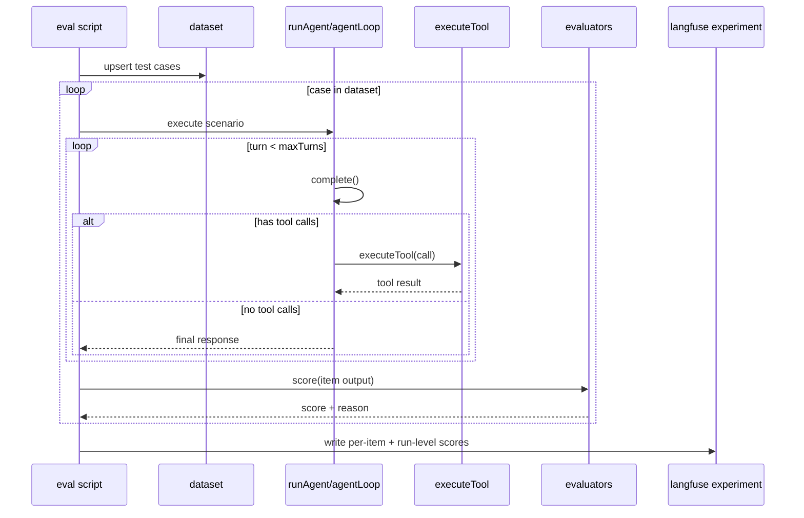

# 03_01_evals - Dokumentacja techniczna

## Cel

Rozszerzenie modułu observability o zautomatyzowane eksperymenty ewaluacyjne (tool-use i correctness), uruchamiane lokalnie i przez Langfuse datasets.

## Główne komponenty

- Ten sam serwer i agent co w 03_01_observability
- Responses API
- Folder eksperymentów (experiments/)
- Evaluatory per-case i scoring run-level

## Przepływ runtime

1. Skrypt eval tworzy lub aktualizuje dataset.
2. Dla każdej próbki uruchamiany jest scenariusz agenta.
3. Evaluator nadaje score dla próbki.
4. Wyniki agregowane są do poziomu eksperymentu.
5. Wynik i metryki trafiają do Langfuse.

## Konfiguracja i runtime

- Domyślny port serwera: 3010 (nadpisywalny przez PORT)
- Tryby uruchomienia: serwer + demo klient lub standalone eksperymenty bez serwera.

## Błędy i fallbacki

- Niestabilność zestawu testowego może powodować dryf wyników.
- Zmiana promptów lub narzędzi wymaga aktualizacji oczekiwań evaluatorów.

## Diagram Mermaid

## Źródła kodu

- [src/index.ts](../03_01_evals/src/index.ts)
- [src/app.ts](../03_01_evals/src/app.ts)
- [src/agent/run.ts](../03_01_evals/src/agent/run.ts)
- [src/agent/tools.ts](../03_01_evals/src/agent/tools.ts)
- [src/core/tracing/](../03_01_evals/src/core/tracing)
