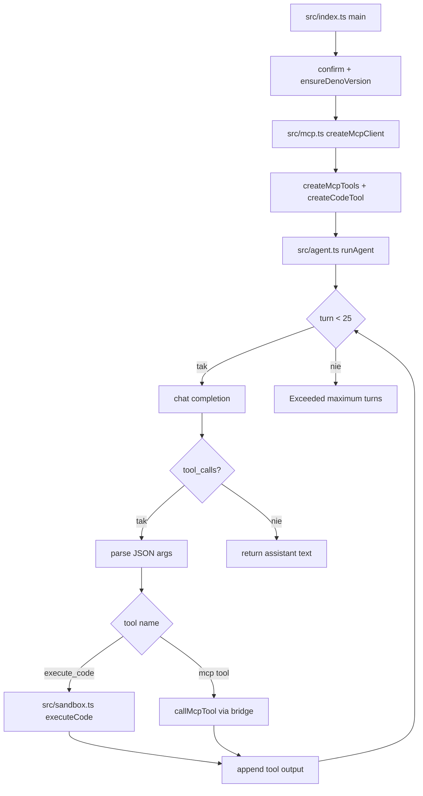

# 03_02_code - Dokumentacja techniczna

## Cel

Agent wykonujący zadania programistyczne i analityczne przez sandbox Deno oraz narzędzia plikowe MCP.

## Architektura logiczna

- Orkiestrator agenta (Responses API)
- MCP file server (odczyt/zapis workspace)
- Narzędzie execute_code uruchamiane w izolowanym procesie Deno
- HTTP bridge wystawiający narzędzia hosta do sandboxu

## Poziomy uprawnień sandboxu

- safe
- standard
- network
- full

## Przepływ runtime

1. Weryfikacja wersji Deno i potwierdzenie parametrów.
2. Nawiązanie połączenia z MCP client.
3. Rejestracja narzędzi MCP i code tool.
4. Pętla agenta do 25 tur.
5. Tool call execute_code trafia do sandboxu Deno.
6. Tool call MCP trafia przez bridge.
7. Output dopisywany do historii i następuje kolejna tura.

## Błędy i fallbacki

- Zbyt szeroki PERMISSION_LEVEL podnosi ryzyko wykonania niebezpiecznego kodu.
- Kod generowany przez model wymaga ograniczeń czasowych i walidacji danych wejściowych.
- Przekroczenie 25 tur kończy się błędem.

## Diagram Mermaid

## Źródła kodu

- [src/index.ts](../03_02_code/src/index.ts)
- [src/agent.ts](../03_02_code/src/agent.ts)
- [src/mcp.ts](../03_02_code/src/mcp.ts)
- [src/sandbox.ts](../03_02_code/src/sandbox.ts)
