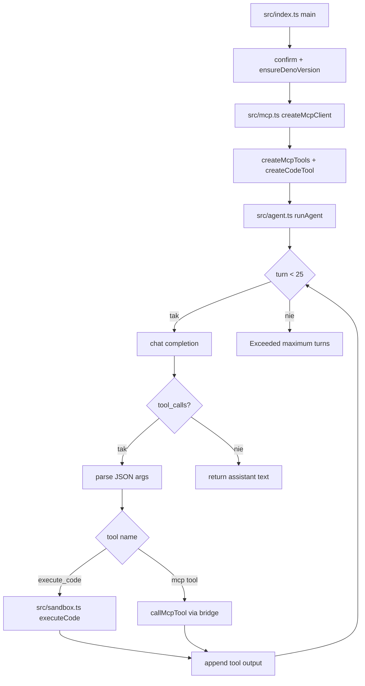
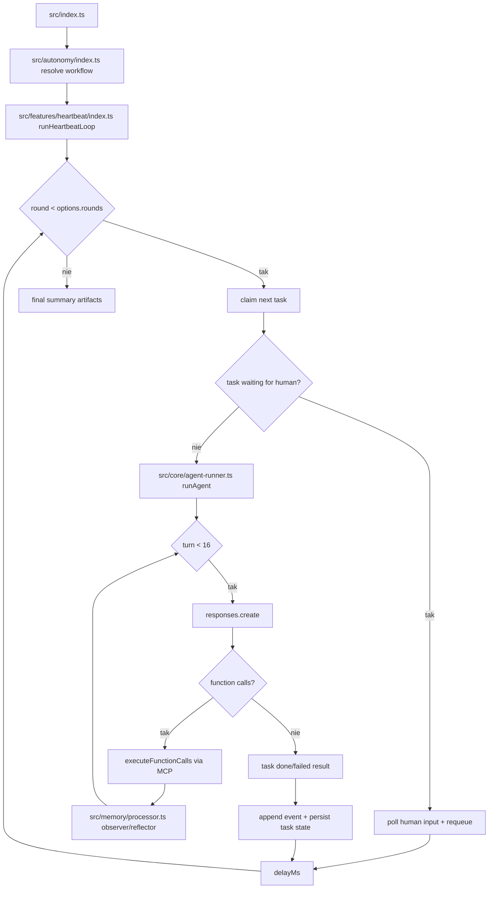

# 03_02 - Code, Email, Events — Indeks

## Moduły

- [03_02_code](03_02_code.md) — sandbox Deno, narzędzia MCP, execute_code
- [03_02_email](03_02_email.md) — triage + draft, access-lock KB
- [03_02_events](03_02_events.md) — heartbeat loop, observer/reflector, HITL

---

## 03_02_code

### Cel

Agent wykonujący zadania programistyczne i analityczne przez sandbox Deno oraz narzędzia plikowe MCP.

### Architektura

- Orkiestrator agenta (Responses API)
- MCP file server (odczyt/zapis workspace)
- Narzędzie `execute_code` uruchamiane w izolowanym procesie Deno
- HTTP bridge, który wystawia narzędzia hosta do sandboxu

### Poziomy uprawnień sandboxu

- `safe`
- `standard`
- `network`
- `full`

### Diagram Mermaid



### Źródła kodu

- [src/index.ts](../03_02_code/src/index.ts)
- [src/agent.ts](../03_02_code/src/agent.ts)
- [src/mcp.ts](../03_02_code/src/mcp.ts)
- [src/sandbox.ts](../03_02_code/src/sandbox.ts)

### Ryzyka

- Zbyt szeroki `PERMISSION_LEVEL` podnosi ryzyko wykonania niebezpiecznego kodu.
- Kod generowany przez model wymaga ograniczeń czasowych i walidacji danych wejściowych.

---

## 03_02_email

### Cel

Dwufazowy system obsługi skrzynki: triage (etykietowanie i decyzja) oraz draft (izolowane tworzenie odpowiedzi).

### Fazy

1. Triage:
   - analiza nieprzeczytanych maili,
   - konsultacja bazy wiedzy,
   - nadanie labeli i wyznaczenie pozycji do odpowiedzi.
2. Draft:
   - uruchamianie izolowanych sesji per reply plan,
   - scope bazy wiedzy ograniczony do konta nadawcy,
   - wygenerowanie draftu bez dostępu do narzędzi.

### Diagram Mermaid

```mermaid
flowchart TD
    MAIN[src/index.ts runAgent] --> TRI[src/phases/triage.ts runTriagePhase]
    TRI --> TLOOP{triage turn < 12}
    TLOOP -->|tak| TCOMP[completion + tool calls]
    TCOMP --> THAS{tool calls?}
    THAS -->|tak| TEXEC[run email/KB tools]
    TEXEC --> MARK[mark_for_reply -> ReplyPlan[]]
    MARK --> TLOOP
    THAS -->|nie| PLANS[collect reply plans]
    PLANS --> FOR[for each ReplyPlan]
    FOR --> LOCK[lockKnowledgeToAccount]
    LOCK --> DRAFT[src/phases/draft.ts runDraftSession]
    DRAFT --> UNLOCK[unlockKnowledge]
    UNLOCK --> OUT[aggregate drafts]
```

### Źródła kodu

- [src/index.ts](../03_02_email/src/index.ts)
- [src/agent.ts](../03_02_email/src/agent.ts)
- [src/phases/triage.ts](../03_02_email/src/phases/triage.ts)
- [src/phases/draft.ts](../03_02_email/src/phases/draft.ts)
- [src/tools/index.ts](../03_02_email/src/tools/index.ts)
- [src/knowledge/access-lock.ts](../03_02_email/src/knowledge/access-lock.ts)

### Ryzyka

- Niewłaściwe scope KB może powodować wyciek kontekstu między nadawcami.
- Brak walidacji języka/tonu może obniżyć jakość draftów.

---

## 03_02_events

### Cel

Architektura multi-agentowa oparta o heartbeat loop, z pamięcią observer/reflector oraz human-in-the-loop.

### Główne komponenty

- Goal contract (`workspace/goal.md`)
- Planner LLM (generuje zwalidowany plan)
- Dispatcher tasków do agentów specjalistycznych
- Observer/Reflector (kompaktowanie pamięci)
- Narzędzie `request_human` i persisted wait states
- Artefakty projektu (`workspace/project/`)

### Diagram Mermaid



### Źródła kodu

- [src/index.ts](../03_02_events/src/index.ts)
- [src/features/heartbeat/index.ts](../03_02_events/src/features/heartbeat/index.ts)
- [src/core/agent-runner.ts](../03_02_events/src/core/agent-runner.ts)
- [src/autonomy/index.ts](../03_02_events/src/autonomy/index.ts)
- [src/memory/processor.ts](../03_02_events/src/memory/processor.ts)

### Ryzyka

- Długie workflowy wymagają kontroli kosztów i liczby rund.
- Niewłaściwe kryteria completion mogą pozostawić zadania w stanie pośrednim.
- Częste pauzy HITL zwiększają czas dostarczenia.
