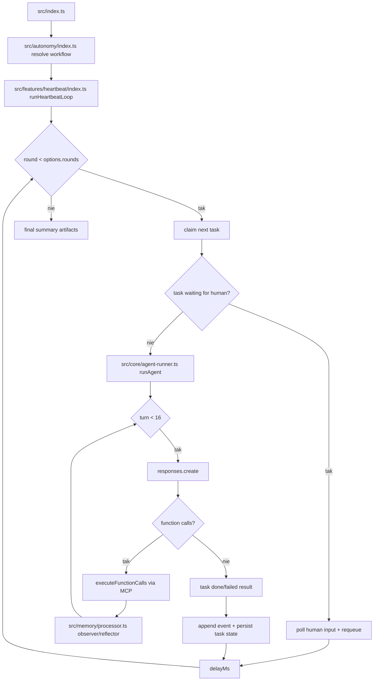

# 03_02_events - Dokumentacja techniczna

## Cel

Architektura multi-agentowa oparta o heartbeat loop, z pamięcią observer/reflector oraz human-in-the-loop.

## Główne komponenty

- Goal contract (workspace/goal.md)
- Planner LLM (generuje zwalidowany plan)
- Dispatcher tasków do agentów specjalistycznych
- Observer/Reflector (kompaktowanie pamięci)
- Narzędzie request_human i persisted wait states
- Artefakty projektu (workspace/project/)

## Przepływ runtime

1. index.ts inicjuje workflow (plan lub resume).
2. runHeartbeatLoop iteruje przez rundy.
3. Każda runda pobiera następne zadanie z kolejki.
4. Zadania czekające na człowieka trafiają do poll loop.
5. Pozostałe zadania uruchamiają runAgent (max 16 tur).
6. Wynik narzędzi przetwarzany przez observer/reflector.
7. Stan zadania i eventy są utrwalane po każdej rundzie.

## Stan i persystencja

- Goal contract i plan w workspace/goal.md.
- Stan tasków i eventy utrwalane per runda.
- Pamięć observer/reflector kompaktowana między rundami.

## Błędy i fallbacki

- Długie workflowy wymagają kontroli kosztów i liczby rund.
- Niewłaściwe kryteria completion mogą pozostawić zadania w stanie pośrednim.
- Częste pauzy HITL zwiększają czas dostarczenia.

## Diagram Mermaid

## Źródła kodu

- [src/index.ts](../03_02_events/src/index.ts)
- [src/features/heartbeat/index.ts](../03_02_events/src/features/heartbeat/index.ts)
- [src/core/agent-runner.ts](../03_02_events/src/core/agent-runner.ts)
- [src/autonomy/index.ts](../03_02_events/src/autonomy/index.ts)
- [src/memory/processor.ts](../03_02_events/src/memory/processor.ts)
