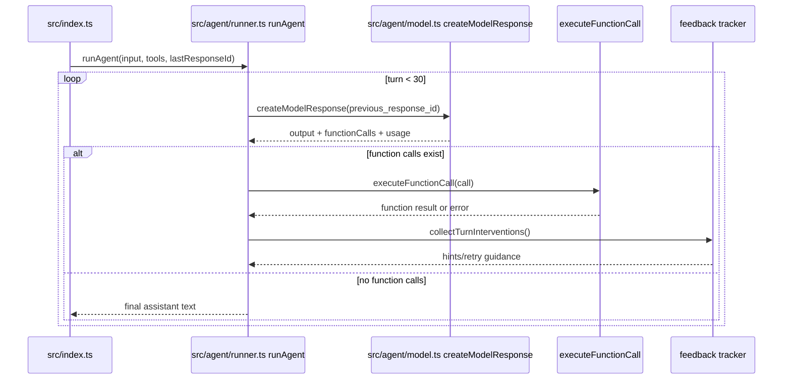

# 03_03_browser - Dokumentacja techniczna

## Cel

Agent automatyzujący przeglądarkę (Playwright) z utrzymaniem sesji i wsparciem narzędzi MCP.

## Architektura logiczna

- Agent CLI
- Playwright browser (domyślnie headless)
- Persystencja cookies sesyjnych (logowanie Goodreads)
- Narzędzia: navigate, screenshot, click, type, extract
- Łańcuch kontekstu konwersacji przez previous_response_id

## Przepływ runtime

1. runAgent inicjowany z input, tools i lastResponseId.
2. Pętla do 30 tur wywołuje createModelResponse z previous_response_id.
3. Jeśli są function calls – executeFunctionCall i collectTurnInterventions.
4. Feedback tracker zbiera hints/retry guidance.
5. Brak function calls kończy pętlę i zwraca finalny tekst.

## Błędy i fallbacki

- Wygasła sesja logowania ogranicza dostęp do danych autoryzowanych.
- Zmiana selektorów strony może psuć automatyzację.
- collectTurnInterventions dostarcza retry guidance do kolejnej tury.

## Diagram Mermaid

## Źródła kodu

- [src/index.ts](../03_03_browser/src/index.ts)
- [src/agent/runner.ts](../03_03_browser/src/agent/runner.ts)
- [src/agent/model.ts](../03_03_browser/src/agent/model.ts)
- [src/tools/index.ts](../03_03_browser/src/tools/index.ts)
- [src/feedback/index.ts](../03_03_browser/src/feedback/index.ts)
