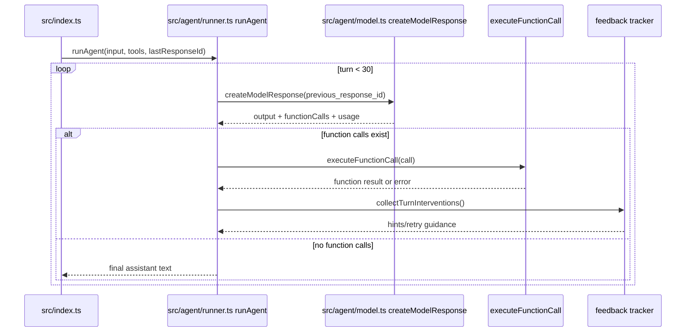
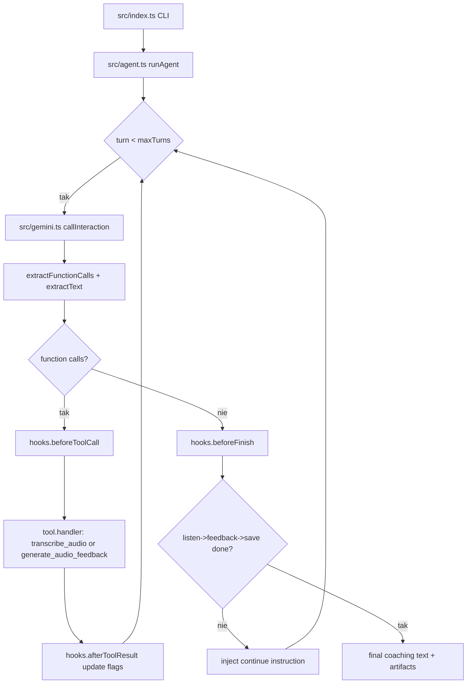

# 03_03 - Browser, Calendar, Language — Indeks

## Moduły

- [03_03_browser](03_03_browser.md) — Playwright, persystencja sesji, feedback tracker
- [03_03_calendar](03_03_calendar.md) — dodawanie wydarzeń, notyfikacje webhookowe
- [03_03_language](03_03_language.md) — ASR/TTS Gemini, coaching wymowy

---

## 03_03_browser

### Cel

Agent automatyzujący przeglądarkę (Playwright) z utrzymaniem sesji i wsparciem narzędzi MCP.

### Architektura

- Agent CLI
- Playwright browser (domyślnie headless)
- Persystencja cookies sesyjnych (logowanie Goodreads)
- Narzędzia: navigate, screenshot, click, type, extract
- Łańcuch kontekstu konwersacji przez `previous_response_id`

### Diagram Mermaid



### Źródła kodu

- [src/index.ts](../03_03_browser/src/index.ts)
- [src/agent/runner.ts](../03_03_browser/src/agent/runner.ts)
- [src/agent/model.ts](../03_03_browser/src/agent/model.ts)
- [src/tools/index.ts](../03_03_browser/src/tools/index.ts)
- [src/feedback/index.ts](../03_03_browser/src/feedback/index.ts)

### Ryzyka

- Wygasła sesja logowania ogranicza dostęp do danych autoryzowanych.
- Zmiana selektorów strony może psuć automatyzację.

---

## 03_03_calendar

### Cel

Agent kalendarzowy działający w dwóch etapach: dodawanie wydarzeń i obsługa webhooków notyfikacyjnych.

### Fazy procesu

1. Add events phase:
   - przyjmuje serię próśb planistycznych,
   - korzysta z kontekstu czasu i lokalizacji,
   - tworzy wydarzenia narzędziami kalendarza.
2. Notification phase:
   - odbiera payloady nadchodzących wydarzeń,
   - wysyła dokładnie jedną notyfikację na wydarzenie.

### Diagram Mermaid

```mermaid
flowchart TD
    IDX[src/index.ts runAgent] --> ADD[src/agent.ts runToolLoop add phase]
    ADD --> ALOOP{turn < 12}
    ALOOP -->|tak| ACOMP[complete()]
    ACOMP --> ACALL{toolCalls?}
    ACALL -->|tak| AEXEC[tool.handler(args)]
    AEXEC --> AAPPEND[append tool outputs]
    AAPPEND --> ALOOP
    ACALL -->|nie| ADONE[phase output]
    ADONE --> NOTIF[src/agent.ts runToolLoop notification phase]
    NOTIF --> NLOOP{turn < 12}
    NLOOP -->|tak| NCOMP[complete()]
    NCOMP --> NCALL{toolCalls?}
    NCALL -->|tak| NEXEC[send_notification handler]
    NEXEC --> NLOOP
    NCALL -->|nie| NDONE[final notifications]
```

### Źródła kodu

- [src/index.ts](../03_03_calendar/src/index.ts)
- [src/agent.ts](../03_03_calendar/src/agent.ts)
- [src/tools/index.ts](../03_03_calendar/src/tools/index.ts)
- [src/data/calendar.ts](../03_03_calendar/src/data/calendar.ts)

### Ryzyka

- Duplikaty webhooków wymagają idempotencji po stronie powiadomień.
- Błędy stref czasowych wpływają na poprawność terminów.

---

## 03_03_language

### Cel

Agent trenerski języka angielskiego z ASR, analizą wymowy oraz TTS opartymi o Gemini.

### Pipeline coachingu

1. Odczyt profilu ucznia z `workspace/profile.json`.
2. `listen`: transkrypcja i analiza nagrania (`.wav`).
3. `feedback`: personalizowany feedback tekst + audio.
4. Zapis sesji i aktualizacja słabych obszarów w profilu.

### Hooki cyklu życia

- `beforeToolCall` rejestruje ścieżkę audio.
- `afterToolResult` monitoruje flagi ukończenia etapów.
- `beforeFinish` blokuje zakończenie, jeśli pipeline jest niekompletny.

### Diagram Mermaid



### Źródła kodu

- [src/index.ts](../03_03_language/src/index.ts)
- [src/agent.ts](../03_03_language/src/agent.ts)
- [src/gemini.ts](../03_03_language/src/gemini.ts)
- [src/tools.ts](../03_03_language/src/tools.ts)
- [src/hooks.ts](../03_03_language/src/hooks.ts)

### Ryzyka

- Jakość nagrania silnie wpływa na trafność diagnozy.
- Dodatkowe wywołania Gemini wewnątrz narzędzi zwiększają koszt i latencję.
