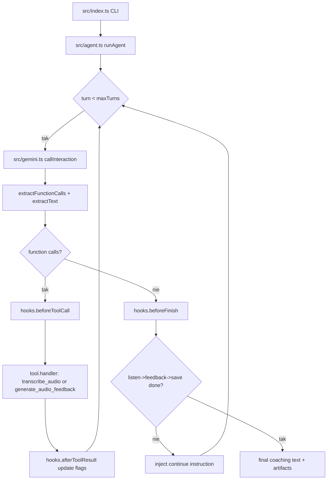

# 03_03_language - Dokumentacja techniczna

## Cel

Agent trenerski języka angielskiego z ASR, analizą wymowy oraz TTS opartymi o Gemini.

## Pipeline coachingu

1. Odczyt profilu ucznia z workspace/profile.json.
2. listen: transkrypcja i analiza nagrania (.wav).
3. feedback: personalizowany feedback tekst + audio.
4. Zapis sesji i aktualizacja słabych obszarów w profilu.

## Hooki cyklu życia

- beforeToolCall rejestruje ścieżkę audio.
- afterToolResult monitoruje flagi ukończenia etapów.
- beforeFinish blokuje zakończenie, jeśli pipeline jest niekompletny.

## Przepływ runtime

1. CLI odczytuje ścieżkę nagrania i uruchamia runAgent.
2. Pętla do maxTurns wywołuje callInteraction (Gemini).
3. extractFunctionCalls i extractText przetwarzają odpowiedź modelu.
4. Dla function calls: beforeToolCall → handler (transcribe_audio / generate_audio_feedback) → afterToolResult.
5. Brak function calls wchodzi w beforeFinish – jeśli pipeline niekompletny, inject continue instruction.
6. Pipeline kompletny (listen → feedback → save) → zwrot wyników.

## Błędy i fallbacki

- Jakość nagrania silnie wpływa na trafność diagnozy.
- Dodatkowe wywołania Gemini wewnątrz narzędzi zwiększają koszt i latencję.
- beforeFinish zapobiega przedwczesnemu zakończeniu niekompletnego pipeline.

## Diagram Mermaid

## Źródła kodu

- [src/index.ts](../03_03_language/src/index.ts)
- [src/agent.ts](../03_03_language/src/agent.ts)
- [src/gemini.ts](../03_03_language/src/gemini.ts)
- [src/tools.ts](../03_03_language/src/tools.ts)
- [src/hooks.ts](../03_03_language/src/hooks.ts)
