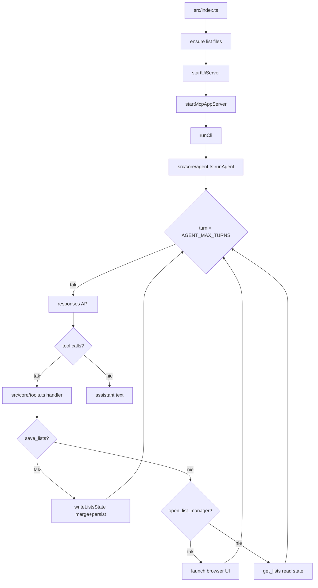

# 03_05_apps - Dokumentacja techniczna

## Cel

Serwer MCP z aplikacją UI do zarządzania listami (todo i shopping), otwieraną narzędziem agenta.

## Architektura logiczna

- Lokalny serwer UI (preview w przeglądarce)
- MCP server z narzędziem app-enabled i resource UI
- Narzędzie open_list_manager
- Persystencja danych w todo.md i shopping.md

## Przepływ runtime

1. Inicjalizacja plików list, start serwera UI i MCP.
2. runCli przekazuje input do runAgent.
3. Pętla agenta (AGENT_MAX_TURNS tur) wywołuje Responses API.
4. save_lists → writeListsState (merge + persist do plików).
5. open_list_manager → launch browser UI.
6. get_lists → read state.
7. Brak tool calls kończy pętlę.

## Stan i persystencja

- todo.md i shopping.md w katalogu workspace/.
- writeListsState wykonuje merge i atomic persist.

## Błędy i fallbacki

- Równoległa edycja plików list może powodować konflikty.
- Brak walidacji markdown może prowadzić do niespójnego formatu.

## Diagram Mermaid

## Źródła kodu

- [src/index.ts](../03_05_apps/src/index.ts)
- [src/core/agent.ts](../03_05_apps/src/core/agent.ts)
- [src/core/tools.ts](../03_05_apps/src/core/tools.ts)
- [src/core/list-files.ts](../03_05_apps/src/core/list-files.ts)
- [src/core/ui-server.ts](../03_05_apps/src/core/ui-server.ts)
