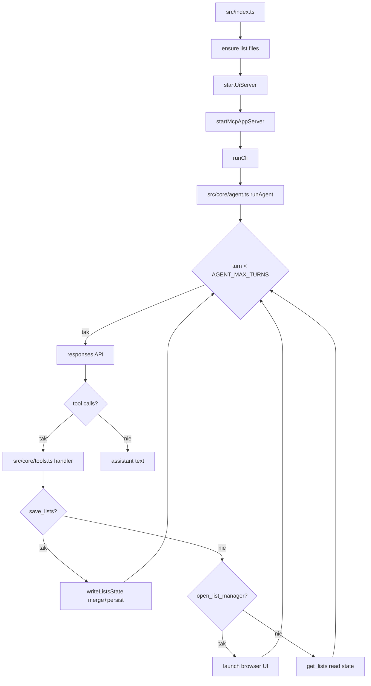
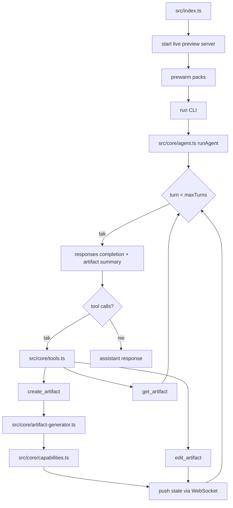
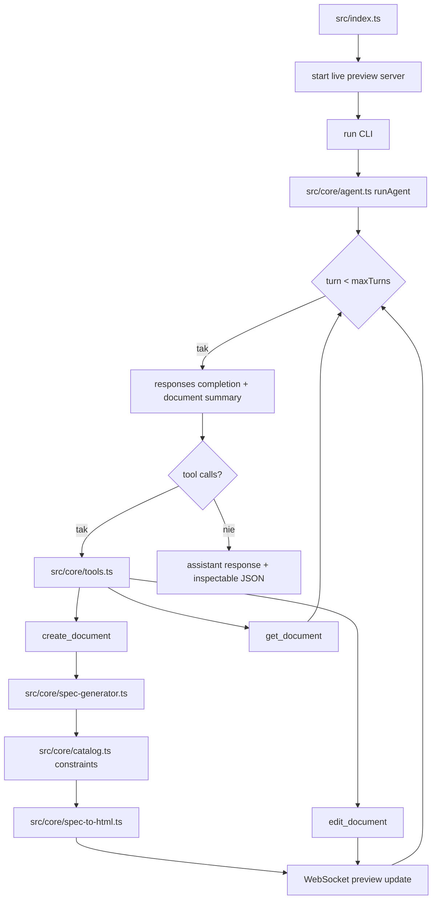

# 03_05 - Apps, Artifacts, Awareness, Render

## 03_05_apps

### Cel

Serwer MCP z aplikacją UI do zarządzania listami (todo i shopping), otwieraną narzędziem agenta.

### Architektura

- Lokalny serwer UI (preview w przeglądarce)
- MCP server z narzędziem app-enabled i resource UI
- Narzędzie `open_list_manager`
- Persystencja danych w `todo.md` i `shopping.md`

### Diagram Mermaid



### Źródła kodu

- [src/index.ts](../03_05_apps/src/index.ts)
- [src/core/agent.ts](../03_05_apps/src/core/agent.ts)
- [src/core/tools.ts](../03_05_apps/src/core/tools.ts)
- [src/core/list-files.ts](../03_05_apps/src/core/list-files.ts)
- [src/core/ui-server.ts](../03_05_apps/src/core/ui-server.ts)

### Ryzyka

- Równoległa edycja plików list może powodować konflikty.
- Brak walidacji markdown może prowadzić do niespójnego formatu.

---

## 03_05_artifacts

### Cel

Agent artefaktów generujący i edytujący aplikacje/widoki z live preview i synchronizacją WebSocket.

### Kluczowe cechy

- Routing promptów między chat i create/edit artifact
- Capability packs (np. Preact, Chart.js, D3, Tailwind, Zod)
- Search/replace na istniejących artefaktach
- Fallback renderer lokalny bez klucza API

### Diagram Mermaid



### Źródła kodu

- [src/index.ts](../03_05_artifacts/src/index.ts)
- [src/core/agent.ts](../03_05_artifacts/src/core/agent.ts)
- [src/core/tools.ts](../03_05_artifacts/src/core/tools.ts)
- [src/core/artifact-generator.ts](../03_05_artifacts/src/core/artifact-generator.ts)
- [src/core/capabilities.ts](../03_05_artifacts/src/core/capabilities.ts)
- [src/core/live-preview-server.ts](../03_05_artifacts/src/core/live-preview-server.ts)

### Ryzyka

- Nieadekwatny dobór capability packa obniża jakość wyniku.
- Dynamiczny kod wizualizacji wymaga sanitizacji danych wejściowych.

---

## 03_05_awareness

### Cel

Agent świadomości kontekstowej z pamięcią trwałą, heurystykami odświeżania i delegacją scouta przez MCP.

### Mechanika

- Wstrzykiwanie aktualnej daty i czasu w każdej turze
- Odczyt profilu, środowiska i pamięci z `workspace/`
- Delegacja `look_around` do sub-agenta scout
- Snapshoty awareness odświeżane wg heurystyk:
  - bootstrap,
  - date-sensitive,
  - weather,
  - periodic.

### Diagram Mermaid

```mermaid
flowchart TD
  CLI[src/index.ts runCli] --> TURN[src/core/agent.ts runAwarenessTurn]
  TURN --> META[inject metadata now_iso/weekday/timezone]
  META --> LOOP[src/core/responses-loop.ts runResponsesLoop]
  LOOP --> R{turn < maxTurns}
  R -->|tak| RESP[openai.responses.create parallel_tool_calls=true]
  RESP --> FC{function calls?}
  FC -->|tak| EXEC[executeTool(call)]
  EXEC --> STATE[src/core/awareness-state.ts load/save state]
  STATE --> TRACE[append jsonl trace]
  TRACE --> R
  FC -->|nie| FINAL[final answer]
  EXEC --> SCOUT{tool == look_around?}
  SCOUT -->|tak| MCP[MCP read profile/environment/memory]
  MCP --> STATE
```

### Źródła kodu

- [src/index.ts](../03_05_awareness/src/index.ts)
- [src/core/agent.ts](../03_05_awareness/src/core/agent.ts)
- [src/core/responses-loop.ts](../03_05_awareness/src/core/responses-loop.ts)
- [src/core/awareness-state.ts](../03_05_awareness/src/core/awareness-state.ts)

### Ryzyka

- Zbyt rzadkie odświeżanie snapshotów może dać nieaktualny kontekst.
- Zbyt częste odświeżanie podnosi koszt i latencję.

---

## 03_05_render

### Cel

Agent renderujący dashboardy i widoki przez strukturalne specyfikacje komponentowe zamiast arbitralnego HTML.

### Ograniczenia projektowe

- Dozwolone tylko component packs:
  - `analytics-core`
  - `analytics-viz`
  - `analytics-table`
  - `analytics-insight`
  - `analytics-controls`
- Renderowanie serwerowe do deterministycznego preview
- JSON view do inspekcji specyfikacji

### Diagram Mermaid



### Źródła kodu

- [src/index.ts](../03_05_render/src/index.ts)
- [src/core/agent.ts](../03_05_render/src/core/agent.ts)
- [src/core/tools.ts](../03_05_render/src/core/tools.ts)
- [src/core/spec-generator.ts](../03_05_render/src/core/spec-generator.ts)
- [src/core/catalog.ts](../03_05_render/src/core/catalog.ts)
- [src/core/spec-to-html.ts](../03_05_render/src/core/spec-to-html.ts)

### Ryzyka

- Ograniczony katalog komponentów może nie pokryć niszowych wymagań UI.
- Błędy mapowania spec -> komponent powodują niezgodność podglądu.
