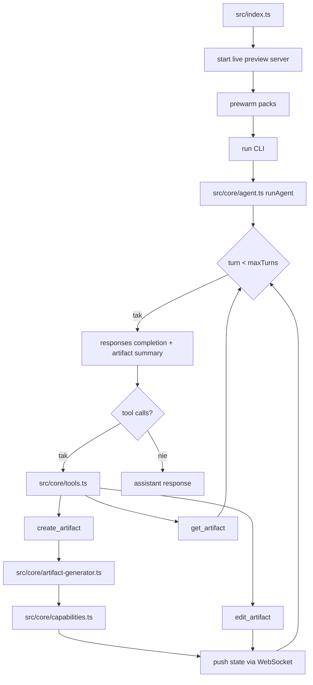

# 03_05_artifacts - Dokumentacja techniczna

## Cel

Agent artefaktów generujący i edytujący aplikacje/widoki z live preview i synchronizacją WebSocket.

## Architektura logiczna

- Routing promptów między chat i create/edit artifact
- Capability packs (np. Preact, Chart.js, D3, Tailwind, Zod)
- Search/replace na istniejących artefaktach
- Fallback renderer lokalny bez klucza API

## Przepływ runtime

1. Start serwera live preview + prewarm packs.
2. CLI uruchamia runAgent.
3. Pętla do maxTurns: responses completion z artifact summary.
4. create_artifact → artifact-generator → capabilities → push state via WebSocket.
5. edit_artifact → push state via WebSocket.
6. get_artifact → tylko odczyt, bez push.
7. Brak tool calls → assistant response.

## Stan i persystencja

- Stany artefaktów synchronizowane przez WebSocket do live preview.
- Capability packs prewarmowane przy starcie.

## Błędy i fallbacki

- Nieadekwatny dobór capability packa obniża jakość wyniku.
- Dynamiczny kod wizualizacji wymaga sanitizacji danych wejściowych.
- Fallback renderer działa bez klucza API.

## Diagram Mermaid

## Źródła kodu

- [src/index.ts](../03_05_artifacts/src/index.ts)
- [src/core/agent.ts](../03_05_artifacts/src/core/agent.ts)
- [src/core/tools.ts](../03_05_artifacts/src/core/tools.ts)
- [src/core/artifact-generator.ts](../03_05_artifacts/src/core/artifact-generator.ts)
- [src/core/capabilities.ts](../03_05_artifacts/src/core/capabilities.ts)
- [src/core/live-preview-server.ts](../03_05_artifacts/src/core/live-preview-server.ts)
