# Globalna mapa zależności modułów 03_ - 05_

Poniższy diagram pokazuje zależności funkcjonalne i podobieństwa wzorców runtime pomiędzy modułami z grup 03_, 04_ i 05_.

```mermaid
flowchart TD
  %% Wejścia i infrastruktura
  ENV[Konfiguracja i klucze API .env] --> AI[Warstwa modeli LLM/Responses]
  MCP[MCP ekosystem: files i custom tools] --> TOOLS[Warstwa narzędzi]

  %% Grupa 03
  subgraph G03[Grupa 03]
    M0301[03_01_observability i evals]
    M0302[03_02_code email events]
    M0303[03_03_browser calendar language]
    M0304[03_04_gmail]
    M0305[03_05_apps artifacts awareness render]
  end

  %% Grupa 04
  subgraph G04[Grupa 04]
    M0401[04_01_garden]
    M0404[04_04_system]
    M0405A[04_05_apps]
    M0405R[04_05_review]
  end

  %% Grupa 05
  subgraph G05[Grupa 05]
    M0501[05_01_agent_graph]
    M0502UI[05_02_ui]
    M0502V[05_02_voice]
    M0503AP[05_03_autoprompt]
    M0503AX[05_03_ax]
    M0503C[05_03_coding]
    M0504API[05_04_api]
    M0504UI[05_04_ui]
  end

  %% Zależności bazowe
  AI --> M0301
  AI --> M0302
  AI --> M0303
  AI --> M0304
  AI --> M0305
  AI --> M0401
  AI --> M0404
  AI --> M0405A
  AI --> M0405R
  AI --> M0501
  AI --> M0502UI
  AI --> M0502V
  AI --> M0503AP
  AI --> M0503AX
  AI --> M0503C
  AI --> M0504API
  AI --> M0504UI

  TOOLS --> M0302
  TOOLS --> M0303
  TOOLS --> M0304
  TOOLS --> M0305
  TOOLS --> M0401
  TOOLS --> M0404
  TOOLS --> M0405A
  TOOLS --> M0405R
  TOOLS --> M0501
  TOOLS --> M0502V
  TOOLS --> M0503C
  TOOLS --> M0504API

  %% Zależności funkcjonalne i wzorcowe
  M0301 -->|wzorzec: observability i eval| M0405R
  M0301 -->|wzorzec: metryki i tracing| M0504API

  M0302 -->|wzorzec: sandbox code tool| M0503C
  M0302 -->|wzorzec: fazy i orchestracja| M0501

  M0303 -->|browser i interakcja realtime| M0502UI
  M0303 -->|audio i multimodalność| M0502V

  M0304 -->|narzędzia domenowe + walidacja| M0504API

  M0305 -->|live preview i artifact flow| M0405A
  M0305 -->|live preview i render pipeline| M0502UI
  M0305 -->|structured render constraints| M0504UI

  M0401 -->|REPL agent z tool loop| M0503C
  M0404 -->|multi-agent delegation| M0501
  M0405A -->|app runtime i UI bridge| M0504UI
  M0405R -->|pipeline review/comments| M0504API

  M0501 -->|backend graph orchestration| M0504API
  M0504API -->|HTTP API| M0504UI

  M0503AP -->|prompt optimization output| M0504API
  M0503AX -->|klasyfikacja i etykiety| M0405R

  %% Persystencja
  STORE[(Pliki workspace i JSON state)]
  STORE --> M0302
  STORE --> M0305
  STORE --> M0401
  STORE --> M0405R
  STORE --> M0501
  STORE --> M0503C

  %% Frontends
  UI[UIs: browser preview, svelte, web apps]
  M0305 --> UI
  M0405A --> UI
  M0405R --> UI
  M0502UI --> UI
  M0504UI --> UI
```

## Legenda

- Strzałki `AI -> moduł` oznaczają zależność od warstwy modelu.
- Strzałki `TOOLS -> moduł` oznaczają intensywne użycie narzędzi (MCP/local tools).
- Strzałki `moduł -> moduł` oznaczają zależność wzorców architektonicznych lub przepływu odpowiedzialności.
- Węzły `STORE` i `UI` pokazują wspólne warstwy persystencji i interfejsu.
