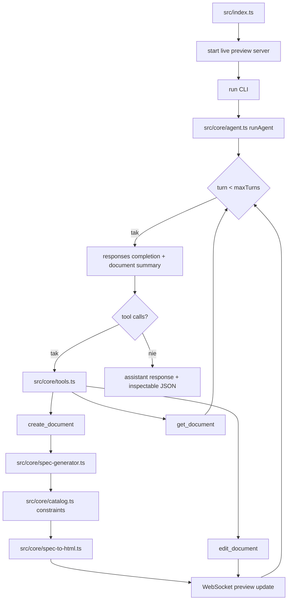

# 03_05_render - Dokumentacja techniczna

## Cel

Agent renderujący dashboardy i widoki przez strukturalne specyfikacje komponentowe zamiast arbitralnego HTML.

## Ograniczenia projektowe

- Dozwolone tylko component packs:
  - analytics-core
  - analytics-viz
  - analytics-table
  - analytics-insight
  - analytics-controls
- Renderowanie serwerowe do deterministycznego preview
- JSON view do inspekcji specyfikacji

## Przepływ runtime

1. Start serwera live preview.
2. CLI uruchamia runAgent.
3. Pętla do maxTurns: responses completion z document summary.
4. create_document → spec-generator → catalog constraints → spec-to-html → WebSocket update.
5. edit_document → WebSocket update.
6. get_document → tylko odczyt.
7. Brak tool calls → assistant response + inspectable JSON.

## Stan i persystencja

- Specyfikacje dokumentów przechowywane w pamięci agenta.
- WebSocket synchronizuje stan podglądu na bieżąco.

## Błędy i fallbacki

- Ograniczony katalog komponentów może nie pokryć niszowych wymagań UI.
- Błędy mapowania spec → komponent powodują niezgodność podglądu.
- catalog.ts egzekwuje dozwolone packs.

## Diagram Mermaid

## Źródła kodu

- [src/index.ts](../03_05_render/src/index.ts)
- [src/core/agent.ts](../03_05_render/src/core/agent.ts)
- [src/core/tools.ts](../03_05_render/src/core/tools.ts)
- [src/core/spec-generator.ts](../03_05_render/src/core/spec-generator.ts)
- [src/core/catalog.ts](../03_05_render/src/core/catalog.ts)
- [src/core/spec-to-html.ts](../03_05_render/src/core/spec-to-html.ts)
