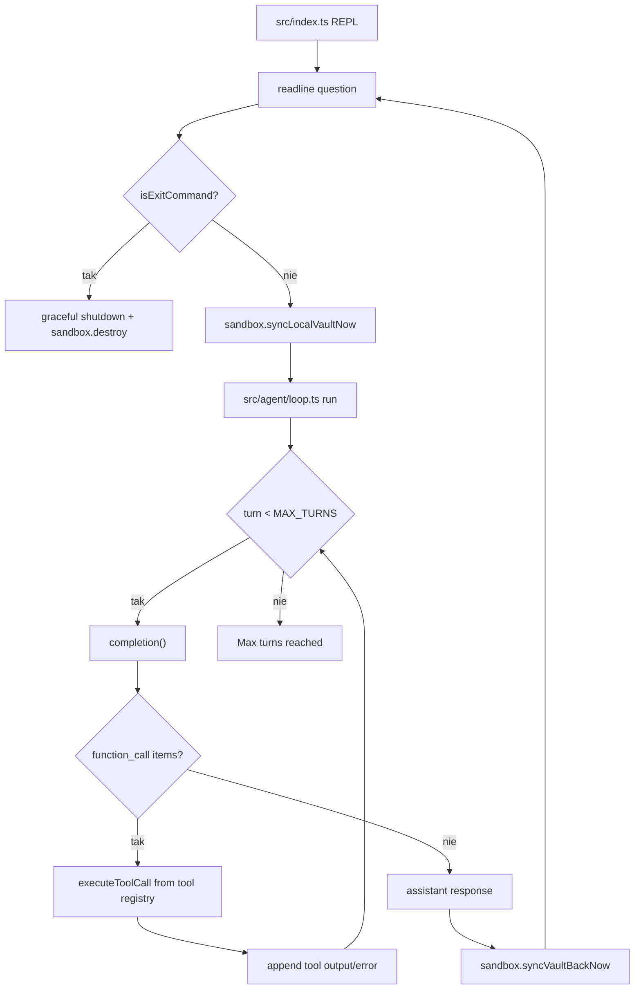

# 04_01_garden - Dokumentacja techniczna

## Cel

Interaktywny agent REPL, który pracuje na sandboxowanym vault i wykonuje narzędzia przez pętlę tool-calling.

## Architektura logiczna

- CLI REPL z readline
- LazySandbox (sync lokalny -> wykonanie -> sync zwrotny)
- Agent loop z limitem tur
- Rejestr narzędzi (terminal, code mode, git push)

## Przepływ runtime

1. Użytkownik wpisuje wiadomość w REPL.
2. Wejście jest walidowane (isExitCommand).
3. Sandbox wykonuje syncLocalVaultNow.
4. Agent run uruchamia pętlę completion -> tool call.
5. Wynik narzędzia jest dopisywany do historii i następuje kolejna tura.
6. Po odpowiedzi końcowej następuje syncVaultBackNow.
7. Przy exit/quit proces kończy się z sandbox.destroy().

## Stan i persystencja

- Stan konwersacji utrzymywany w pamięci procesu.
- Stan plików utrzymywany w vault przez LazySandbox.
- Kontekst agenta i skilli ładowany z plików szablonów.

## Błędy i fallbacki

- Błąd narzędzia konwertowany do tekstowego outputu i zwracany do pętli.
- Brak narzędzia kończy się błędem dispatcher-a.
- Osiągnięcie limitu tur zwraca odpowiedź fallback (max turns reached).

## Diagram Mermaid

## Źródła kodu

- [src/index.ts](../04_01_garden/src/index.ts)
- [src/agent/loop.ts](../04_01_garden/src/agent/loop.ts)
- [src/tools/index.ts](../04_01_garden/src/tools/index.ts)
- [src/sandbox/client.ts](../04_01_garden/src/sandbox/client.ts)
- [src/ai/client.ts](../04_01_garden/src/ai/client.ts)
