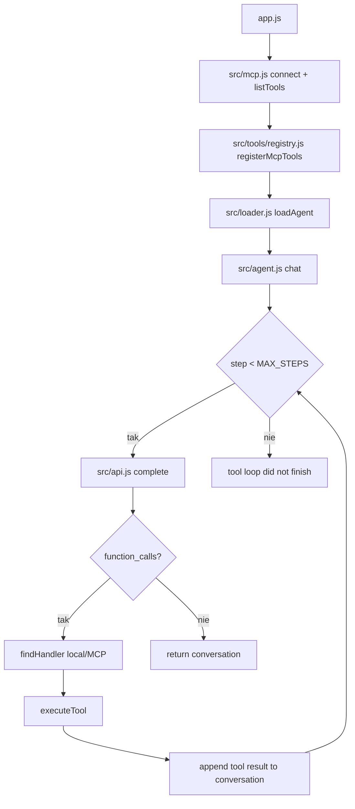

# 04_04_system - Dokumentacja techniczna

## Cel

System multi-agentowy sterowany wiedzą w markdown, z delegacją zadań i dynamiczną rejestracją narzędzi lokalnych oraz MCP.

## Architektura logiczna

- Orkiestrator uruchamiany z app.js
- MCP clients (stdio) i dynamiczne mapowanie files__* i web__*
- Registry narzędzi z dispatch do handlerów local/MCP
- Agent loop z delegacją i ograniczeniem głębokości

## Przepływ runtime

1. Bootstrap: połączenie z MCP i pobranie listy narzędzi.
2. Rejestracja narzędzi MCP w lokalnym registry.
3. Ładowanie profilu agenta z markdown (workspace/system/agents/*.md).
4. Start pętli chat z limitem kroków.
5. Każda iteracja: completion -> parse function calls -> executeTool.
6. Wynik narzędzi dopisywany do konwersacji.
7. Brak function calls kończy turę odpowiedzią końcową.

## Stan i persystencja

- Historia konwersacji utrzymywana w runtime.
- Definicje agentów, workflow i reguły przechowywane w workspace.
- Połączenia MCP utrzymywane per serwer i zamykane w finally.

## Błędy i fallbacki

- Nieznane narzędzie kończy się błędem dispatchera.
- Przekroczenie MAX_STEPS kończy się wyjątkiem.
- Problemy z MCP propagowane do top-level i kończą wykonanie.

## Diagram Mermaid

## Źródła kodu

- [app.js](../04_04_system/app.js)
- [src/agent.js](../04_04_system/src/agent.js)
- [src/mcp.js](../04_04_system/src/mcp.js)
- [src/tools/registry.js](../04_04_system/src/tools/registry.js)
- [src/loader.js](../04_04_system/src/loader.js)
- [src/api.js](../04_04_system/src/api.js)
