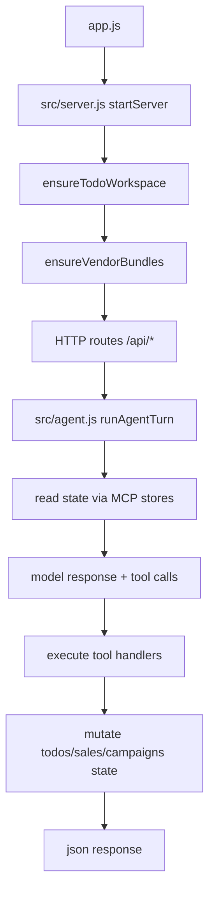

# 04_05_apps - Dokumentacja techniczna

## Cel

Przykład workflow-first MCP Apps: host przeglądarkowy + zdalny MCP server + osadzone aplikacje iframe.

## Architektura logiczna

- MCP server rejestrujący narzędzia i zasoby ui://
- Browser host z AppBridge i sandboxowanym mountowaniem aplikacji
- Aplikacje osadzone (mcp/src/interfaces/*) wykonujące operacje domenowe

## Przepływ runtime

1. Start serwera (startServer), inicjalizacja workspace i bundle host-bridge.
2. Rejestracja endpointów HTTP i runtime MCP.
3. Agent otrzymuje prompt i wybiera narzędzie workflow.
4. Narzędzie zwraca tekst + dane + zasób ui://...
5. Host pobiera zasób i montuje aplikację w iframe.
6. Aplikacja osadzona wykonuje kolejne akcje przez App SDK.
7. Zmiany stanu (todo/sales/campaigns) są utrwalane przez store.

## Stan i persystencja

- Dane workflow utrwalane w store modułu MCP (todos, sales, campaigns).
- Host utrzymuje bieżący stan sesji UI i połączenia AppBridge.
- Bundle host bridge generowany podczas bootstrapa.

## Błędy i fallbacki

- Brak outputu po buildzie bridge traktowany jako błąd krytyczny.
- Błędy serwowania statycznych plików dają 404.
- Błędy endpointów dają 500 ze strukturalnym payloadem.

## Diagram Mermaid

## Źródła kodu

- [app.js](../04_05_apps/app.js)
- [src/server.js](../04_05_apps/src/server.js)
- [src/agent.js](../04_05_apps/src/agent.js)
- [src/config.js](../04_05_apps/src/config.js)
- [mcp/src/core/marketing-server.js](../04_05_apps/mcp/src/core/marketing-server.js)
- [mcp/src/interfaces/todo-app.js](../04_05_apps/mcp/src/interfaces/todo-app.js)
- [public/host.js](../04_05_apps/public/host.js)
- [mcp/src/store/todos.js](../04_05_apps/mcp/src/store/todos.js)
