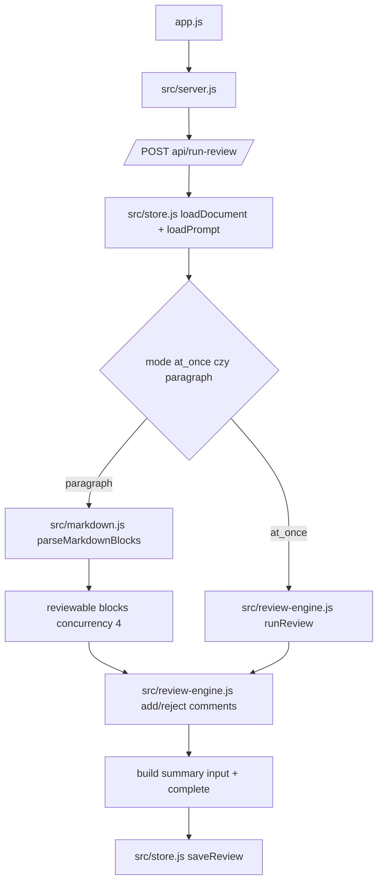

# 04_05_review - Dokumentacja techniczna

## Cel

Lab recenzji markdown z komentarzami zakotwiczonymi do bloków i akcjami accept/reject/revert.

## Architektura logiczna

- Backend HTTP + agent review engine
- Parser markdown (remark) do podziału na bloki
- Store plikowy dla dokumentów, promptów i review session
- Frontend Svelte z nawigacją po komentarzach

## Przepływ runtime

1. Użytkownik wybiera dokument i prompt, uruchamia review.
2. Backend ładuje dokument/prompt i kontekst (contextFiles).
3. W trybie paragraph dokument jest dzielony na bloki reviewable.
4. Agent wykonuje pętlę narzędzi i dodaje komentarze.
5. Komentarze trafiają do review store i są streamowane do UI.
6. Użytkownik akceptuje/odrzuca/revertuje sugestie.
7. Akceptacja powoduje patch dokumentu markdown.

## Stan i persystencja

- Persystencja plikowa: workspace/documents, workspace/prompts, workspace/reviews.
- Review state: komentarze, statusy, czasy utworzenia, powiązane bloki.
- Frontend utrzymuje bieżący fokus komentarza i status sesji.

## Błędy i fallbacki

- Brak dokumentu/prompta powoduje błąd walidacji wejścia.
- Path traversal blokowany przez guard workspace.
- Gdy brak komentarzy, tworzony fallback summary.

## Diagram Mermaid

## Źródła kodu

- [app.js](../04_05_review/app.js)
- [src/server.js](../04_05_review/src/server.js)
- [src/review-engine.js](../04_05_review/src/review-engine.js)
- [src/agent.js](../04_05_review/src/agent.js)
- [src/tools.js](../04_05_review/src/tools.js)
- [src/store.js](../04_05_review/src/store.js)
- [src/markdown.js](../04_05_review/src/markdown.js)
- [frontend/App.svelte](../04_05_review/frontend/App.svelte)
