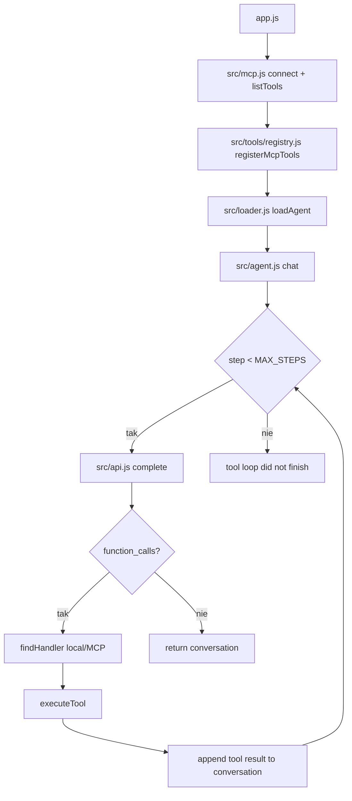
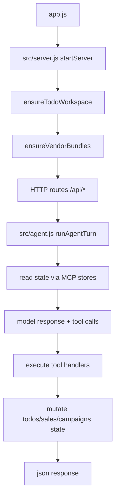
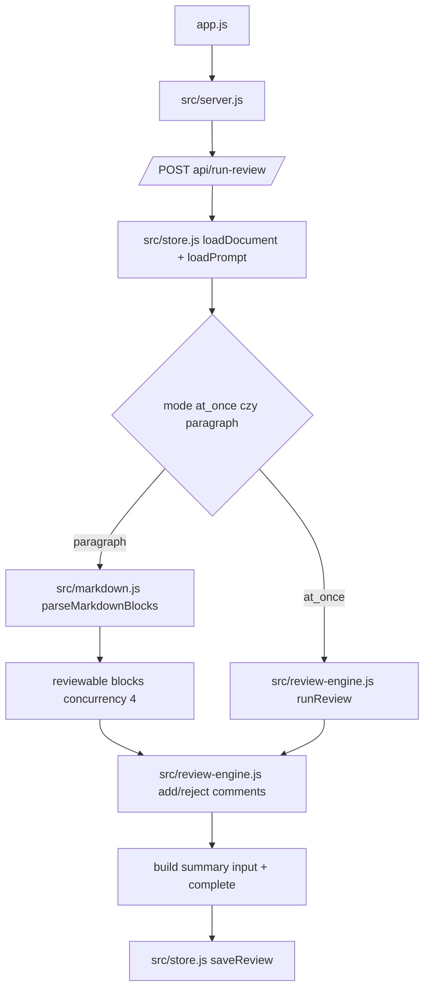

# 04_ - Diagramy logiki wykonania (JS/TS)

## 04_01_garden

```mermaid
flowchart TD
  IDX[src/index.ts REPL] --> ASK[readline question]
  ASK --> EXIT{isExitCommand?}
  EXIT -->|tak| END[graceful shutdown + sandbox.destroy]
  EXIT -->|nie| SYNC1[sandbox.syncLocalVaultNow]
  SYNC1 --> RUN[src/agent/loop.ts run]
  RUN --> LOOP{turn < MAX_TURNS}
  LOOP -->|tak| COMP[completion()]
  COMP --> FC{function_call items?}
  FC -->|tak| EXEC[executeToolCall from tool registry]
  EXEC --> APPEND[append tool output/error]
  APPEND --> LOOP
  FC -->|nie| OUT[assistant response]
  OUT --> SYNC2[sandbox.syncVaultBackNow]
  SYNC2 --> ASK
  LOOP -->|nie| MAX[Max turns reached]
```

### Źródła kodu

- [src/index.ts](../04_01_garden/src/index.ts)
- [src/agent/loop.ts](../04_01_garden/src/agent/loop.ts)
- [src/tools/index.ts](../04_01_garden/src/tools/index.ts)
- [src/sandbox/client.ts](../04_01_garden/src/sandbox/client.ts)
- [src/ai/client.ts](../04_01_garden/src/ai/client.ts)

---

## 04_04_system



### Źródła kodu

- [app.js](../04_04_system/app.js)
- [src/agent.js](../04_04_system/src/agent.js)
- [src/mcp.js](../04_04_system/src/mcp.js)
- [src/tools/registry.js](../04_04_system/src/tools/registry.js)
- [src/loader.js](../04_04_system/src/loader.js)
- [src/api.js](../04_04_system/src/api.js)

---

## 04_05_apps



### Źródła kodu

- [app.js](../04_05_apps/app.js)
- [src/server.js](../04_05_apps/src/server.js)
- [src/agent.js](../04_05_apps/src/agent.js)
- [src/config.js](../04_05_apps/src/config.js)
- [mcp/src/store/todos.js](../04_05_apps/mcp/src/store/todos.js)
- [mcp/src/store/stripe.js](../04_05_apps/mcp/src/store/stripe.js)

---

## 04_05_review



### Źródła kodu

- [app.js](../04_05_review/app.js)
- [src/server.js](../04_05_review/src/server.js)
- [src/review-engine.js](../04_05_review/src/review-engine.js)
- [src/store.js](../04_05_review/src/store.js)
- [src/markdown.js](../04_05_review/src/markdown.js)
- [src/api.js](../04_05_review/src/api.js)
