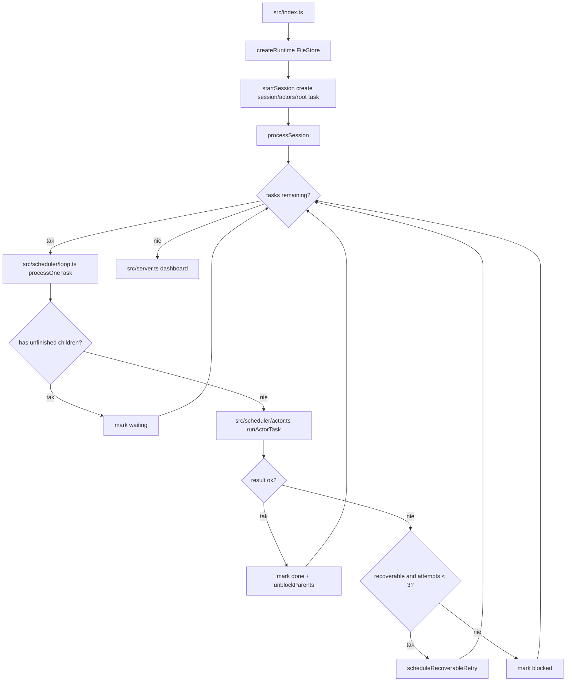

# 05_01_agent_graph - Dokumentacja techniczna

## Cel

System orkiestracji agentów oparty o graf zadań, relacje między encjami i mechanizm odzyskiwania po błędach.

## Architektura logiczna

- Runtime z FileStore dla encji (sessions, actors, tasks, items, artifacts, relations)
- Scheduler przetwarzający zadania według stanu i zależności
- Actor loop wykonujący taski i zapisujący efekty do grafu
- Dashboard HTTP do wizualizacji sesji

## Przepływ runtime

1. Start sesji: tworzona sesja, aktor user i orchestrator oraz root task.
2. processSession iteruje po zadaniach do wyczerpania worklisty.
3. processOneTask sprawdza dzieci i gotowość zadania.
4. runActorTask wykonuje task przez agent loop i narzędzia.
5. Wynik oznacza task jako done/waiting/blocked.
6. Rodzice są odblokowywani po ukończeniu dzieci.
7. Dashboard prezentuje stan grafu i artefakty.

## Stan i persystencja

- Wszystkie encje zapisywane plikowo przez FileStore.
- Relacje grafu utrwalają zależności między taskami i artefaktami.
- Agregowane są metryki tokenowe sesji.

## Błędy i fallbacki

- Recoverable errors trafiają do kolejki retry (MAX_AUTO_RETRY_ATTEMPTS).
- Brak przypisanego aktora blokuje zadanie.
- Błędy nieretryowalne oznaczają task jako blocked.

## Diagram Mermaid

## Źródła kodu

- [src/index.ts](../05_01_agent_graph/src/index.ts)
- [src/runtime.ts](../05_01_agent_graph/src/runtime.ts)
- [src/scheduler/loop.ts](../05_01_agent_graph/src/scheduler/loop.ts)
- [src/scheduler/actor.ts](../05_01_agent_graph/src/scheduler/actor.ts)
- [src/server.ts](../05_01_agent_graph/src/server.ts)
