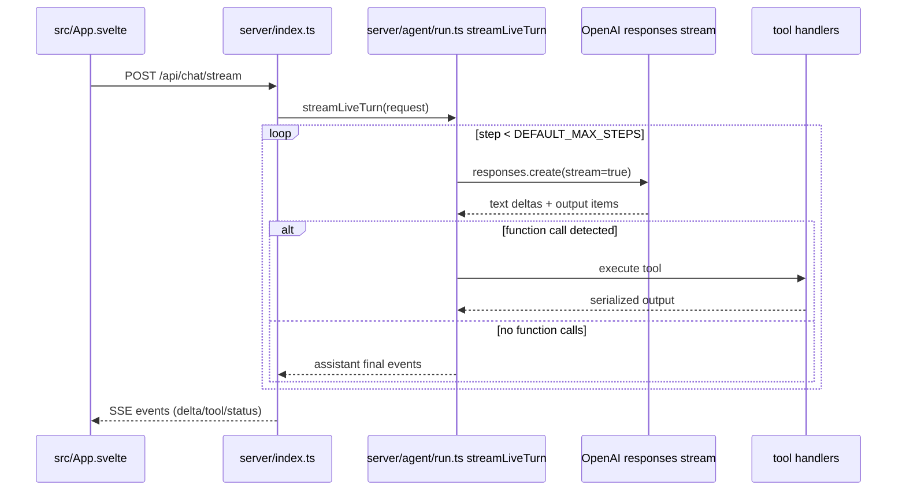

# 05_02_ui - Dokumentacja techniczna

## Cel

Referencyjny interfejs Svelte 5 do długich konwersacji i streamingu SSE z eventowym materializowaniem odpowiedzi.

## Architektura logiczna

- Backend Bun/Hono z endpointem SSE
- Event stream przetwarzany przez streamLiveTurn
- Store konwersacji po stronie klienta (hydrate + live events)
- Komponenty UI dla text delta, tool calls i artefaktów

## Przepływ runtime

1. UI inicjuje POST /api/chat/stream.
2. Serwer tworzy turę i wywołuje streamLiveTurn.
3. Loop kroków pobiera stream z Responses API.
4. Event parser rozróżnia text/tool/thinking/status.
5. Tool calls są wykonywane i serializowane do eventów.
6. UI odbiera SSE i aktualizuje listę wiadomości.
7. Po końcu tury zapis snapshotu konwersacji.

## Stan i persystencja

- ConversationStore utrzymuje historię i tryby (live/mock).
- Server może seedować długą historię do testów UI.
- Side-effecty narzędzi zapisywane do lokalnego .data/.

## Błędy i fallbacki

- Body limit i walidacje CORS zwracają kontrolowane błędy HTTP.
- Rozłączenie streamu obsługiwane jako przerwana sesja.
- Tryb mock zapewnia fallback bez live modelu.

## Diagram Mermaid

## Źródła kodu

- [server/index.ts](../05_02_ui/server/index.ts)
- [server/agent/run.ts](../05_02_ui/server/agent/run.ts)
- [server/conversation/store.ts](../05_02_ui/server/conversation/store.ts)
- [server/ai/client.ts](../05_02_ui/server/ai/client.ts)
- [src/App.svelte](../05_02_ui/src/App.svelte)
