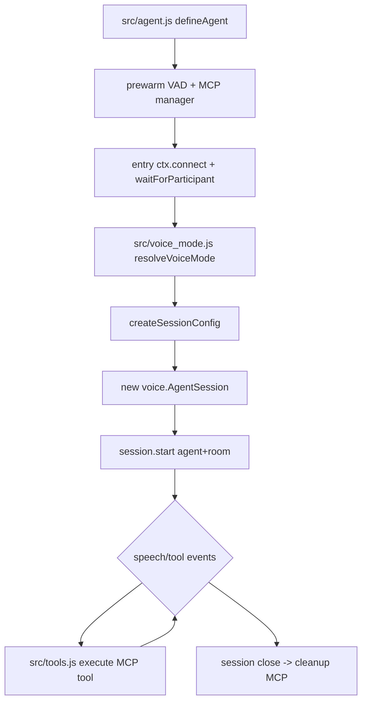

# 05_02_voice - Dokumentacja techniczna

## Cel

Agent głosowy LiveKit z adaptacyjnym doborem stosu (Gemini lub ElevenLabs/OpenAI), VAD i narzędziami MCP.

## Architektura logiczna

- defineAgent + cli.runApp (LiveKit)
- Prewarm VAD i managera MCP
- Resolve voice mode na podstawie dostępnych kluczy
- Voice session z eventami speech/tool

## Przepływ runtime

1. Prewarm ładuje VAD i przygotowuje manager MCP.
2. entry łączy się z room i czeka na uczestnika.
3. resolveVoiceMode wybiera pipeline audio.
4. Tworzona jest konfiguracja sesji i AgentSession.
5. Sesja streamuje mowę użytkownika/agenta.
6. Tool calls są wykonywane przez adapter MCP.
7. Na zamknięciu sesji następuje cleanup połączeń.

## Stan i persystencja

- Stan sesji jest ephemeral (brak trwałej historii).
- Utrzymywany runtime MCP i konfiguracja audio.
- VAD model współdzielony przez prewarm.

## Błędy i fallbacki

- Nieudana inicjalizacja MCP degraduje funkcjonalność narzędzi.
- Brak kompatybilnego voice mode kończy się błędem startu.
- Błędy narzędzi zwracane do odpowiedzi sesji.

## Diagram Mermaid

## Źródła kodu

- [src/agent.js](../05_02_voice/src/agent.js)
- [src/voice_mode.js](../05_02_voice/src/voice_mode.js)
- [src/tools.js](../05_02_voice/src/tools.js)
- [src/mcp.js](../05_02_voice/src/mcp.js)
- [src/elevenlabs_tts.js](../05_02_voice/src/elevenlabs_tts.js)
