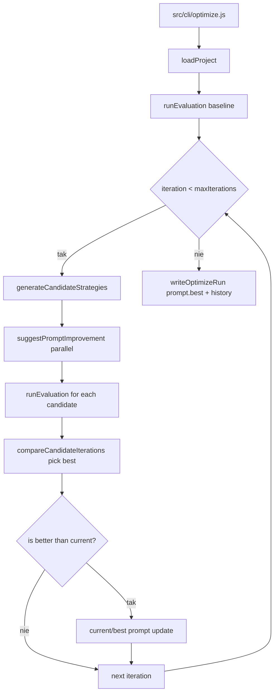

# 05_03_autoprompt - Dokumentacja techniczna

## Cel

Automatyczna optymalizacja promptów: generowanie kandydatów, ocena jakości i iteracyjny wybór najlepszego promptu.

## Architektura logiczna

- CLI optimizer
- Loader konfiguracji projektu i zestawu testów
- Pętla iteracyjna candidate -> evaluate -> select
- Moduł zapisu artefaktów runu (prompty, diffy, trace)

## Przepływ runtime

1. CLI parsuje argumenty i ładuje projekt.
2. Wykonywany jest baseline evaluation.
3. Każda iteracja generuje wiele kandydatów strategią K-best.
4. Kandydaci są oceniani na tym samym zbiorze przypadków.
5. compareCandidateIterations wybiera najlepszy wynik.
6. Jeśli wynik poprawia baseline/current, prompt jest aktualizowany.
7. Końcowy prompt i historia iteracji są zapisywane do runs/.

## Stan i persystencja

- Wejście: projects/<name>/... (prompt, schema, testy).
- Wyjście: runs/<name>/<timestamp>/ (run.json, prompt.best, diffy, traces).
- Stan iteracji utrzymywany w pamięci podczas optymalizacji.

## Błędy i fallbacki

- Błędy parse argumentów przerywają wykonanie.
- Nieudane kandydaty są pomijane (allSettled).
- Błędy projektu (brak plików) kończą proces ładowania.

## Diagram Mermaid

## Źródła kodu

- [src/cli/optimize.js](../05_03_autoprompt/src/cli/optimize.js)
- [src/core/optimize-project.js](../05_03_autoprompt/src/core/optimize-project.js)
- [src/core/run-evaluation.js](../05_03_autoprompt/src/core/run-evaluation.js)
- [src/core/improve-prompt.js](../05_03_autoprompt/src/core/improve-prompt.js)
- [src/project/load-project.js](../05_03_autoprompt/src/project/load-project.js)
