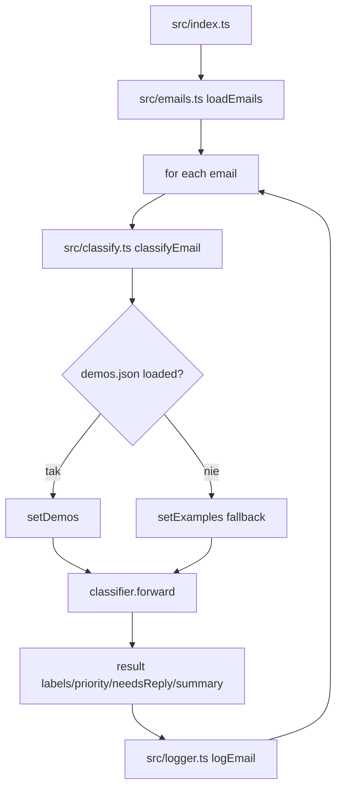

# 05_03_ax - Dokumentacja techniczna

## Cel

Klasyfikator e-maili deweloperskich oparty o Ax (sygnatury, few-shot, bootstrap demos).

## Architektura logiczna

- Loader wiadomości i etykiet
- Klasyfikator Ax z sygnaturą wyjścia strukturalnego
- Fallback examples lub demos wytrenowane przez optimizer
- Logger wyników klasyfikacji

## Przepływ runtime

1. Ładowanie e-maili wejściowych.
2. Dla każdej wiadomości uruchamiane classifyEmail.
3. System sprawdza obecność demos.json.
4. Ustawia setDemos albo fallback setExamples.
5. classifier.forward zwraca etykiety i metadane.
6. Wynik jest logowany i przechodzimy do kolejnego maila.

## Stan i persystencja

- demos.json przechowuje zoptymalizowane przykłady few-shot.
- Dane wejściowe i fallback examples są statyczne w src/.
- Brak trwałego stanu sesji runtime.

## Błędy i fallbacki

- Błąd odczytu demos -> fallback do ręcznych przykładów.
- Błędny rekord maila może zostać pominięty.
- Krytyczny błąd modelu kończy pętlę klasyfikacji.

## Diagram Mermaid

## Źródła kodu

- [src/index.ts](../05_03_ax/src/index.ts)
- [src/classify.ts](../05_03_ax/src/classify.ts)
- [src/emails.ts](../05_03_ax/src/emails.ts)
- [src/examples.ts](../05_03_ax/src/examples.ts)
- [src/logger.ts](../05_03_ax/src/logger.ts)
