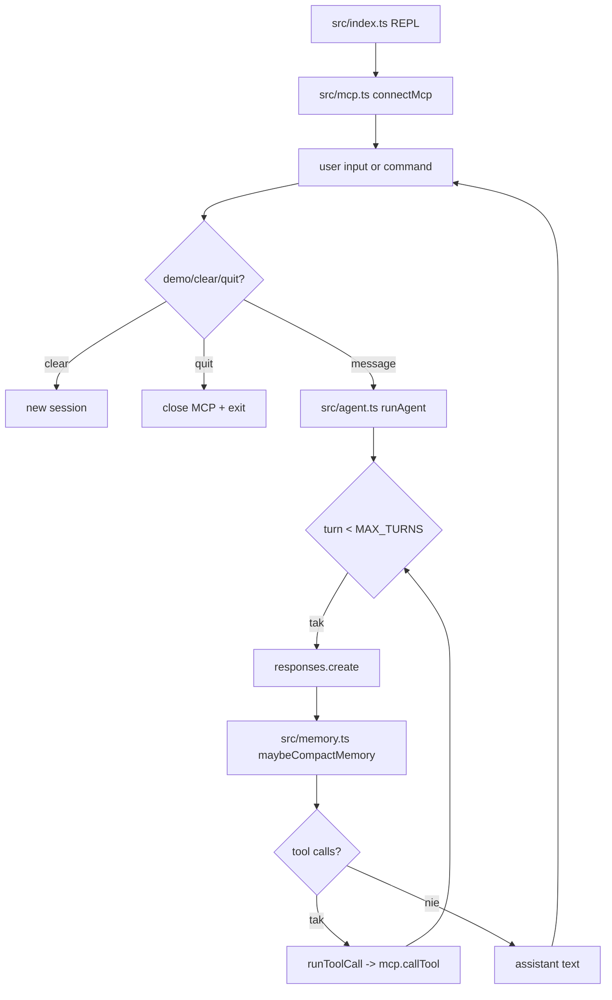

# 05_03_coding - Dokumentacja techniczna

## Cel

REPL coding-agent z MCP files i kompaktowaniem pamięci sesji.

## Architektura logiczna

- Interaktywny CLI loop (/demo, /clear, /quit)
- Agent loop z Responses API i tool-calling
- MCP client do operacji na plikach
- Memory manager z podsumowaniem i rolling window wiadomości

## Przepływ runtime

1. Start i połączenie z MCP files.
2. REPL czyta komendę lub wiadomość użytkownika.
3. runAgent dopisuje wiadomość do sesji.
4. Przed turą uruchamiane maybeCompactMemory.
5. Model zwraca tekst i opcjonalne tool calls.
6. Tool calls wykonują mcp.callTool i wracają do pętli.
7. Brak tool calls kończy turę odpowiedzią końcową.

## Stan i persystencja

- Sesja czatu utrzymywana i serializowana do .sessions/.
- Summary pamięci utrwalane jako markdown.
- Zachowywana jest ograniczona liczba ostatnich wiadomości.

## Błędy i fallbacki

- Błędne JSON args narzędzia zwracają jawny błąd parsera.
- Błąd narzędzia zwraca komunikat i kontynuuje sesję.
- Błąd kompaktowania pamięci nie przerywa pętli.

## Diagram Mermaid

## Źródła kodu

- [src/index.ts](../05_03_coding/src/index.ts)
- [src/agent.ts](../05_03_coding/src/agent.ts)
- [src/memory.ts](../05_03_coding/src/memory.ts)
- [src/mcp.ts](../05_03_coding/src/mcp.ts)
- [src/config.ts](../05_03_coding/src/config.ts)
