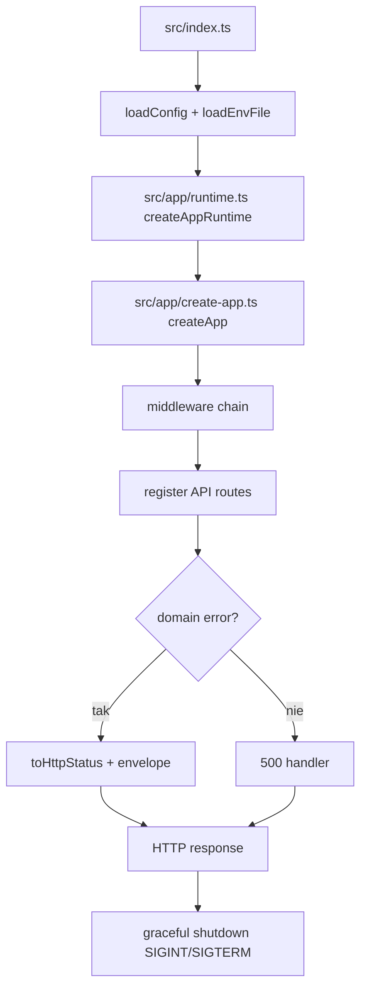

# 05_04_api - Dokumentacja techniczna

## Cel

Backend API (Hono) z middleware security/auth/context, routingiem domenowym i kontrolowanym error envelope.

## Architektura logiczna

- Bootstrap config + env loader
- Runtime init (logger, db, LLM, MCP)
- Hono app z middleware pipeline
- Adaptery HTTP i mapowanie błędów domenowych

## Przepływ runtime

1. loadConfig i loadEnvFileIntoProcess.
2. createAppRuntime inicjalizuje usługi i połączenia.
3. createApp montuje middleware i routery.
4. Żądanie przechodzi przez security/context/auth/body-limit.
5. Route handler wykonuje logikę i zwraca envelope.
6. Domain exceptions mapowane są do kodów HTTP.
7. Przy SIGINT/SIGTERM wykonywany graceful shutdown.

## Stan i persystencja

- Persystencja DB przez Drizzle + better-sqlite3.
- Kontekst requestu przechowuje requestId i traceId.
- Konfiguracja MCP serwerów ładowana z configu.

## Błędy i fallbacki

- Domain errors mapowane do 4xx/5xx wg typu.
- Błędy niedomenowe zwracają 500.
- W production odpowiedzi są ograniczane do bezpiecznych komunikatów.

## Diagram Mermaid

## Źródła kodu

- [src/index.ts](../05_04_api/src/index.ts)
- [src/app/create-app.ts](../05_04_api/src/app/create-app.ts)
- [src/app/runtime.ts](../05_04_api/src/app/runtime.ts)
- [src/app/middleware/](../05_04_api/src/app/middleware)
- [src/adapters/http/routes/](../05_04_api/src/adapters/http/routes)
