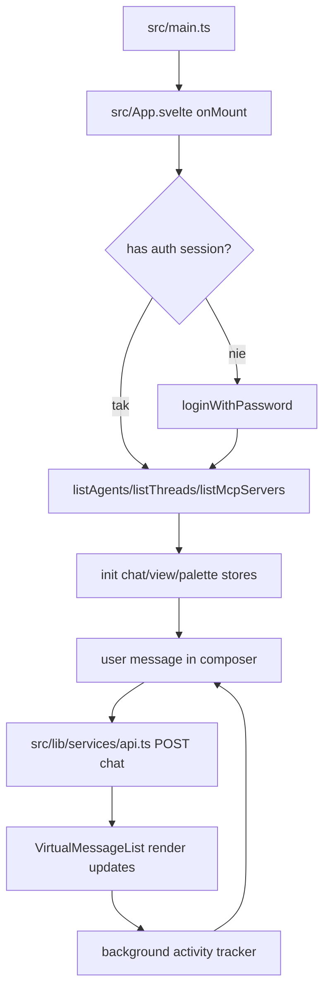

# 05_04_ui - Dokumentacja techniczna

## Cel

Frontend Svelte 5 do pracy z backendem 05_04_api: streaming chat, zarządzanie agentami/MCP i wielodzierżawowość.

## Architektura logiczna

- App shell z auth i routingiem widoków workspace
- API/auth services do REST + SSE
- Stores dla czatu, widoków, palety komend, lightboxów
- Komponenty renderujące bloki wiadomości i artefakty

## Przepływ runtime

1. onMount sprawdza sesję auth.
2. Jeśli potrzeba, użytkownik loguje się hasłem.
3. Ładowane są agenty, MCP servers, profile narzędzi i wątki.
4. Tworzone/odtwarzane stores interfejsu.
5. Wysyłka wiadomości uruchamia API call i stream odpowiedzi.
6. VirtualMessageList renderuje inkrementalne aktualizacje.
7. Użytkownik może przełączać tenant/workspace i zarządzać konfiguracją.

## Stan i persystencja

- Stan UI i konwersacji przechowywany w store klienta.
- Sesja auth i tenant id utrzymywane po stronie frontendowej + backend.
- Długie wątki obsługiwane przez wirtualizację listy.

## Błędy i fallbacki

- Błędy auth pokazują ekran logowania i komunikat.
- Błędy API mapowane do human-readable message.
- Flagi connecting i tenantChangePending blokują akcje podczas przejść.

## Diagram Mermaid

## Źródła kodu

- [src/main.ts](../05_04_ui/src/main.ts)
- [src/App.svelte](../05_04_ui/src/App.svelte)
- [src/lib/services/api.ts](../05_04_ui/src/lib/services/api.ts)
- [src/lib/services/auth.ts](../05_04_ui/src/lib/services/auth.ts)
- [src/lib/stores/](../05_04_ui/src/lib/stores)
