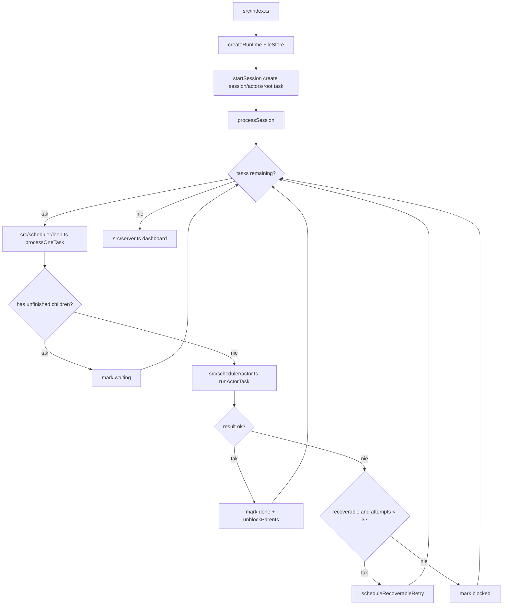
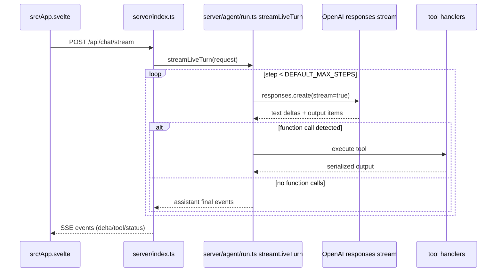
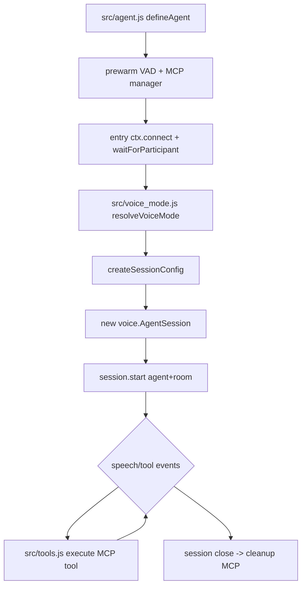
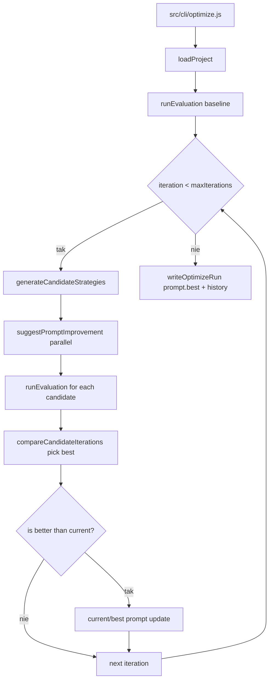
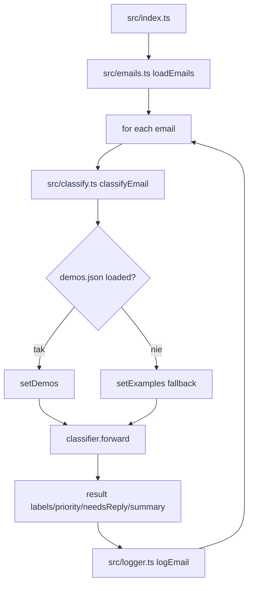
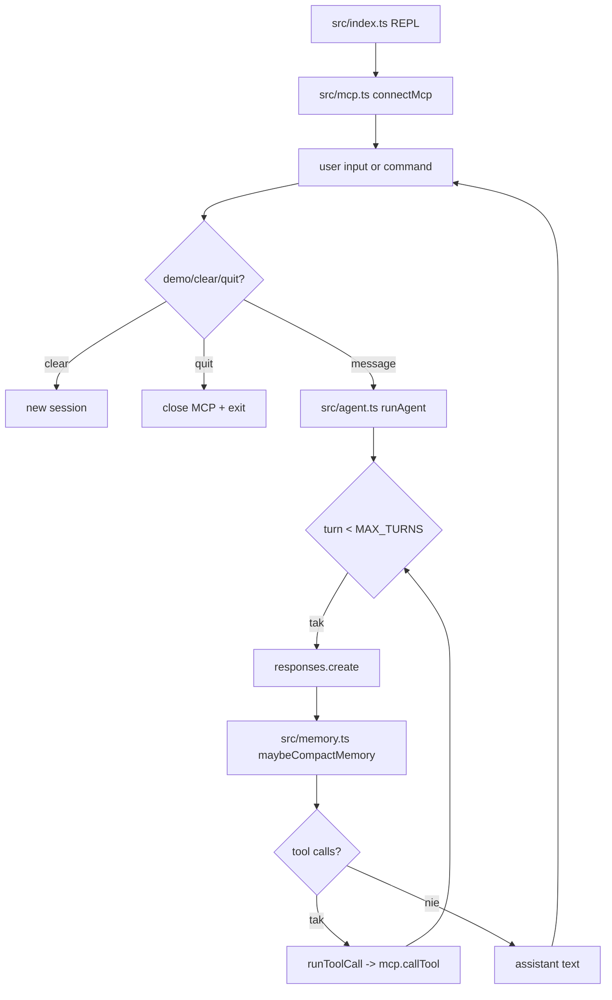
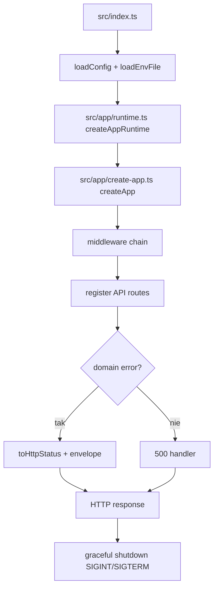
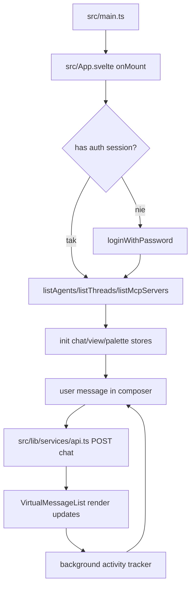

# 05_ - Diagramy logiki wykonania (JS/TS)

## 05_01_agent_graph

### Źródła kodu

- [src/index.ts](../05_01_agent_graph/src/index.ts)
- [src/runtime.ts](../05_01_agent_graph/src/runtime.ts)
- [src/scheduler/loop.ts](../05_01_agent_graph/src/scheduler/loop.ts)
- [src/scheduler/actor.ts](../05_01_agent_graph/src/scheduler/actor.ts)
- [src/server.ts](../05_01_agent_graph/src/server.ts)

---

## 05_02_ui

### Źródła kodu

- [server/index.ts](../05_02_ui/server/index.ts)
- [server/agent/run.ts](../05_02_ui/server/agent/run.ts)
- [server/conversation/store.ts](../05_02_ui/server/conversation/store.ts)
- [server/ai/client.ts](../05_02_ui/server/ai/client.ts)
- [src/App.svelte](../05_02_ui/src/App.svelte)

---

## 05_02_voice

### Źródła kodu

- [src/agent.js](../05_02_voice/src/agent.js)
- [src/voice_mode.js](../05_02_voice/src/voice_mode.js)
- [src/tools.js](../05_02_voice/src/tools.js)
- [src/mcp.js](../05_02_voice/src/mcp.js)
- [src/elevenlabs_tts.js](../05_02_voice/src/elevenlabs_tts.js)

---

## 05_03_autoprompt

### Źródła kodu

- [src/cli/optimize.js](../05_03_autoprompt/src/cli/optimize.js)
- [src/core/optimize-project.js](../05_03_autoprompt/src/core/optimize-project.js)
- [src/core/run-evaluation.js](../05_03_autoprompt/src/core/run-evaluation.js)
- [src/core/improve-prompt.js](../05_03_autoprompt/src/core/improve-prompt.js)
- [src/project/load-project.js](../05_03_autoprompt/src/project/load-project.js)

---

## 05_03_ax

### Źródła kodu

- [src/index.ts](../05_03_ax/src/index.ts)
- [src/classify.ts](../05_03_ax/src/classify.ts)
- [src/emails.ts](../05_03_ax/src/emails.ts)
- [src/examples.ts](../05_03_ax/src/examples.ts)
- [src/logger.ts](../05_03_ax/src/logger.ts)

---

## 05_03_coding

### Źródła kodu

- [src/index.ts](../05_03_coding/src/index.ts)
- [src/agent.ts](../05_03_coding/src/agent.ts)
- [src/memory.ts](../05_03_coding/src/memory.ts)
- [src/mcp.ts](../05_03_coding/src/mcp.ts)
- [src/config.ts](../05_03_coding/src/config.ts)

---

## 05_04_api

### Źródła kodu

- [src/index.ts](../05_04_api/src/index.ts)
- [src/app/create-app.ts](../05_04_api/src/app/create-app.ts)
- [src/app/runtime.ts](../05_04_api/src/app/runtime.ts)
- [src/app/middleware/](../05_04_api/src/app/middleware)
- [src/adapters/http/routes/](../05_04_api/src/adapters/http/routes)

---

## 05_04_ui

### Źródła kodu

- [src/main.ts](../05_04_ui/src/main.ts)
- [src/App.svelte](../05_04_ui/src/App.svelte)
- [src/lib/services/api.ts](../05_04_ui/src/lib/services/api.ts)
- [src/lib/services/auth.ts](../05_04_ui/src/lib/services/auth.ts)
- [src/lib/stores/](../05_04_ui/src/lib/stores)
