# 03_01_observability — Mapa zależności funkcji

## Diagram Mermaid

```mermaid
flowchart TD
  subgraph agent_run["agent/run"]
    runAgent["runAgent()"]
    agentLoop["agentLoop()"]
    toAssistantMessage["toAssistantMessage()"]
    mergeUsage["mergeUsage()"]
  end
  subgraph core_tracing_context["core/tracing/context"]
    setPromptRef["setPromptRef()"]
    advanceTurn["advanceTurn()"]
    nextToolIndex["nextToolIndex()"]
    getCurrentTurn["getCurrentTurn()"]
    getCurrentAgentName["getCurrentAgentName()"]
    formatGenerationName["formatGenerationName()"]
    formatToolName["formatToolName()"]
    getPromptRef["getPromptRef()"]
  end
  subgraph core_tracing_prompts["core/tracing/prompts"]
    getPromptRefByName["getPromptRefByName()"]
    computeHash["computeHash()"]
    loadState["loadState()"]
    collectPromptSources["collectPromptSources()"]
    pushPrompt["pushPrompt()"]
    syncPrompts["syncPrompts()"]
    saveState["saveState()"]
  end
  subgraph agent_tools["agent/tools"]
    executeTool["executeTool()"]
    parseArgs["parseArgs()"]
  end
  subgraph core_tracing_tracer["core/tracing/tracer"]
    recordTraceError["recordTraceError()"]
    setTraceOutput["setTraceOutput()"]
    startGeneration["startGeneration()"]
    toUsageDetails["toUsageDetails()"]
  end
  subgraph app["app"]
    createApp["createApp()"]
  end
  subgraph core_tracing_init["core/tracing/init"]
    flush["flush()"]
    isTracingActive["isTracingActive()"]
    getTracingLogger["getTracingLogger()"]
    logTrace["logTrace()"]
    initTracing["initTracing()"]
    shutdownTracing["shutdownTracing()"]
  end
  subgraph session["session"]
    getSession["getSession()"]
    listSessions["listSessions()"]
  end
  subgraph core_adapters_index["core/adapters/index"]
    adapters["adapters()"]
  end
  subgraph core_adapters_openai["core/adapters/openai"]
    openaiAdapter["openaiAdapter()"]
    mapError["mapError()"]
    buildMessages["buildMessages()"]
    toResult["toResult()"]
    extractText["extractText()"]
    toToolCalls["toToolCalls()"]
  end
  subgraph core_tracing_adapter["core/tracing/adapter"]
    withGenerationTracing["withGenerationTracing()"]
    formatInput["formatInput()"]
    buildGenerationInput["buildGenerationInput()"]
    formatOutput["formatOutput()"]
    formatContent["formatContent()"]
  end
  subgraph core_logger["core/logger"]
    createLogger["createLogger()"]
    write["write()"]
  end
  subgraph index["index"]
    shutdown["shutdown()"]
  end
  runAgent --> agentLoop
  runAgent --> setPromptRef
  runAgent --> getPromptRefByName
  toAssistantMessage --> mergeUsage
  toAssistantMessage --> agentLoop
  toAssistantMessage --> executeTool
  toAssistantMessage --> advanceTurn
  toAssistantMessage --> setPromptRef
  toAssistantMessage --> getPromptRefByName
  toAssistantMessage --> recordTraceError
  mergeUsage --> toAssistantMessage
  mergeUsage --> agentLoop
  mergeUsage --> executeTool
  mergeUsage --> advanceTurn
  mergeUsage --> setPromptRef
  mergeUsage --> getPromptRefByName
  mergeUsage --> recordTraceError
  agentLoop --> toAssistantMessage
  agentLoop --> mergeUsage
  agentLoop --> executeTool
  agentLoop --> advanceTurn
  agentLoop --> setPromptRef
  agentLoop --> getPromptRefByName
  agentLoop --> recordTraceError
  executeTool --> parseArgs
  createApp --> runAgent
  createApp --> flush
  createApp --> setTraceOutput
  createApp --> getSession
  createApp --> listSessions
  adapters --> openaiAdapter
  adapters --> withGenerationTracing
  openaiAdapter --> mapError
  openaiAdapter --> buildMessages
  openaiAdapter --> toResult
  mapError --> extractText
  mapError --> toToolCalls
  extractText --> mapError
  extractText --> toToolCalls
  extractText --> buildMessages
  extractText --> toResult
  toToolCalls --> mapError
  toToolCalls --> extractText
  toToolCalls --> buildMessages
  toToolCalls --> toResult
  buildMessages --> mapError
  buildMessages --> extractText
  buildMessages --> toToolCalls
  buildMessages --> toResult
  toResult --> mapError
  toResult --> extractText
  toResult --> toToolCalls
  toResult --> buildMessages
  createLogger --> write
  write --> createLogger
  withGenerationTracing --> formatInput
  withGenerationTracing --> buildGenerationInput
  withGenerationTracing --> formatOutput
  withGenerationTracing --> isTracingActive
  withGenerationTracing --> startGeneration
  formatContent --> formatInput
  formatContent --> isTracingActive
  formatContent --> startGeneration
  formatInput --> formatContent
  formatInput --> buildGenerationInput
  formatInput --> isTracingActive
  formatInput --> startGeneration
  buildGenerationInput --> formatInput
  buildGenerationInput --> formatOutput
  buildGenerationInput --> isTracingActive
  buildGenerationInput --> startGeneration
  formatOutput --> formatInput
  formatOutput --> buildGenerationInput
  formatOutput --> isTracingActive
  formatOutput --> startGeneration
  advanceTurn --> nextToolIndex
  getCurrentTurn --> nextToolIndex
  getCurrentAgentName --> nextToolIndex
  formatGenerationName --> nextToolIndex
  formatToolName --> nextToolIndex
  getTracingLogger --> shutdown
  logTrace --> shutdown
  initTracing --> shutdown
  flush --> shutdown
  shutdownTracing --> shutdown
  getPromptRefByName --> logTrace
  getPromptRefByName --> computeHash
  getPromptRefByName --> loadState
  getPromptRefByName --> collectPromptSources
  getPromptRefByName --> pushPrompt
  syncPrompts --> logTrace
  syncPrompts --> computeHash
  syncPrompts --> loadState
  syncPrompts --> saveState
  syncPrompts --> collectPromptSources
  syncPrompts --> pushPrompt
  computeHash --> logTrace
  computeHash --> loadState
  computeHash --> saveState
  computeHash --> collectPromptSources
  computeHash --> pushPrompt
  loadState --> logTrace
  loadState --> computeHash
  loadState --> saveState
  loadState --> collectPromptSources
  loadState --> pushPrompt
  saveState --> logTrace
  saveState --> computeHash
  saveState --> loadState
  saveState --> collectPromptSources
  saveState --> pushPrompt
  collectPromptSources --> logTrace
  collectPromptSources --> computeHash
  collectPromptSources --> loadState
  collectPromptSources --> saveState
  collectPromptSources --> pushPrompt
  pushPrompt --> logTrace
  pushPrompt --> computeHash
  pushPrompt --> loadState
  pushPrompt --> saveState
  pushPrompt --> collectPromptSources
  setTraceOutput --> getCurrentTurn
  setTraceOutput --> formatGenerationName
  setTraceOutput --> formatToolName
  setTraceOutput --> getPromptRef
  setTraceOutput --> isTracingActive
  setTraceOutput --> toUsageDetails
  startGeneration --> getCurrentTurn
  startGeneration --> formatGenerationName
  startGeneration --> formatToolName
  startGeneration --> getPromptRef
  startGeneration --> logTrace
  startGeneration --> isTracingActive
  startGeneration --> toUsageDetails
  recordTraceError --> logTrace
  recordTraceError --> isTracingActive
  toUsageDetails --> getCurrentTurn
  toUsageDetails --> formatGenerationName
  toUsageDetails --> getPromptRef
  toUsageDetails --> isTracingActive
  shutdown --> shutdownTracing
```

## Tabela wywołań

| Funkcja | Plik | Wywołuje |
|---------|------|----------|
| `runAgent` | `agent/run.ts` | `agentLoop`, `setPromptRef`, `getPromptRefByName` |
| `toAssistantMessage` | `agent/run.ts` | `mergeUsage`, `agentLoop`, `executeTool`, `advanceTurn`, `setPromptRef`, `getPromptRefByName`, `recordTraceError` |
| `mergeUsage` | `agent/run.ts` | `toAssistantMessage`, `agentLoop`, `executeTool`, `advanceTurn`, `setPromptRef`, `getPromptRefByName`, `recordTraceError` |
| `agentLoop` | `agent/run.ts` | `toAssistantMessage`, `mergeUsage`, `executeTool`, `advanceTurn`, `setPromptRef`, `getPromptRefByName`, `recordTraceError` |
| `executeTool` | `agent/tools.ts` | `parseArgs` |
| `parseArgs` | `agent/tools.ts` |  |
| `createApp` | `app.ts` | `runAgent`, `flush`, `setTraceOutput`, `getSession`, `listSessions` |
| `adapters` | `core/adapters/index.ts` | `openaiAdapter`, `withGenerationTracing` |
| `openaiAdapter` | `core/adapters/openai.ts` | `mapError`, `buildMessages`, `toResult` |
| `mapError` | `core/adapters/openai.ts` | `extractText`, `toToolCalls` |
| `extractText` | `core/adapters/openai.ts` | `mapError`, `toToolCalls`, `buildMessages`, `toResult` |
| `toToolCalls` | `core/adapters/openai.ts` | `mapError`, `extractText`, `buildMessages`, `toResult` |
| `buildMessages` | `core/adapters/openai.ts` | `mapError`, `extractText`, `toToolCalls`, `toResult` |
| `toResult` | `core/adapters/openai.ts` | `mapError`, `extractText`, `toToolCalls`, `buildMessages` |
| `createLogger` | `core/logger.ts` | `write` |
| `write` | `core/logger.ts` | `createLogger` |
| `withGenerationTracing` | `core/tracing/adapter.ts` | `formatInput`, `buildGenerationInput`, `formatOutput`, `isTracingActive`, `startGeneration` |
| `formatContent` | `core/tracing/adapter.ts` | `formatInput`, `isTracingActive`, `startGeneration` |
| `formatInput` | `core/tracing/adapter.ts` | `formatContent`, `buildGenerationInput`, `isTracingActive`, `startGeneration` |
| `buildGenerationInput` | `core/tracing/adapter.ts` | `formatInput`, `formatOutput`, `isTracingActive`, `startGeneration` |
| `formatOutput` | `core/tracing/adapter.ts` | `formatInput`, `buildGenerationInput`, `isTracingActive`, `startGeneration` |
| `advanceTurn` | `core/tracing/context.ts` | `nextToolIndex` |
| `getCurrentTurn` | `core/tracing/context.ts` | `nextToolIndex` |
| `getCurrentAgentName` | `core/tracing/context.ts` | `nextToolIndex` |
| `formatGenerationName` | `core/tracing/context.ts` | `nextToolIndex` |
| `formatToolName` | `core/tracing/context.ts` | `nextToolIndex` |
| `setPromptRef` | `core/tracing/context.ts` |  |
| `getPromptRef` | `core/tracing/context.ts` |  |
| `nextToolIndex` | `core/tracing/context.ts` |  |
| `getTracingLogger` | `core/tracing/init.ts` | `shutdown` |
| `logTrace` | `core/tracing/init.ts` | `shutdown` |
| `initTracing` | `core/tracing/init.ts` | `shutdown` |
| `flush` | `core/tracing/init.ts` | `shutdown` |
| `shutdownTracing` | `core/tracing/init.ts` | `shutdown` |
| `isTracingActive` | `core/tracing/init.ts` |  |
| `getPromptRefByName` | `core/tracing/prompts.ts` | `logTrace`, `computeHash`, `loadState`, `collectPromptSources`, `pushPrompt` |
| `syncPrompts` | `core/tracing/prompts.ts` | `logTrace`, `computeHash`, `loadState`, `saveState`, `collectPromptSources`, `pushPrompt` |
| `computeHash` | `core/tracing/prompts.ts` | `logTrace`, `loadState`, `saveState`, `collectPromptSources`, `pushPrompt` |
| `loadState` | `core/tracing/prompts.ts` | `logTrace`, `computeHash`, `saveState`, `collectPromptSources`, `pushPrompt` |
| `saveState` | `core/tracing/prompts.ts` | `logTrace`, `computeHash`, `loadState`, `collectPromptSources`, `pushPrompt` |
| `collectPromptSources` | `core/tracing/prompts.ts` | `logTrace`, `computeHash`, `loadState`, `saveState`, `pushPrompt` |
| `pushPrompt` | `core/tracing/prompts.ts` | `logTrace`, `computeHash`, `loadState`, `saveState`, `collectPromptSources` |
| `setTraceOutput` | `core/tracing/tracer.ts` | `getCurrentTurn`, `formatGenerationName`, `formatToolName`, `getPromptRef`, `isTracingActive`, `toUsageDetails` |
| `startGeneration` | `core/tracing/tracer.ts` | `getCurrentTurn`, `formatGenerationName`, `formatToolName`, `getPromptRef`, `logTrace`, `isTracingActive`, `toUsageDetails` |
| `recordTraceError` | `core/tracing/tracer.ts` | `logTrace`, `isTracingActive` |
| `toUsageDetails` | `core/tracing/tracer.ts` | `getCurrentTurn`, `formatGenerationName`, `getPromptRef`, `isTracingActive` |
| `shutdown` | `index.ts` | `shutdownTracing` |
| `getSession` | `session.ts` |  |
| `listSessions` | `session.ts` |  |