# 03_02_code — Mapa zależności funkcji

## Diagram Mermaid

```mermaid
flowchart TD
  subgraph agent["agent"]
    runAgent["runAgent()"]
    truncate["truncate()"]
  end
  subgraph prompt["prompt"]
    buildSystemPrompt["buildSystemPrompt()"]
  end
  subgraph index["index"]
    yellow["yellow()"]
    dim["dim()"]
    cyan["cyan()"]
    confirmRun["confirmRun()"]
    main["main()"]
  end
  subgraph mcp["mcp"]
    createMcpClient["createMcpClient()"]
    loadConfig["loadConfig()"]
    isTextContent["isTextContent()"]
    listMcpTools["listMcpTools()"]
    callMcpTool["callMcpTool()"]
  end
  subgraph sandbox["sandbox"]
    ensureSandbox["ensureSandbox()"]
    startBridge["startBridge()"]
    generatePrelude["generatePrelude()"]
    ensureDeno["ensureDeno()"]
    ensurePdfkitCached["ensurePdfkitCached()"]
    buildPermissionFlags["buildPermissionFlags()"]
    executeCode["executeCode()"]
    runDeno["runDeno()"]
    denoInstallHint["denoInstallHint()"]
  end
  subgraph tools["tools"]
    createMcpTools["createMcpTools()"]
    createCodeTool["createCodeTool()"]
  end
  subgraph scripts_generate_cost_dataset["scripts/generate-cost-dataset"]
    hashString["hashString()"]
    mulberry32["mulberry32()"]
    toMonth["toMonth()"]
    randomInt["randomInt()"]
    weightedPickCategory["weightedPickCategory()"]
    seasonalFactor["seasonalFactor()"]
    createLineItem["createLineItem()"]
    generateDataset["generateDataset()"]
  end
  runAgent --> truncate
  runAgent --> buildSystemPrompt
  truncate --> buildSystemPrompt
  yellow --> runAgent
  yellow --> dim
  yellow --> cyan
  yellow --> confirmRun
  yellow --> main
  yellow --> createMcpClient
  yellow --> ensureSandbox
  yellow --> startBridge
  yellow --> generatePrelude
  yellow --> createMcpTools
  yellow --> createCodeTool
  dim --> runAgent
  dim --> yellow
  dim --> cyan
  dim --> confirmRun
  dim --> main
  dim --> createMcpClient
  dim --> ensureSandbox
  dim --> startBridge
  dim --> generatePrelude
  dim --> createMcpTools
  dim --> createCodeTool
  cyan --> runAgent
  cyan --> yellow
  cyan --> dim
  cyan --> confirmRun
  cyan --> main
  cyan --> createMcpClient
  cyan --> ensureSandbox
  cyan --> startBridge
  cyan --> generatePrelude
  cyan --> createMcpTools
  cyan --> createCodeTool
  confirmRun --> runAgent
  confirmRun --> yellow
  confirmRun --> dim
  confirmRun --> cyan
  confirmRun --> main
  confirmRun --> createMcpClient
  confirmRun --> ensureSandbox
  confirmRun --> startBridge
  confirmRun --> generatePrelude
  confirmRun --> createMcpTools
  confirmRun --> createCodeTool
  main --> runAgent
  main --> dim
  main --> confirmRun
  main --> createMcpClient
  main --> ensureSandbox
  main --> startBridge
  main --> generatePrelude
  main --> createMcpTools
  main --> createCodeTool
  createMcpClient --> loadConfig
  isTextContent --> loadConfig
  ensureSandbox --> ensureDeno
  ensureSandbox --> ensurePdfkitCached
  ensureSandbox --> buildPermissionFlags
  executeCode --> buildPermissionFlags
  runDeno --> denoInstallHint
  runDeno --> ensureDeno
  runDeno --> ensurePdfkitCached
  denoInstallHint --> runDeno
  denoInstallHint --> ensureDeno
  denoInstallHint --> ensurePdfkitCached
  ensureDeno --> runDeno
  ensureDeno --> denoInstallHint
  ensureDeno --> ensurePdfkitCached
  ensureDeno --> buildPermissionFlags
  ensurePdfkitCached --> runDeno
  ensurePdfkitCached --> ensureDeno
  ensurePdfkitCached --> buildPermissionFlags
  hashString --> mulberry32
  hashString --> toMonth
  hashString --> randomInt
  hashString --> weightedPickCategory
  hashString --> seasonalFactor
  mulberry32 --> hashString
  mulberry32 --> toMonth
  mulberry32 --> randomInt
  mulberry32 --> weightedPickCategory
  mulberry32 --> seasonalFactor
  toMonth --> hashString
  toMonth --> mulberry32
  toMonth --> randomInt
  toMonth --> weightedPickCategory
  toMonth --> seasonalFactor
  randomInt --> hashString
  randomInt --> mulberry32
  randomInt --> toMonth
  randomInt --> weightedPickCategory
  randomInt --> seasonalFactor
  randomInt --> createLineItem
  weightedPickCategory --> hashString
  weightedPickCategory --> mulberry32
  weightedPickCategory --> toMonth
  weightedPickCategory --> randomInt
  weightedPickCategory --> seasonalFactor
  weightedPickCategory --> createLineItem
  seasonalFactor --> hashString
  seasonalFactor --> mulberry32
  seasonalFactor --> toMonth
  seasonalFactor --> randomInt
  seasonalFactor --> weightedPickCategory
  seasonalFactor --> createLineItem
  createLineItem --> hashString
  createLineItem --> mulberry32
  createLineItem --> toMonth
  createLineItem --> randomInt
  createLineItem --> weightedPickCategory
  createLineItem --> seasonalFactor
  generateDataset --> hashString
  generateDataset --> mulberry32
  generateDataset --> toMonth
  generateDataset --> randomInt
  generateDataset --> createLineItem
  createMcpTools --> listMcpTools
  createMcpTools --> callMcpTool
  createMcpTools --> executeCode
  createCodeTool --> executeCode
```

## Tabela wywołań

| Funkcja | Plik | Wywołuje |
|---------|------|----------|
| `runAgent` | `agent.ts` | `truncate`, `buildSystemPrompt` |
| `truncate` | `agent.ts` | `buildSystemPrompt` |
| `yellow` | `index.ts` | `runAgent`, `dim`, `cyan`, `confirmRun`, `main`, `createMcpClient`, `ensureSandbox`, `startBridge`, `generatePrelude`, `createMcpTools`, `createCodeTool` |
| `dim` | `index.ts` | `runAgent`, `yellow`, `cyan`, `confirmRun`, `main`, `createMcpClient`, `ensureSandbox`, `startBridge`, `generatePrelude`, `createMcpTools`, `createCodeTool` |
| `cyan` | `index.ts` | `runAgent`, `yellow`, `dim`, `confirmRun`, `main`, `createMcpClient`, `ensureSandbox`, `startBridge`, `generatePrelude`, `createMcpTools`, `createCodeTool` |
| `confirmRun` | `index.ts` | `runAgent`, `yellow`, `dim`, `cyan`, `main`, `createMcpClient`, `ensureSandbox`, `startBridge`, `generatePrelude`, `createMcpTools`, `createCodeTool` |
| `main` | `index.ts` | `runAgent`, `dim`, `confirmRun`, `createMcpClient`, `ensureSandbox`, `startBridge`, `generatePrelude`, `createMcpTools`, `createCodeTool` |
| `createMcpClient` | `mcp.ts` | `loadConfig` |
| `listMcpTools` | `mcp.ts` |  |
| `callMcpTool` | `mcp.ts` |  |
| `isTextContent` | `mcp.ts` | `loadConfig` |
| `loadConfig` | `mcp.ts` |  |
| `buildSystemPrompt` | `prompt.ts` |  |
| `ensureSandbox` | `sandbox.ts` | `ensureDeno`, `ensurePdfkitCached`, `buildPermissionFlags` |
| `executeCode` | `sandbox.ts` | `buildPermissionFlags` |
| `startBridge` | `sandbox.ts` |  |
| `generatePrelude` | `sandbox.ts` |  |
| `runDeno` | `sandbox.ts` | `denoInstallHint`, `ensureDeno`, `ensurePdfkitCached` |
| `denoInstallHint` | `sandbox.ts` | `runDeno`, `ensureDeno`, `ensurePdfkitCached` |
| `ensureDeno` | `sandbox.ts` | `runDeno`, `denoInstallHint`, `ensurePdfkitCached`, `buildPermissionFlags` |
| `ensurePdfkitCached` | `sandbox.ts` | `runDeno`, `ensureDeno`, `buildPermissionFlags` |
| `buildPermissionFlags` | `sandbox.ts` |  |
| `hashString` | `scripts/generate-cost-dataset.ts` | `mulberry32`, `toMonth`, `randomInt`, `weightedPickCategory`, `seasonalFactor` |
| `mulberry32` | `scripts/generate-cost-dataset.ts` | `hashString`, `toMonth`, `randomInt`, `weightedPickCategory`, `seasonalFactor` |
| `toMonth` | `scripts/generate-cost-dataset.ts` | `hashString`, `mulberry32`, `randomInt`, `weightedPickCategory`, `seasonalFactor` |
| `randomInt` | `scripts/generate-cost-dataset.ts` | `hashString`, `mulberry32`, `toMonth`, `weightedPickCategory`, `seasonalFactor`, `createLineItem` |
| `weightedPickCategory` | `scripts/generate-cost-dataset.ts` | `hashString`, `mulberry32`, `toMonth`, `randomInt`, `seasonalFactor`, `createLineItem` |
| `seasonalFactor` | `scripts/generate-cost-dataset.ts` | `hashString`, `mulberry32`, `toMonth`, `randomInt`, `weightedPickCategory`, `createLineItem` |
| `createLineItem` | `scripts/generate-cost-dataset.ts` | `hashString`, `mulberry32`, `toMonth`, `randomInt`, `weightedPickCategory`, `seasonalFactor` |
| `generateDataset` | `scripts/generate-cost-dataset.ts` | `hashString`, `mulberry32`, `toMonth`, `randomInt`, `createLineItem` |
| `createMcpTools` | `tools.ts` | `listMcpTools`, `callMcpTool`, `executeCode` |
| `createCodeTool` | `tools.ts` | `executeCode` |