# 03_02_email — Mapa zależności funkcji

## Diagram Mermaid

```mermaid
flowchart TD
  subgraph agent["agent"]
    runAgent["runAgent()"]
  end
  subgraph logger["logger"]
    banner["banner()"]
    inboxOverview["inboxOverview()"]
    turnKnowledgeAccess["turnKnowledgeAccess()"]
    turnChanges["turnChanges()"]
    finalSummary["finalSummary()"]
    phaseHeader["phaseHeader()"]
    result["result()"]
    pad["pad()"]
    truncate["truncate()"]
    hr["hr()"]
    wrapText["wrapText()"]
    userLabels["userLabels()"]
    turnHeader["turnHeader()"]
    toolCall["toolCall()"]
    summarizeArgs["summarizeArgs()"]
    summarizeResult["summarizeResult()"]
    toolResult["toolResult()"]
    toolError["toolError()"]
    draftSessionHeader["draftSessionHeader()"]
    draftSessionResult["draftSessionResult()"]
    agentDone["agentDone()"]
    labelsWithDiff["labelsWithDiff()"]
  end
  subgraph phases_draft["phases/draft"]
    runDraftSession["runDraftSession()"]
  end
  subgraph phases_triage["phases/triage"]
    runTriagePhase["runTriagePhase()"]
    handleMarkForReply["handleMarkForReply()"]
    withDefaultHooks["withDefaultHooks()"]
    noop["noop()"]
  end
  subgraph state["state"]
    createTracker["createTracker()"]
    takeSnapshot["takeSnapshot()"]
    diff["diff()"]
    resolveLabel["resolveLabel()"]
  end
  subgraph core_completion["core/completion"]
    complete["complete()"]
    extractText["extractText()"]
    extractToolCalls["extractToolCalls()"]
  end
  subgraph index["index"]
    main["main()"]
  end
  subgraph knowledge_scoping["knowledge/scoping"]
    getScopedKnowledge["getScopedKnowledge()"]
  end
  subgraph knowledge_access_lock["knowledge/access-lock"]
    assertAccountAccess["assertAccountAccess()"]
    getLockedAccount["getLockedAccount()"]
    lockKnowledgeToAccount["lockKnowledgeToAccount()"]
    unlockKnowledge["unlockKnowledge()"]
  end
  subgraph prompts_draft["prompts/draft"]
    buildDraftContext["buildDraftContext()"]
    buildDraftPrompt["buildDraftPrompt()"]
    renderKB["renderKB()"]
    renderThread["renderThread()"]
  end
  subgraph prompts_triage["prompts/triage"]
    buildTriagePrompt["buildTriagePrompt()"]
  end
  subgraph data_contacts["data/contacts"]
    classifyContact["classifyContact()"]
  end
  runAgent --> banner
  runAgent --> inboxOverview
  runAgent --> turnKnowledgeAccess
  runAgent --> turnChanges
  runAgent --> finalSummary
  runAgent --> phaseHeader
  runAgent --> runDraftSession
  runAgent --> runTriagePhase
  runAgent --> createTracker
  complete --> extractText
  complete --> extractToolCalls
  extractText --> extractToolCalls
  extractToolCalls --> extractText
  main --> runAgent
  main --> result
  getScopedKnowledge --> assertAccountAccess
  banner --> pad
  banner --> truncate
  banner --> hr
  banner --> wrapText
  banner --> userLabels
  inboxOverview --> pad
  inboxOverview --> truncate
  inboxOverview --> hr
  inboxOverview --> userLabels
  turnHeader --> pad
  turnHeader --> truncate
  turnHeader --> hr
  toolCall --> pad
  toolCall --> truncate
  toolCall --> summarizeArgs
  toolCall --> summarizeResult
  toolResult --> pad
  toolResult --> truncate
  toolResult --> summarizeResult
  toolError --> pad
  toolError --> truncate
  turnKnowledgeAccess --> pad
  turnKnowledgeAccess --> truncate
  turnChanges --> pad
  turnChanges --> truncate
  finalSummary --> pad
  finalSummary --> truncate
  finalSummary --> hr
  phaseHeader --> getLockedAccount
  phaseHeader --> pad
  phaseHeader --> truncate
  phaseHeader --> hr
  draftSessionHeader --> getLockedAccount
  draftSessionHeader --> pad
  draftSessionHeader --> truncate
  draftSessionHeader --> hr
  draftSessionResult --> truncate
  draftSessionResult --> hr
  agentDone --> hr
  result --> hr
  pad --> hr
  pad --> wrapText
  truncate --> pad
  truncate --> hr
  truncate --> wrapText
  hr --> pad
  hr --> wrapText
  wrapText --> pad
  wrapText --> hr
  userLabels --> pad
  userLabels --> hr
  userLabels --> wrapText
  summarizeArgs --> pad
  summarizeArgs --> truncate
  summarizeArgs --> summarizeResult
  summarizeResult --> pad
  summarizeResult --> truncate
  summarizeResult --> summarizeArgs
  labelsWithDiff --> pad
  labelsWithDiff --> hr
  runDraftSession --> complete
  runDraftSession --> lockKnowledgeToAccount
  runDraftSession --> unlockKnowledge
  runDraftSession --> draftSessionHeader
  runDraftSession --> draftSessionResult
  runDraftSession --> buildDraftContext
  runDraftSession --> buildDraftPrompt
  runTriagePhase --> complete
  runTriagePhase --> handleMarkForReply
  runTriagePhase --> withDefaultHooks
  runTriagePhase --> buildTriagePrompt
  handleMarkForReply --> complete
  handleMarkForReply --> classifyContact
  handleMarkForReply --> withDefaultHooks
  handleMarkForReply --> buildTriagePrompt
  noop --> complete
  noop --> handleMarkForReply
  noop --> withDefaultHooks
  noop --> buildTriagePrompt
  withDefaultHooks --> complete
  withDefaultHooks --> handleMarkForReply
  withDefaultHooks --> buildTriagePrompt
  buildDraftContext --> getScopedKnowledge
  buildDraftContext --> renderKB
  buildDraftContext --> renderThread
  buildDraftPrompt --> renderKB
  buildDraftPrompt --> renderThread
  renderKB --> renderThread
  renderThread --> renderKB
  createTracker --> takeSnapshot
  createTracker --> diff
  resolveLabel --> takeSnapshot
  resolveLabel --> diff
  takeSnapshot --> resolveLabel
  takeSnapshot --> diff
  diff --> resolveLabel
  diff --> takeSnapshot
```

## Tabela wywołań

| Funkcja | Plik | Wywołuje |
|---------|------|----------|
| `runAgent` | `agent.ts` | `banner`, `inboxOverview`, `turnKnowledgeAccess`, `turnChanges`, `finalSummary`, `phaseHeader`, `runDraftSession`, `runTriagePhase`, `createTracker` |
| `complete` | `core/completion.ts` | `extractText`, `extractToolCalls` |
| `extractText` | `core/completion.ts` | `extractToolCalls` |
| `extractToolCalls` | `core/completion.ts` | `extractText` |
| `classifyContact` | `data/contacts.ts` |  |
| `main` | `index.ts` | `runAgent`, `result` |
| `lockKnowledgeToAccount` | `knowledge/access-lock.ts` |  |
| `unlockKnowledge` | `knowledge/access-lock.ts` |  |
| `getLockedAccount` | `knowledge/access-lock.ts` |  |
| `assertAccountAccess` | `knowledge/access-lock.ts` |  |
| `getScopedKnowledge` | `knowledge/scoping.ts` | `assertAccountAccess` |
| `banner` | `logger.ts` | `pad`, `truncate`, `hr`, `wrapText`, `userLabels` |
| `inboxOverview` | `logger.ts` | `pad`, `truncate`, `hr`, `userLabels` |
| `turnHeader` | `logger.ts` | `pad`, `truncate`, `hr` |
| `toolCall` | `logger.ts` | `pad`, `truncate`, `summarizeArgs`, `summarizeResult` |
| `toolResult` | `logger.ts` | `pad`, `truncate`, `summarizeResult` |
| `toolError` | `logger.ts` | `pad`, `truncate` |
| `turnKnowledgeAccess` | `logger.ts` | `pad`, `truncate` |
| `turnChanges` | `logger.ts` | `pad`, `truncate` |
| `finalSummary` | `logger.ts` | `pad`, `truncate`, `hr` |
| `phaseHeader` | `logger.ts` | `getLockedAccount`, `pad`, `truncate`, `hr` |
| `draftSessionHeader` | `logger.ts` | `getLockedAccount`, `pad`, `truncate`, `hr` |
| `draftSessionResult` | `logger.ts` | `truncate`, `hr` |
| `agentDone` | `logger.ts` | `hr` |
| `result` | `logger.ts` | `hr` |
| `pad` | `logger.ts` | `hr`, `wrapText` |
| `truncate` | `logger.ts` | `pad`, `hr`, `wrapText` |
| `hr` | `logger.ts` | `pad`, `wrapText` |
| `wrapText` | `logger.ts` | `pad`, `hr` |
| `userLabels` | `logger.ts` | `pad`, `hr`, `wrapText` |
| `summarizeArgs` | `logger.ts` | `pad`, `truncate`, `summarizeResult` |
| `summarizeResult` | `logger.ts` | `pad`, `truncate`, `summarizeArgs` |
| `labelsWithDiff` | `logger.ts` | `pad`, `hr` |
| `runDraftSession` | `phases/draft.ts` | `complete`, `lockKnowledgeToAccount`, `unlockKnowledge`, `draftSessionHeader`, `draftSessionResult`, `buildDraftContext`, `buildDraftPrompt` |
| `runTriagePhase` | `phases/triage.ts` | `complete`, `handleMarkForReply`, `withDefaultHooks`, `buildTriagePrompt` |
| `handleMarkForReply` | `phases/triage.ts` | `complete`, `classifyContact`, `withDefaultHooks`, `buildTriagePrompt` |
| `noop` | `phases/triage.ts` | `complete`, `handleMarkForReply`, `withDefaultHooks`, `buildTriagePrompt` |
| `withDefaultHooks` | `phases/triage.ts` | `complete`, `handleMarkForReply`, `buildTriagePrompt` |
| `buildDraftContext` | `prompts/draft.ts` | `getScopedKnowledge`, `renderKB`, `renderThread` |
| `buildDraftPrompt` | `prompts/draft.ts` | `renderKB`, `renderThread` |
| `renderKB` | `prompts/draft.ts` | `renderThread` |
| `renderThread` | `prompts/draft.ts` | `renderKB` |
| `buildTriagePrompt` | `prompts/triage.ts` |  |
| `createTracker` | `state.ts` | `takeSnapshot`, `diff` |
| `resolveLabel` | `state.ts` | `takeSnapshot`, `diff` |
| `takeSnapshot` | `state.ts` | `resolveLabel`, `diff` |
| `diff` | `state.ts` | `resolveLabel`, `takeSnapshot` |