# 03_03_browser — Mapa zależności funkcji

## Diagram Mermaid

```mermaid
flowchart TD
  subgraph agent_interventions["agent/interventions"]
    createInterventionState["createInterventionState()"]
    buildScreenshotTip["buildScreenshotTip()"]
    buildDiscoveryTip["buildDiscoveryTip()"]
    collectTurnInterventions["collectTurnInterventions()"]
    appendFinalDiscoveryTip["appendFinalDiscoveryTip()"]
  end
  subgraph agent_model["agent/model"]
    buildFunctionTools["buildFunctionTools()"]
    openai["openai()"]
    createModelResponse["createModelResponse()"]
    extractFunctionCalls["extractFunctionCalls()"]
    extractTextOutput["extractTextOutput()"]
    applyUsage["applyUsage()"]
  end
  subgraph agent_runner["agent/runner"]
    runAgent["runAgent()"]
  end
  subgraph agent_tool_executor["agent/tool-executor"]
    executeFunctionCall["executeFunctionCall()"]
    isStructuredOutput["isStructuredOutput()"]
    isEmptyStringResult["isEmptyStringResult()"]
    hasNullTitleAuthorPair["hasNullTitleAuthorPair()"]
    enrichOutput["enrichOutput()"]
    buildErrorOutput["buildErrorOutput()"]
    buildFailureResult["buildFailureResult()"]
    buildSuccessResult["buildSuccessResult()"]
    parseArguments["parseArguments()"]
    repairHint["repairHint()"]
    fsWriteHtmlHint["fsWriteHtmlHint()"]
    validateToolArguments["validateToolArguments()"]
    compactPreview["compactPreview()"]
    ensureFsWriteContentString["ensureFsWriteContentString()"]
    ensureFsWriteRequiredArgs["ensureFsWriteRequiredArgs()"]
  end
  subgraph feedback_tracker["feedback/tracker"]
    createFeedbackTracker["createFeedbackTracker()"]
    extractDomain["extractDomain()"]
    toInstructionSiteKey["toInstructionSiteKey()"]
    buildStats["buildStats()"]
  end
  subgraph prompt["prompt"]
    buildSystemPrompt["buildSystemPrompt()"]
    listInstructionFiles["listInstructionFiles()"]
  end
  subgraph browser["browser"]
    launch["launch()"]
    getPage["getPage()"]
    close["close()"]
    screenshot["screenshot()"]
    loadStorageState["loadStorageState()"]
    saveStorageState["saveStorageState()"]
    saveSession["saveSession()"]
    hasSession["hasSession()"]
  end
  subgraph index["index"]
    loginFlow["loginFlow()"]
    chatFlow["chatFlow()"]
    main["main()"]
  end
  subgraph mcp["mcp"]
    createMcpClient["createMcpClient()"]
    isTextContent["isTextContent()"]
    listMcpTools["listMcpTools()"]
    callMcpTool["callMcpTool()"]
  end
  subgraph tools_browser_tools["tools/browser-tools"]
    createBrowserTools["createBrowserTools()"]
    isLikelyErrorPage["isLikelyErrorPage()"]
    handleNavigate["handleNavigate()"]
    handleEvaluate["handleEvaluate()"]
    handleClick["handleClick()"]
    handleTypeText["handleTypeText()"]
    handleScreenshot["handleScreenshot()"]
  end
  subgraph tools_mcp_tools["tools/mcp-tools"]
    createMcpFileTools["createMcpFileTools()"]
  end
  subgraph log["log"]
    pad["pad()"]
    ts["ts()"]
    truncate["truncate()"]
    line["line()"]
    separator["separator()"]
  end
  subgraph tools_artifacts["tools/artifacts"]
    savePageText["savePageText()"]
    savePageStructure["savePageStructure()"]
    slugFromUrl["slugFromUrl()"]
    ensureArtifactsDir["ensureArtifactsDir()"]
    saveNavigationArtifacts["saveNavigationArtifacts()"]
    encodePngFileAsImageContent["encodePngFileAsImageContent()"]
  end
  createInterventionState --> buildScreenshotTip
  createInterventionState --> buildDiscoveryTip
  collectTurnInterventions --> buildScreenshotTip
  collectTurnInterventions --> buildDiscoveryTip
  buildScreenshotTip --> buildDiscoveryTip
  buildDiscoveryTip --> buildScreenshotTip
  buildFunctionTools --> openai
  createModelResponse --> openai
  runAgent --> createInterventionState
  runAgent --> collectTurnInterventions
  runAgent --> appendFinalDiscoveryTip
  runAgent --> buildFunctionTools
  runAgent --> createModelResponse
  runAgent --> extractFunctionCalls
  runAgent --> extractTextOutput
  runAgent --> applyUsage
  runAgent --> executeFunctionCall
  runAgent --> createFeedbackTracker
  runAgent --> buildSystemPrompt
  executeFunctionCall --> isStructuredOutput
  executeFunctionCall --> isEmptyStringResult
  executeFunctionCall --> hasNullTitleAuthorPair
  executeFunctionCall --> enrichOutput
  executeFunctionCall --> buildErrorOutput
  executeFunctionCall --> buildFailureResult
  executeFunctionCall --> buildSuccessResult
  executeFunctionCall --> parseArguments
  executeFunctionCall --> repairHint
  executeFunctionCall --> fsWriteHtmlHint
  executeFunctionCall --> validateToolArguments
  isStructuredOutput --> compactPreview
  isEmptyStringResult --> compactPreview
  hasNullTitleAuthorPair --> compactPreview
  enrichOutput --> compactPreview
  buildErrorOutput --> compactPreview
  buildFailureResult --> compactPreview
  buildSuccessResult --> compactPreview
  buildSuccessResult --> ensureFsWriteContentString
  buildSuccessResult --> ensureFsWriteRequiredArgs
  compactPreview --> buildFailureResult
  compactPreview --> ensureFsWriteContentString
  compactPreview --> ensureFsWriteRequiredArgs
  parseArguments --> buildErrorOutput
  parseArguments --> buildFailureResult
  parseArguments --> compactPreview
  parseArguments --> ensureFsWriteContentString
  parseArguments --> ensureFsWriteRequiredArgs
  repairHint --> buildErrorOutput
  repairHint --> buildFailureResult
  repairHint --> parseArguments
  repairHint --> ensureFsWriteContentString
  repairHint --> ensureFsWriteRequiredArgs
  repairHint --> validateToolArguments
  fsWriteHtmlHint --> buildErrorOutput
  fsWriteHtmlHint --> buildFailureResult
  fsWriteHtmlHint --> parseArguments
  fsWriteHtmlHint --> repairHint
  fsWriteHtmlHint --> ensureFsWriteContentString
  fsWriteHtmlHint --> ensureFsWriteRequiredArgs
  fsWriteHtmlHint --> validateToolArguments
  ensureFsWriteContentString --> isStructuredOutput
  ensureFsWriteContentString --> buildErrorOutput
  ensureFsWriteContentString --> buildFailureResult
  ensureFsWriteContentString --> parseArguments
  ensureFsWriteContentString --> repairHint
  ensureFsWriteContentString --> ensureFsWriteRequiredArgs
  ensureFsWriteContentString --> validateToolArguments
  ensureFsWriteRequiredArgs --> isStructuredOutput
  ensureFsWriteRequiredArgs --> isEmptyStringResult
  ensureFsWriteRequiredArgs --> hasNullTitleAuthorPair
  ensureFsWriteRequiredArgs --> buildErrorOutput
  ensureFsWriteRequiredArgs --> buildFailureResult
  ensureFsWriteRequiredArgs --> buildSuccessResult
  ensureFsWriteRequiredArgs --> parseArguments
  ensureFsWriteRequiredArgs --> repairHint
  ensureFsWriteRequiredArgs --> ensureFsWriteContentString
  ensureFsWriteRequiredArgs --> validateToolArguments
  validateToolArguments --> isStructuredOutput
  validateToolArguments --> isEmptyStringResult
  validateToolArguments --> hasNullTitleAuthorPair
  validateToolArguments --> enrichOutput
  validateToolArguments --> buildErrorOutput
  validateToolArguments --> buildFailureResult
  validateToolArguments --> buildSuccessResult
  validateToolArguments --> parseArguments
  validateToolArguments --> repairHint
  validateToolArguments --> ensureFsWriteContentString
  validateToolArguments --> ensureFsWriteRequiredArgs
  launch --> getPage
  launch --> close
  launch --> screenshot
  launch --> loadStorageState
  launch --> saveStorageState
  getPage --> launch
  getPage --> close
  getPage --> screenshot
  getPage --> saveStorageState
  saveSession --> getPage
  saveSession --> close
  saveSession --> screenshot
  saveSession --> saveStorageState
  close --> getPage
  close --> screenshot
  screenshot --> getPage
  hasSession --> launch
  hasSession --> getPage
  hasSession --> close
  hasSession --> screenshot
  hasSession --> loadStorageState
  hasSession --> saveStorageState
  loadStorageState --> launch
  loadStorageState --> getPage
  loadStorageState --> close
  loadStorageState --> screenshot
  loadStorageState --> hasSession
  loadStorageState --> saveStorageState
  saveStorageState --> launch
  saveStorageState --> getPage
  saveStorageState --> close
  saveStorageState --> screenshot
  saveStorageState --> loadStorageState
  createFeedbackTracker --> extractDomain
  createFeedbackTracker --> toInstructionSiteKey
  createFeedbackTracker --> buildStats
  extractDomain --> toInstructionSiteKey
  toInstructionSiteKey --> extractDomain
  toInstructionSiteKey --> buildStats
  buildStats --> extractDomain
  buildStats --> toInstructionSiteKey
  loginFlow --> runAgent
  loginFlow --> launch
  loginFlow --> saveSession
  loginFlow --> close
  loginFlow --> createFeedbackTracker
  loginFlow --> createMcpClient
  loginFlow --> createBrowserTools
  loginFlow --> createMcpFileTools
  chatFlow --> runAgent
  chatFlow --> launch
  chatFlow --> close
  chatFlow --> createFeedbackTracker
  chatFlow --> loginFlow
  chatFlow --> main
  chatFlow --> createMcpClient
  chatFlow --> createBrowserTools
  chatFlow --> createMcpFileTools
  main --> loginFlow
  main --> chatFlow
  pad --> ts
  pad --> truncate
  pad --> line
  pad --> separator
  ts --> pad
  ts --> truncate
  ts --> line
  ts --> separator
  truncate --> ts
  truncate --> line
  truncate --> separator
  line --> ts
  line --> truncate
  line --> separator
  separator --> truncate
  separator --> line
  createMcpClient --> close
  isTextContent --> close
  buildSystemPrompt --> listInstructionFiles
  savePageText --> savePageStructure
  savePageText --> slugFromUrl
  savePageText --> ensureArtifactsDir
  savePageStructure --> savePageText
  savePageStructure --> slugFromUrl
  savePageStructure --> ensureArtifactsDir
  saveNavigationArtifacts --> savePageText
  saveNavigationArtifacts --> savePageStructure
  slugFromUrl --> savePageText
  slugFromUrl --> savePageStructure
  slugFromUrl --> ensureArtifactsDir
  ensureArtifactsDir --> savePageText
  ensureArtifactsDir --> savePageStructure
  ensureArtifactsDir --> slugFromUrl
  isLikelyErrorPage --> getPage
  isLikelyErrorPage --> screenshot
  isLikelyErrorPage --> saveNavigationArtifacts
  isLikelyErrorPage --> encodePngFileAsImageContent
  handleNavigate --> getPage
  handleNavigate --> screenshot
  handleNavigate --> saveNavigationArtifacts
  handleNavigate --> encodePngFileAsImageContent
  handleNavigate --> isLikelyErrorPage
  handleEvaluate --> getPage
  handleEvaluate --> screenshot
  handleEvaluate --> encodePngFileAsImageContent
  handleClick --> getPage
  handleClick --> screenshot
  handleClick --> encodePngFileAsImageContent
  handleTypeText --> getPage
  handleTypeText --> screenshot
  handleTypeText --> encodePngFileAsImageContent
  handleScreenshot --> screenshot
  handleScreenshot --> encodePngFileAsImageContent
  createMcpFileTools --> listMcpTools
  createMcpFileTools --> callMcpTool
```

## Tabela wywołań

| Funkcja | Plik | Wywołuje |
|---------|------|----------|
| `createInterventionState` | `agent/interventions.ts` | `buildScreenshotTip`, `buildDiscoveryTip` |
| `collectTurnInterventions` | `agent/interventions.ts` | `buildScreenshotTip`, `buildDiscoveryTip` |
| `appendFinalDiscoveryTip` | `agent/interventions.ts` |  |
| `buildScreenshotTip` | `agent/interventions.ts` | `buildDiscoveryTip` |
| `buildDiscoveryTip` | `agent/interventions.ts` | `buildScreenshotTip` |
| `buildFunctionTools` | `agent/model.ts` | `openai` |
| `createModelResponse` | `agent/model.ts` | `openai` |
| `extractFunctionCalls` | `agent/model.ts` |  |
| `extractTextOutput` | `agent/model.ts` |  |
| `applyUsage` | `agent/model.ts` |  |
| `openai` | `agent/model.ts` |  |
| `runAgent` | `agent/runner.ts` | `createInterventionState`, `collectTurnInterventions`, `appendFinalDiscoveryTip`, `buildFunctionTools`, `createModelResponse`, `extractFunctionCalls`, `extractTextOutput`, `applyUsage`, `executeFunctionCall`, `createFeedbackTracker`, `buildSystemPrompt` |
| `executeFunctionCall` | `agent/tool-executor.ts` | `isStructuredOutput`, `isEmptyStringResult`, `hasNullTitleAuthorPair`, `enrichOutput`, `buildErrorOutput`, `buildFailureResult`, `buildSuccessResult`, `parseArguments`, `repairHint`, `fsWriteHtmlHint`, `validateToolArguments` |
| `isStructuredOutput` | `agent/tool-executor.ts` | `compactPreview` |
| `isEmptyStringResult` | `agent/tool-executor.ts` | `compactPreview` |
| `hasNullTitleAuthorPair` | `agent/tool-executor.ts` | `compactPreview` |
| `enrichOutput` | `agent/tool-executor.ts` | `compactPreview` |
| `buildErrorOutput` | `agent/tool-executor.ts` | `compactPreview` |
| `buildFailureResult` | `agent/tool-executor.ts` | `compactPreview` |
| `buildSuccessResult` | `agent/tool-executor.ts` | `compactPreview`, `ensureFsWriteContentString`, `ensureFsWriteRequiredArgs` |
| `compactPreview` | `agent/tool-executor.ts` | `buildFailureResult`, `ensureFsWriteContentString`, `ensureFsWriteRequiredArgs` |
| `parseArguments` | `agent/tool-executor.ts` | `buildErrorOutput`, `buildFailureResult`, `compactPreview`, `ensureFsWriteContentString`, `ensureFsWriteRequiredArgs` |
| `repairHint` | `agent/tool-executor.ts` | `buildErrorOutput`, `buildFailureResult`, `parseArguments`, `ensureFsWriteContentString`, `ensureFsWriteRequiredArgs`, `validateToolArguments` |
| `fsWriteHtmlHint` | `agent/tool-executor.ts` | `buildErrorOutput`, `buildFailureResult`, `parseArguments`, `repairHint`, `ensureFsWriteContentString`, `ensureFsWriteRequiredArgs`, `validateToolArguments` |
| `ensureFsWriteContentString` | `agent/tool-executor.ts` | `isStructuredOutput`, `buildErrorOutput`, `buildFailureResult`, `parseArguments`, `repairHint`, `ensureFsWriteRequiredArgs`, `validateToolArguments` |
| `ensureFsWriteRequiredArgs` | `agent/tool-executor.ts` | `isStructuredOutput`, `isEmptyStringResult`, `hasNullTitleAuthorPair`, `buildErrorOutput`, `buildFailureResult`, `buildSuccessResult`, `parseArguments`, `repairHint`, `ensureFsWriteContentString`, `validateToolArguments` |
| `validateToolArguments` | `agent/tool-executor.ts` | `isStructuredOutput`, `isEmptyStringResult`, `hasNullTitleAuthorPair`, `enrichOutput`, `buildErrorOutput`, `buildFailureResult`, `buildSuccessResult`, `parseArguments`, `repairHint`, `ensureFsWriteContentString`, `ensureFsWriteRequiredArgs` |
| `launch` | `browser.ts` | `getPage`, `close`, `screenshot`, `loadStorageState`, `saveStorageState` |
| `getPage` | `browser.ts` | `launch`, `close`, `screenshot`, `saveStorageState` |
| `saveSession` | `browser.ts` | `getPage`, `close`, `screenshot`, `saveStorageState` |
| `close` | `browser.ts` | `getPage`, `screenshot` |
| `screenshot` | `browser.ts` | `getPage` |
| `hasSession` | `browser.ts` | `launch`, `getPage`, `close`, `screenshot`, `loadStorageState`, `saveStorageState` |
| `loadStorageState` | `browser.ts` | `launch`, `getPage`, `close`, `screenshot`, `hasSession`, `saveStorageState` |
| `saveStorageState` | `browser.ts` | `launch`, `getPage`, `close`, `screenshot`, `loadStorageState` |
| `createFeedbackTracker` | `feedback/tracker.ts` | `extractDomain`, `toInstructionSiteKey`, `buildStats` |
| `extractDomain` | `feedback/tracker.ts` | `toInstructionSiteKey` |
| `toInstructionSiteKey` | `feedback/tracker.ts` | `extractDomain`, `buildStats` |
| `buildStats` | `feedback/tracker.ts` | `extractDomain`, `toInstructionSiteKey` |
| `loginFlow` | `index.ts` | `runAgent`, `launch`, `saveSession`, `close`, `createFeedbackTracker`, `createMcpClient`, `createBrowserTools`, `createMcpFileTools` |
| `chatFlow` | `index.ts` | `runAgent`, `launch`, `close`, `createFeedbackTracker`, `loginFlow`, `main`, `createMcpClient`, `createBrowserTools`, `createMcpFileTools` |
| `main` | `index.ts` | `loginFlow`, `chatFlow` |
| `pad` | `log.ts` | `ts`, `truncate`, `line`, `separator` |
| `ts` | `log.ts` | `pad`, `truncate`, `line`, `separator` |
| `truncate` | `log.ts` | `ts`, `line`, `separator` |
| `line` | `log.ts` | `ts`, `truncate`, `separator` |
| `separator` | `log.ts` | `truncate`, `line` |
| `createMcpClient` | `mcp.ts` | `close` |
| `listMcpTools` | `mcp.ts` |  |
| `callMcpTool` | `mcp.ts` |  |
| `isTextContent` | `mcp.ts` | `close` |
| `buildSystemPrompt` | `prompt.ts` | `listInstructionFiles` |
| `listInstructionFiles` | `prompt.ts` |  |
| `savePageText` | `tools/artifacts.ts` | `savePageStructure`, `slugFromUrl`, `ensureArtifactsDir` |
| `savePageStructure` | `tools/artifacts.ts` | `savePageText`, `slugFromUrl`, `ensureArtifactsDir` |
| `saveNavigationArtifacts` | `tools/artifacts.ts` | `savePageText`, `savePageStructure` |
| `encodePngFileAsImageContent` | `tools/artifacts.ts` |  |
| `slugFromUrl` | `tools/artifacts.ts` | `savePageText`, `savePageStructure`, `ensureArtifactsDir` |
| `ensureArtifactsDir` | `tools/artifacts.ts` | `savePageText`, `savePageStructure`, `slugFromUrl` |
| `createBrowserTools` | `tools/browser-tools.ts` |  |
| `isLikelyErrorPage` | `tools/browser-tools.ts` | `getPage`, `screenshot`, `saveNavigationArtifacts`, `encodePngFileAsImageContent` |
| `handleNavigate` | `tools/browser-tools.ts` | `getPage`, `screenshot`, `saveNavigationArtifacts`, `encodePngFileAsImageContent`, `isLikelyErrorPage` |
| `handleEvaluate` | `tools/browser-tools.ts` | `getPage`, `screenshot`, `encodePngFileAsImageContent` |
| `handleClick` | `tools/browser-tools.ts` | `getPage`, `screenshot`, `encodePngFileAsImageContent` |
| `handleTypeText` | `tools/browser-tools.ts` | `getPage`, `screenshot`, `encodePngFileAsImageContent` |
| `handleScreenshot` | `tools/browser-tools.ts` | `screenshot`, `encodePngFileAsImageContent` |
| `createMcpFileTools` | `tools/mcp-tools.ts` | `listMcpTools`, `callMcpTool` |