# 03_03_calendar — Mapa zależności funkcji

## Diagram Mermaid

```mermaid
flowchart TD
  subgraph agent["agent"]
    runAgent["runAgent()"]
    runToolLoop["runToolLoop()"]
    asResponseTools["asResponseTools()"]
  end
  subgraph data_calendar["data/calendar"]
    getEvents["getEvents()"]
    addEvent["addEvent()"]
  end
  subgraph data_environment["data/environment"]
    setTime["setTime()"]
    setUserLocation["setUserLocation()"]
    buildMetadata["buildMetadata()"]
    getEnvironment["getEnvironment()"]
    resolvePlace["resolvePlace()"]
  end
  subgraph data_notifications["data/notifications"]
    listNotifications["listNotifications()"]
    pushNotification["pushNotification()"]
  end
  subgraph logger["logger"]
    banner["banner()"]
    phaseHeader["phaseHeader()"]
    stepHeader["stepHeader()"]
    metadata["metadata()"]
    stepResult["stepResult()"]
    eventTable["eventTable()"]
    notificationTable["notificationTable()"]
    done["done()"]
    turnHeader["turnHeader()"]
    toolCall["toolCall()"]
    toolError["toolError()"]
    toolResult["toolResult()"]
    pad["pad()"]
    truncate["truncate()"]
    hr["hr()"]
    formatArgs["formatArgs()"]
    printContactMatch["printContactMatch()"]
    printPlaceMatch["printPlaceMatch()"]
    printEventCreated["printEventCreated()"]
    printEventFound["printEventFound()"]
    printRoute["printRoute()"]
    printNotificationSent["printNotificationSent()"]
    printSearchResults["printSearchResults()"]
  end
  subgraph prompt["prompt"]
    buildAddPhasePrompt["buildAddPhasePrompt()"]
    buildNotificationPhasePrompt["buildNotificationPhasePrompt()"]
  end
  subgraph core_completion["core/completion"]
    complete["complete()"]
    extractText["extractText()"]
    extractToolCalls["extractToolCalls()"]
  end
  subgraph data_weather["data/weather"]
    getWeatherAt["getWeatherAt()"]
  end
  subgraph index["index"]
    main["main()"]
  end
  subgraph tools_calendar["tools/calendar"]
    parseIso["parseIso()"]
    normalizeText["normalizeText()"]
    buildEventSearchText["buildEventSearchText()"]
    toGuestList["toGuestList()"]
    sortByStart["sortByStart()"]
    scoreTitleMatch["scoreTitleMatch()"]
    scoreTimeProximity["scoreTimeProximity()"]
  end
  runAgent --> runToolLoop
  runAgent --> getEvents
  runAgent --> setTime
  runAgent --> setUserLocation
  runAgent --> buildMetadata
  runAgent --> listNotifications
  runAgent --> banner
  runAgent --> phaseHeader
  runAgent --> stepHeader
  runAgent --> metadata
  runAgent --> stepResult
  runAgent --> eventTable
  runAgent --> notificationTable
  runAgent --> done
  runAgent --> buildAddPhasePrompt
  runAgent --> buildNotificationPhasePrompt
  asResponseTools --> complete
  asResponseTools --> setTime
  asResponseTools --> setUserLocation
  asResponseTools --> banner
  asResponseTools --> phaseHeader
  asResponseTools --> turnHeader
  asResponseTools --> toolCall
  asResponseTools --> toolError
  asResponseTools --> toolResult
  runToolLoop --> asResponseTools
  runToolLoop --> complete
  runToolLoop --> setTime
  runToolLoop --> setUserLocation
  runToolLoop --> buildMetadata
  runToolLoop --> banner
  runToolLoop --> phaseHeader
  runToolLoop --> stepHeader
  runToolLoop --> metadata
  runToolLoop --> turnHeader
  runToolLoop --> toolCall
  runToolLoop --> toolError
  runToolLoop --> toolResult
  runToolLoop --> buildAddPhasePrompt
  complete --> extractText
  complete --> extractToolCalls
  extractText --> extractToolCalls
  extractToolCalls --> extractText
  getEnvironment --> resolvePlace
  getEnvironment --> getWeatherAt
  setTime --> resolvePlace
  setTime --> getWeatherAt
  setUserLocation --> resolvePlace
  setUserLocation --> getWeatherAt
  buildMetadata --> resolvePlace
  buildMetadata --> getWeatherAt
  resolvePlace --> getWeatherAt
  pushNotification --> getEnvironment
  main --> runAgent
  banner --> pad
  banner --> truncate
  banner --> hr
  banner --> formatArgs
  phaseHeader --> pad
  phaseHeader --> truncate
  phaseHeader --> hr
  phaseHeader --> formatArgs
  stepHeader --> truncate
  stepHeader --> hr
  stepHeader --> formatArgs
  metadata --> truncate
  metadata --> formatArgs
  turnHeader --> truncate
  turnHeader --> formatArgs
  toolCall --> truncate
  toolCall --> formatArgs
  toolError --> truncate
  toolResult --> truncate
  toolResult --> hr
  toolResult --> printContactMatch
  toolResult --> printPlaceMatch
  toolResult --> printEventCreated
  toolResult --> printEventFound
  toolResult --> printRoute
  toolResult --> printNotificationSent
  toolResult --> printSearchResults
  stepResult --> pad
  stepResult --> truncate
  stepResult --> hr
  eventTable --> pad
  eventTable --> truncate
  eventTable --> hr
  notificationTable --> truncate
  notificationTable --> hr
  done --> hr
  pad --> truncate
  pad --> hr
  pad --> formatArgs
  truncate --> pad
  truncate --> hr
  truncate --> formatArgs
  hr --> pad
  hr --> truncate
  hr --> formatArgs
  formatArgs --> truncate
  printContactMatch --> truncate
  printPlaceMatch --> truncate
  printEventCreated --> truncate
  printEventFound --> truncate
  printEventFound --> printContactMatch
  printEventFound --> printPlaceMatch
  printEventFound --> printEventCreated
  printEventFound --> printRoute
  printEventFound --> printNotificationSent
  printRoute --> truncate
  printRoute --> printContactMatch
  printRoute --> printPlaceMatch
  printRoute --> printEventCreated
  printRoute --> printEventFound
  printRoute --> printNotificationSent
  printRoute --> printSearchResults
  printNotificationSent --> truncate
  printNotificationSent --> printContactMatch
  printNotificationSent --> printPlaceMatch
  printNotificationSent --> printEventCreated
  printNotificationSent --> printEventFound
  printNotificationSent --> printRoute
  printNotificationSent --> printSearchResults
  printSearchResults --> truncate
  printSearchResults --> hr
  printSearchResults --> printContactMatch
  printSearchResults --> printPlaceMatch
  printSearchResults --> printEventCreated
  printSearchResults --> printEventFound
  printSearchResults --> printRoute
  printSearchResults --> printNotificationSent
  parseIso --> normalizeText
  parseIso --> buildEventSearchText
  toGuestList --> normalizeText
  toGuestList --> buildEventSearchText
  sortByStart --> parseIso
  sortByStart --> normalizeText
  sortByStart --> buildEventSearchText
  normalizeText --> parseIso
  normalizeText --> buildEventSearchText
  buildEventSearchText --> parseIso
  buildEventSearchText --> normalizeText
  scoreTitleMatch --> addEvent
  scoreTitleMatch --> parseIso
  scoreTitleMatch --> normalizeText
  scoreTitleMatch --> buildEventSearchText
  scoreTimeProximity --> addEvent
  scoreTimeProximity --> parseIso
  scoreTimeProximity --> toGuestList
```

## Tabela wywołań

| Funkcja | Plik | Wywołuje |
|---------|------|----------|
| `runAgent` | `agent.ts` | `runToolLoop`, `getEvents`, `setTime`, `setUserLocation`, `buildMetadata`, `listNotifications`, `banner`, `phaseHeader`, `stepHeader`, `metadata`, `stepResult`, `eventTable`, `notificationTable`, `done`, `buildAddPhasePrompt`, `buildNotificationPhasePrompt` |
| `asResponseTools` | `agent.ts` | `complete`, `setTime`, `setUserLocation`, `banner`, `phaseHeader`, `turnHeader`, `toolCall`, `toolError`, `toolResult` |
| `runToolLoop` | `agent.ts` | `asResponseTools`, `complete`, `setTime`, `setUserLocation`, `buildMetadata`, `banner`, `phaseHeader`, `stepHeader`, `metadata`, `turnHeader`, `toolCall`, `toolError`, `toolResult`, `buildAddPhasePrompt` |
| `complete` | `core/completion.ts` | `extractText`, `extractToolCalls` |
| `extractText` | `core/completion.ts` | `extractToolCalls` |
| `extractToolCalls` | `core/completion.ts` | `extractText` |
| `addEvent` | `data/calendar.ts` |  |
| `getEvents` | `data/calendar.ts` |  |
| `getEnvironment` | `data/environment.ts` | `resolvePlace`, `getWeatherAt` |
| `setTime` | `data/environment.ts` | `resolvePlace`, `getWeatherAt` |
| `setUserLocation` | `data/environment.ts` | `resolvePlace`, `getWeatherAt` |
| `buildMetadata` | `data/environment.ts` | `resolvePlace`, `getWeatherAt` |
| `resolvePlace` | `data/environment.ts` | `getWeatherAt` |
| `pushNotification` | `data/notifications.ts` | `getEnvironment` |
| `listNotifications` | `data/notifications.ts` |  |
| `getWeatherAt` | `data/weather.ts` |  |
| `main` | `index.ts` | `runAgent` |
| `banner` | `logger.ts` | `pad`, `truncate`, `hr`, `formatArgs` |
| `phaseHeader` | `logger.ts` | `pad`, `truncate`, `hr`, `formatArgs` |
| `stepHeader` | `logger.ts` | `truncate`, `hr`, `formatArgs` |
| `metadata` | `logger.ts` | `truncate`, `formatArgs` |
| `turnHeader` | `logger.ts` | `truncate`, `formatArgs` |
| `toolCall` | `logger.ts` | `truncate`, `formatArgs` |
| `toolError` | `logger.ts` | `truncate` |
| `toolResult` | `logger.ts` | `truncate`, `hr`, `printContactMatch`, `printPlaceMatch`, `printEventCreated`, `printEventFound`, `printRoute`, `printNotificationSent`, `printSearchResults` |
| `stepResult` | `logger.ts` | `pad`, `truncate`, `hr` |
| `eventTable` | `logger.ts` | `pad`, `truncate`, `hr` |
| `notificationTable` | `logger.ts` | `truncate`, `hr` |
| `done` | `logger.ts` | `hr` |
| `pad` | `logger.ts` | `truncate`, `hr`, `formatArgs` |
| `truncate` | `logger.ts` | `pad`, `hr`, `formatArgs` |
| `hr` | `logger.ts` | `pad`, `truncate`, `formatArgs` |
| `formatArgs` | `logger.ts` | `truncate` |
| `printContactMatch` | `logger.ts` | `truncate` |
| `printPlaceMatch` | `logger.ts` | `truncate` |
| `printEventCreated` | `logger.ts` | `truncate` |
| `printEventFound` | `logger.ts` | `truncate`, `printContactMatch`, `printPlaceMatch`, `printEventCreated`, `printRoute`, `printNotificationSent` |
| `printRoute` | `logger.ts` | `truncate`, `printContactMatch`, `printPlaceMatch`, `printEventCreated`, `printEventFound`, `printNotificationSent`, `printSearchResults` |
| `printNotificationSent` | `logger.ts` | `truncate`, `printContactMatch`, `printPlaceMatch`, `printEventCreated`, `printEventFound`, `printRoute`, `printSearchResults` |
| `printSearchResults` | `logger.ts` | `truncate`, `hr`, `printContactMatch`, `printPlaceMatch`, `printEventCreated`, `printEventFound`, `printRoute`, `printNotificationSent` |
| `buildAddPhasePrompt` | `prompt.ts` |  |
| `buildNotificationPhasePrompt` | `prompt.ts` |  |
| `parseIso` | `tools/calendar.ts` | `normalizeText`, `buildEventSearchText` |
| `toGuestList` | `tools/calendar.ts` | `normalizeText`, `buildEventSearchText` |
| `sortByStart` | `tools/calendar.ts` | `parseIso`, `normalizeText`, `buildEventSearchText` |
| `normalizeText` | `tools/calendar.ts` | `parseIso`, `buildEventSearchText` |
| `buildEventSearchText` | `tools/calendar.ts` | `parseIso`, `normalizeText` |
| `scoreTitleMatch` | `tools/calendar.ts` | `addEvent`, `parseIso`, `normalizeText`, `buildEventSearchText` |
| `scoreTimeProximity` | `tools/calendar.ts` | `addEvent`, `parseIso`, `toGuestList` |