# 03_03_language — Mapa zależności funkcji

## Diagram Mermaid

```mermaid
flowchart TD
  subgraph agent["agent"]
    runAgent["runAgent()"]
  end
  subgraph gemini["gemini"]
    callInteraction["callInteraction()"]
    extractText["extractText()"]
    extractFunctionCalls["extractFunctionCalls()"]
    buildFunctionResult["buildFunctionResult()"]
    apiKey["apiKey()"]
    isObject["isObject()"]
    parseInteractionResponse["parseInteractionResponse()"]
    truncate["truncate()"]
    isTextContent["isTextContent()"]
    isThoughtContent["isThoughtContent()"]
    isAudioContent["isAudioContent()"]
    extractAudio["extractAudio()"]
    toOutputArray["toOutputArray()"]
    hasTypeField["hasTypeField()"]
    isFunctionCallContent["isFunctionCallContent()"]
  end
  subgraph hooks["hooks"]
    listRecentSessions["listRecentSessions()"]
    createAgentHooks["createAgentHooks()"]
    toFilePath["toFilePath()"]
    summaryFromListen["summaryFromListen()"]
    detectToolError["detectToolError()"]
    freshPhaseFlags["freshPhaseFlags()"]
    snapshotPhase["snapshotPhase()"]
    resetPhaseFields["resetPhaseFields()"]
    uniq["uniq()"]
    defaultProfile["defaultProfile()"]
    isPronunciationTrait["isPronunciationTrait()"]
    tryParseProfile["tryParseProfile()"]
    fallbackTextFromListen["fallbackTextFromListen()"]
    speechFromListen["speechFromListen()"]
  end
  subgraph prompt["prompt"]
    buildSystemPrompt["buildSystemPrompt()"]
  end
  subgraph helpers["helpers"]
    safePath["safePath()"]
    normalizeRelativePath["normalizeRelativePath()"]
    mimeFor["mimeFor()"]
    normalizeSeverity["normalizeSeverity()"]
    toWav["toWav()"]
    toNumber["toNumber()"]
    normalizeListenResult["normalizeListenResult()"]
    tokenize["tokenize()"]
    fillerCounts["fillerCounts()"]
  end
  subgraph index["index"]
    ensureDirs["ensureDirs()"]
    main["main()"]
  end
  subgraph tools["tools"]
    normalizeProfile["normalizeProfile()"]
    fallbackFeedbackText["fallbackFeedbackText()"]
  end
  runAgent --> callInteraction
  runAgent --> extractText
  runAgent --> extractFunctionCalls
  runAgent --> buildFunctionResult
  runAgent --> listRecentSessions
  runAgent --> createAgentHooks
  runAgent --> buildSystemPrompt
  callInteraction --> apiKey
  callInteraction --> isObject
  callInteraction --> parseInteractionResponse
  callInteraction --> truncate
  callInteraction --> isTextContent
  callInteraction --> isThoughtContent
  callInteraction --> isAudioContent
  extractText --> isTextContent
  extractText --> isThoughtContent
  extractText --> isAudioContent
  extractFunctionCalls --> isAudioContent
  extractAudio --> isAudioContent
  apiKey --> isObject
  apiKey --> toOutputArray
  apiKey --> parseInteractionResponse
  apiKey --> truncate
  apiKey --> isTextContent
  isObject --> apiKey
  isObject --> toOutputArray
  isObject --> parseInteractionResponse
  isObject --> truncate
  isObject --> isTextContent
  isObject --> isThoughtContent
  hasTypeField --> apiKey
  hasTypeField --> isObject
  hasTypeField --> toOutputArray
  hasTypeField --> parseInteractionResponse
  hasTypeField --> truncate
  hasTypeField --> isTextContent
  hasTypeField --> isThoughtContent
  toOutputArray --> apiKey
  toOutputArray --> isObject
  toOutputArray --> parseInteractionResponse
  toOutputArray --> truncate
  toOutputArray --> isTextContent
  toOutputArray --> isThoughtContent
  parseInteractionResponse --> apiKey
  parseInteractionResponse --> isObject
  parseInteractionResponse --> toOutputArray
  parseInteractionResponse --> truncate
  parseInteractionResponse --> isTextContent
  parseInteractionResponse --> isThoughtContent
  parseInteractionResponse --> isAudioContent
  truncate --> apiKey
  truncate --> isObject
  truncate --> parseInteractionResponse
  truncate --> isTextContent
  truncate --> isThoughtContent
  truncate --> isAudioContent
  isTextContent --> isObject
  isTextContent --> isThoughtContent
  isTextContent --> isAudioContent
  isThoughtContent --> isObject
  isThoughtContent --> isTextContent
  isThoughtContent --> isAudioContent
  isFunctionCallContent --> isObject
  isFunctionCallContent --> isTextContent
  isFunctionCallContent --> isThoughtContent
  isFunctionCallContent --> isAudioContent
  isAudioContent --> isTextContent
  isAudioContent --> isThoughtContent
  safePath --> normalizeRelativePath
  mimeFor --> normalizeSeverity
  toWav --> toNumber
  toWav --> normalizeSeverity
  normalizeListenResult --> tokenize
  normalizeListenResult --> fillerCounts
  normalizeListenResult --> toNumber
  normalizeListenResult --> normalizeSeverity
  tokenize --> fillerCounts
  tokenize --> toNumber
  tokenize --> normalizeSeverity
  fillerCounts --> tokenize
  fillerCounts --> toNumber
  fillerCounts --> normalizeSeverity
  toNumber --> tokenize
  toNumber --> fillerCounts
  toNumber --> normalizeSeverity
  normalizeSeverity --> tokenize
  normalizeSeverity --> fillerCounts
  normalizeSeverity --> toNumber
  listRecentSessions --> toFilePath
  listRecentSessions --> summaryFromListen
  listRecentSessions --> detectToolError
  listRecentSessions --> freshPhaseFlags
  listRecentSessions --> snapshotPhase
  listRecentSessions --> resetPhaseFields
  createAgentHooks --> toFilePath
  createAgentHooks --> summaryFromListen
  createAgentHooks --> detectToolError
  createAgentHooks --> freshPhaseFlags
  createAgentHooks --> snapshotPhase
  createAgentHooks --> resetPhaseFields
  uniq --> defaultProfile
  uniq --> isPronunciationTrait
  toFilePath --> defaultProfile
  toFilePath --> isPronunciationTrait
  defaultProfile --> isPronunciationTrait
  defaultProfile --> callInteraction
  defaultProfile --> safePath
  tryParseProfile --> defaultProfile
  tryParseProfile --> isPronunciationTrait
  summaryFromListen --> isPronunciationTrait
  summaryFromListen --> fallbackTextFromListen
  summaryFromListen --> freshPhaseFlags
  isPronunciationTrait --> fallbackTextFromListen
  isPronunciationTrait --> freshPhaseFlags
  isPronunciationTrait --> callInteraction
  isPronunciationTrait --> safePath
  isPronunciationTrait --> mimeFor
  speechFromListen --> isPronunciationTrait
  speechFromListen --> fallbackTextFromListen
  speechFromListen --> freshPhaseFlags
  fallbackTextFromListen --> toFilePath
  fallbackTextFromListen --> detectToolError
  fallbackTextFromListen --> freshPhaseFlags
  fallbackTextFromListen --> snapshotPhase
  fallbackTextFromListen --> resetPhaseFields
  detectToolError --> toFilePath
  detectToolError --> summaryFromListen
  detectToolError --> fallbackTextFromListen
  detectToolError --> freshPhaseFlags
  detectToolError --> snapshotPhase
  detectToolError --> resetPhaseFields
  freshPhaseFlags --> toFilePath
  freshPhaseFlags --> summaryFromListen
  freshPhaseFlags --> fallbackTextFromListen
  freshPhaseFlags --> detectToolError
  freshPhaseFlags --> snapshotPhase
  freshPhaseFlags --> resetPhaseFields
  snapshotPhase --> toFilePath
  snapshotPhase --> summaryFromListen
  snapshotPhase --> fallbackTextFromListen
  snapshotPhase --> detectToolError
  snapshotPhase --> freshPhaseFlags
  snapshotPhase --> resetPhaseFields
  resetPhaseFields --> toFilePath
  resetPhaseFields --> summaryFromListen
  resetPhaseFields --> detectToolError
  resetPhaseFields --> freshPhaseFlags
  resetPhaseFields --> snapshotPhase
  ensureDirs --> runAgent
  ensureDirs --> main
  main --> runAgent
  main --> ensureDirs
  normalizeProfile --> callInteraction
  normalizeProfile --> safePath
  normalizeProfile --> defaultProfile
  fallbackFeedbackText --> callInteraction
  fallbackFeedbackText --> safePath
  fallbackFeedbackText --> mimeFor
```

## Tabela wywołań

| Funkcja | Plik | Wywołuje |
|---------|------|----------|
| `runAgent` | `agent.ts` | `callInteraction`, `extractText`, `extractFunctionCalls`, `buildFunctionResult`, `listRecentSessions`, `createAgentHooks`, `buildSystemPrompt` |
| `callInteraction` | `gemini.ts` | `apiKey`, `isObject`, `parseInteractionResponse`, `truncate`, `isTextContent`, `isThoughtContent`, `isAudioContent` |
| `extractText` | `gemini.ts` | `isTextContent`, `isThoughtContent`, `isAudioContent` |
| `extractFunctionCalls` | `gemini.ts` | `isAudioContent` |
| `extractAudio` | `gemini.ts` | `isAudioContent` |
| `buildFunctionResult` | `gemini.ts` |  |
| `apiKey` | `gemini.ts` | `isObject`, `toOutputArray`, `parseInteractionResponse`, `truncate`, `isTextContent` |
| `isObject` | `gemini.ts` | `apiKey`, `toOutputArray`, `parseInteractionResponse`, `truncate`, `isTextContent`, `isThoughtContent` |
| `hasTypeField` | `gemini.ts` | `apiKey`, `isObject`, `toOutputArray`, `parseInteractionResponse`, `truncate`, `isTextContent`, `isThoughtContent` |
| `toOutputArray` | `gemini.ts` | `apiKey`, `isObject`, `parseInteractionResponse`, `truncate`, `isTextContent`, `isThoughtContent` |
| `parseInteractionResponse` | `gemini.ts` | `apiKey`, `isObject`, `toOutputArray`, `truncate`, `isTextContent`, `isThoughtContent`, `isAudioContent` |
| `truncate` | `gemini.ts` | `apiKey`, `isObject`, `parseInteractionResponse`, `isTextContent`, `isThoughtContent`, `isAudioContent` |
| `isTextContent` | `gemini.ts` | `isObject`, `isThoughtContent`, `isAudioContent` |
| `isThoughtContent` | `gemini.ts` | `isObject`, `isTextContent`, `isAudioContent` |
| `isFunctionCallContent` | `gemini.ts` | `isObject`, `isTextContent`, `isThoughtContent`, `isAudioContent` |
| `isAudioContent` | `gemini.ts` | `isTextContent`, `isThoughtContent` |
| `normalizeRelativePath` | `helpers.ts` |  |
| `safePath` | `helpers.ts` | `normalizeRelativePath` |
| `mimeFor` | `helpers.ts` | `normalizeSeverity` |
| `toWav` | `helpers.ts` | `toNumber`, `normalizeSeverity` |
| `normalizeListenResult` | `helpers.ts` | `tokenize`, `fillerCounts`, `toNumber`, `normalizeSeverity` |
| `tokenize` | `helpers.ts` | `fillerCounts`, `toNumber`, `normalizeSeverity` |
| `fillerCounts` | `helpers.ts` | `tokenize`, `toNumber`, `normalizeSeverity` |
| `toNumber` | `helpers.ts` | `tokenize`, `fillerCounts`, `normalizeSeverity` |
| `normalizeSeverity` | `helpers.ts` | `tokenize`, `fillerCounts`, `toNumber` |
| `listRecentSessions` | `hooks.ts` | `toFilePath`, `summaryFromListen`, `detectToolError`, `freshPhaseFlags`, `snapshotPhase`, `resetPhaseFields` |
| `createAgentHooks` | `hooks.ts` | `toFilePath`, `summaryFromListen`, `detectToolError`, `freshPhaseFlags`, `snapshotPhase`, `resetPhaseFields` |
| `uniq` | `hooks.ts` | `defaultProfile`, `isPronunciationTrait` |
| `toFilePath` | `hooks.ts` | `defaultProfile`, `isPronunciationTrait` |
| `defaultProfile` | `hooks.ts` | `isPronunciationTrait`, `callInteraction`, `safePath` |
| `tryParseProfile` | `hooks.ts` | `defaultProfile`, `isPronunciationTrait` |
| `summaryFromListen` | `hooks.ts` | `isPronunciationTrait`, `fallbackTextFromListen`, `freshPhaseFlags` |
| `isPronunciationTrait` | `hooks.ts` | `fallbackTextFromListen`, `freshPhaseFlags`, `callInteraction`, `safePath`, `mimeFor` |
| `speechFromListen` | `hooks.ts` | `isPronunciationTrait`, `fallbackTextFromListen`, `freshPhaseFlags` |
| `fallbackTextFromListen` | `hooks.ts` | `toFilePath`, `detectToolError`, `freshPhaseFlags`, `snapshotPhase`, `resetPhaseFields` |
| `detectToolError` | `hooks.ts` | `toFilePath`, `summaryFromListen`, `fallbackTextFromListen`, `freshPhaseFlags`, `snapshotPhase`, `resetPhaseFields` |
| `freshPhaseFlags` | `hooks.ts` | `toFilePath`, `summaryFromListen`, `fallbackTextFromListen`, `detectToolError`, `snapshotPhase`, `resetPhaseFields` |
| `snapshotPhase` | `hooks.ts` | `toFilePath`, `summaryFromListen`, `fallbackTextFromListen`, `detectToolError`, `freshPhaseFlags`, `resetPhaseFields` |
| `resetPhaseFields` | `hooks.ts` | `toFilePath`, `summaryFromListen`, `detectToolError`, `freshPhaseFlags`, `snapshotPhase` |
| `ensureDirs` | `index.ts` | `runAgent`, `main` |
| `main` | `index.ts` | `runAgent`, `ensureDirs` |
| `buildSystemPrompt` | `prompt.ts` |  |
| `normalizeProfile` | `tools.ts` | `callInteraction`, `safePath`, `defaultProfile` |
| `fallbackFeedbackText` | `tools.ts` | `callInteraction`, `safePath`, `mimeFor` |