# 03_05_apps — Mapa zależności funkcji

## Diagram Mermaid

```mermaid
flowchart TD
  subgraph config["config"]
    parsePositiveInt["parsePositiveInt()"]
    parseBool["parseBool()"]
    parseLogLevel["parseLogLevel()"]
    resolveWorkspacePath["resolveWorkspacePath()"]
  end
  subgraph core_agent["core/agent"]
    runAgent["runAgent()"]
    parseArgs["parseArgs()"]
  end
  subgraph core_tools["core/tools"]
    createTools["createTools()"]
  end
  subgraph core_browser["core/browser"]
    openBrowser["openBrowser()"]
    buildOpenCommand["buildOpenCommand()"]
  end
  subgraph core_cli["core/cli"]
    runCli["runCli()"]
    isExitInput["isExitInput()"]
    printBanner["printBanner()"]
  end
  subgraph core_list_files["core/list-files"]
    ensureListFiles["ensureListFiles()"]
    readListsState["readListsState()"]
    writeListsState["writeListsState()"]
    nowIso["nowIso()"]
    normalizeItems["normalizeItems()"]
    readListFromFile["readListFromFile()"]
    writeListToFile["writeListToFile()"]
    createId["createId()"]
    normalizeText["normalizeText()"]
    normalizeItem["normalizeItem()"]
    parseMarkdownList["parseMarkdownList()"]
    toMarkdown["toMarkdown()"]
    summarizeLists["summarizeLists()"]
  end
  subgraph core_mcp_app_server["core/mcp-app-server"]
    startMcpAppServer["startMcpAppServer()"]
    parseFocus["parseFocus()"]
    toStructuredContent["toStructuredContent()"]
  end
  subgraph core_ui_html["core/ui-html"]
    renderListManagerHtml["renderListManagerHtml()"]
    resolveUiBuildPath["resolveUiBuildPath()"]
  end
  subgraph core_ui_server["core/ui-server"]
    startUiServer["startUiServer()"]
    json["json()"]
  end
  subgraph index["index"]
    serializeError["serializeError()"]
    main["main()"]
  end
  subgraph logger["logger"]
    shouldLog["shouldLog()"]
    write["write()"]
  end
  parsePositiveInt --> parseBool
  parsePositiveInt --> parseLogLevel
  parsePositiveInt --> resolveWorkspacePath
  parseBool --> parsePositiveInt
  parseBool --> parseLogLevel
  parseBool --> resolveWorkspacePath
  parseLogLevel --> parsePositiveInt
  parseLogLevel --> parseBool
  parseLogLevel --> resolveWorkspacePath
  resolveWorkspacePath --> parsePositiveInt
  resolveWorkspacePath --> parseBool
  resolveWorkspacePath --> parseLogLevel
  runAgent --> parseArgs
  runAgent --> createTools
  parseArgs --> createTools
  openBrowser --> buildOpenCommand
  runCli --> runAgent
  runCli --> isExitInput
  runCli --> printBanner
  isExitInput --> runAgent
  isExitInput --> printBanner
  printBanner --> runAgent
  printBanner --> isExitInput
  ensureListFiles --> readListsState
  ensureListFiles --> writeListsState
  ensureListFiles --> nowIso
  ensureListFiles --> normalizeItems
  ensureListFiles --> readListFromFile
  ensureListFiles --> writeListToFile
  readListsState --> nowIso
  readListsState --> normalizeItems
  readListsState --> readListFromFile
  readListsState --> writeListToFile
  writeListsState --> nowIso
  writeListsState --> normalizeItems
  writeListsState --> writeListToFile
  nowIso --> readListsState
  nowIso --> writeListsState
  nowIso --> createId
  nowIso --> normalizeText
  nowIso --> normalizeItem
  nowIso --> normalizeItems
  nowIso --> parseMarkdownList
  nowIso --> toMarkdown
  nowIso --> readListFromFile
  createId --> readListsState
  createId --> writeListsState
  createId --> nowIso
  createId --> normalizeText
  createId --> normalizeItem
  createId --> normalizeItems
  createId --> parseMarkdownList
  createId --> toMarkdown
  createId --> readListFromFile
  createId --> writeListToFile
  normalizeText --> readListsState
  normalizeText --> writeListsState
  normalizeText --> nowIso
  normalizeText --> createId
  normalizeText --> normalizeItem
  normalizeText --> normalizeItems
  normalizeText --> parseMarkdownList
  normalizeText --> toMarkdown
  normalizeText --> readListFromFile
  normalizeText --> writeListToFile
  normalizeItem --> readListsState
  normalizeItem --> writeListsState
  normalizeItem --> nowIso
  normalizeItem --> createId
  normalizeItem --> normalizeText
  normalizeItem --> normalizeItems
  normalizeItem --> parseMarkdownList
  normalizeItem --> toMarkdown
  normalizeItem --> readListFromFile
  normalizeItem --> writeListToFile
  normalizeItems --> readListsState
  normalizeItems --> writeListsState
  normalizeItems --> nowIso
  normalizeItems --> createId
  normalizeItems --> normalizeText
  normalizeItems --> normalizeItem
  normalizeItems --> parseMarkdownList
  normalizeItems --> toMarkdown
  normalizeItems --> readListFromFile
  normalizeItems --> writeListToFile
  parseMarkdownList --> readListsState
  parseMarkdownList --> writeListsState
  parseMarkdownList --> nowIso
  parseMarkdownList --> createId
  parseMarkdownList --> normalizeText
  parseMarkdownList --> normalizeItems
  parseMarkdownList --> toMarkdown
  parseMarkdownList --> readListFromFile
  parseMarkdownList --> writeListToFile
  toMarkdown --> readListsState
  toMarkdown --> writeListsState
  toMarkdown --> nowIso
  toMarkdown --> normalizeItems
  toMarkdown --> parseMarkdownList
  toMarkdown --> readListFromFile
  toMarkdown --> writeListToFile
  readListFromFile --> readListsState
  readListFromFile --> writeListsState
  readListFromFile --> nowIso
  readListFromFile --> normalizeItems
  readListFromFile --> parseMarkdownList
  readListFromFile --> toMarkdown
  readListFromFile --> writeListToFile
  writeListToFile --> readListsState
  writeListToFile --> writeListsState
  writeListToFile --> nowIso
  writeListToFile --> normalizeItems
  writeListToFile --> toMarkdown
  writeListToFile --> readListFromFile
  startMcpAppServer --> readListsState
  startMcpAppServer --> writeListsState
  startMcpAppServer --> summarizeLists
  startMcpAppServer --> parseFocus
  startMcpAppServer --> toStructuredContent
  startMcpAppServer --> renderListManagerHtml
  parseFocus --> readListsState
  parseFocus --> writeListsState
  parseFocus --> summarizeLists
  parseFocus --> toStructuredContent
  parseFocus --> renderListManagerHtml
  toStructuredContent --> readListsState
  toStructuredContent --> writeListsState
  toStructuredContent --> summarizeLists
  toStructuredContent --> parseFocus
  toStructuredContent --> renderListManagerHtml
  createTools --> openBrowser
  createTools --> readListsState
  createTools --> writeListsState
  createTools --> summarizeLists
  renderListManagerHtml --> resolveUiBuildPath
  startUiServer --> readListsState
  startUiServer --> writeListsState
  startUiServer --> renderListManagerHtml
  startUiServer --> json
  json --> readListsState
  json --> writeListsState
  json --> renderListManagerHtml
  serializeError --> openBrowser
  serializeError --> runCli
  serializeError --> ensureListFiles
  serializeError --> startMcpAppServer
  serializeError --> startUiServer
  serializeError --> main
  main --> openBrowser
  main --> runCli
  main --> ensureListFiles
  main --> startMcpAppServer
  main --> startUiServer
  main --> serializeError
  shouldLog --> write
  write --> shouldLog
```

## Tabela wywołań

| Funkcja | Plik | Wywołuje |
|---------|------|----------|
| `parsePositiveInt` | `config.ts` | `parseBool`, `parseLogLevel`, `resolveWorkspacePath` |
| `parseBool` | `config.ts` | `parsePositiveInt`, `parseLogLevel`, `resolveWorkspacePath` |
| `parseLogLevel` | `config.ts` | `parsePositiveInt`, `parseBool`, `resolveWorkspacePath` |
| `resolveWorkspacePath` | `config.ts` | `parsePositiveInt`, `parseBool`, `parseLogLevel` |
| `runAgent` | `core/agent.ts` | `parseArgs`, `createTools` |
| `parseArgs` | `core/agent.ts` | `createTools` |
| `openBrowser` | `core/browser.ts` | `buildOpenCommand` |
| `buildOpenCommand` | `core/browser.ts` |  |
| `runCli` | `core/cli.ts` | `runAgent`, `isExitInput`, `printBanner` |
| `isExitInput` | `core/cli.ts` | `runAgent`, `printBanner` |
| `printBanner` | `core/cli.ts` | `runAgent`, `isExitInput` |
| `ensureListFiles` | `core/list-files.ts` | `readListsState`, `writeListsState`, `nowIso`, `normalizeItems`, `readListFromFile`, `writeListToFile` |
| `readListsState` | `core/list-files.ts` | `nowIso`, `normalizeItems`, `readListFromFile`, `writeListToFile` |
| `writeListsState` | `core/list-files.ts` | `nowIso`, `normalizeItems`, `writeListToFile` |
| `summarizeLists` | `core/list-files.ts` |  |
| `nowIso` | `core/list-files.ts` | `readListsState`, `writeListsState`, `createId`, `normalizeText`, `normalizeItem`, `normalizeItems`, `parseMarkdownList`, `toMarkdown`, `readListFromFile` |
| `createId` | `core/list-files.ts` | `readListsState`, `writeListsState`, `nowIso`, `normalizeText`, `normalizeItem`, `normalizeItems`, `parseMarkdownList`, `toMarkdown`, `readListFromFile`, `writeListToFile` |
| `normalizeText` | `core/list-files.ts` | `readListsState`, `writeListsState`, `nowIso`, `createId`, `normalizeItem`, `normalizeItems`, `parseMarkdownList`, `toMarkdown`, `readListFromFile`, `writeListToFile` |
| `normalizeItem` | `core/list-files.ts` | `readListsState`, `writeListsState`, `nowIso`, `createId`, `normalizeText`, `normalizeItems`, `parseMarkdownList`, `toMarkdown`, `readListFromFile`, `writeListToFile` |
| `normalizeItems` | `core/list-files.ts` | `readListsState`, `writeListsState`, `nowIso`, `createId`, `normalizeText`, `normalizeItem`, `parseMarkdownList`, `toMarkdown`, `readListFromFile`, `writeListToFile` |
| `parseMarkdownList` | `core/list-files.ts` | `readListsState`, `writeListsState`, `nowIso`, `createId`, `normalizeText`, `normalizeItems`, `toMarkdown`, `readListFromFile`, `writeListToFile` |
| `toMarkdown` | `core/list-files.ts` | `readListsState`, `writeListsState`, `nowIso`, `normalizeItems`, `parseMarkdownList`, `readListFromFile`, `writeListToFile` |
| `readListFromFile` | `core/list-files.ts` | `readListsState`, `writeListsState`, `nowIso`, `normalizeItems`, `parseMarkdownList`, `toMarkdown`, `writeListToFile` |
| `writeListToFile` | `core/list-files.ts` | `readListsState`, `writeListsState`, `nowIso`, `normalizeItems`, `toMarkdown`, `readListFromFile` |
| `startMcpAppServer` | `core/mcp-app-server.ts` | `readListsState`, `writeListsState`, `summarizeLists`, `parseFocus`, `toStructuredContent`, `renderListManagerHtml` |
| `parseFocus` | `core/mcp-app-server.ts` | `readListsState`, `writeListsState`, `summarizeLists`, `toStructuredContent`, `renderListManagerHtml` |
| `toStructuredContent` | `core/mcp-app-server.ts` | `readListsState`, `writeListsState`, `summarizeLists`, `parseFocus`, `renderListManagerHtml` |
| `createTools` | `core/tools.ts` | `openBrowser`, `readListsState`, `writeListsState`, `summarizeLists` |
| `renderListManagerHtml` | `core/ui-html.ts` | `resolveUiBuildPath` |
| `resolveUiBuildPath` | `core/ui-html.ts` |  |
| `startUiServer` | `core/ui-server.ts` | `readListsState`, `writeListsState`, `renderListManagerHtml`, `json` |
| `json` | `core/ui-server.ts` | `readListsState`, `writeListsState`, `renderListManagerHtml` |
| `serializeError` | `index.ts` | `openBrowser`, `runCli`, `ensureListFiles`, `startMcpAppServer`, `startUiServer`, `main` |
| `main` | `index.ts` | `openBrowser`, `runCli`, `ensureListFiles`, `startMcpAppServer`, `startUiServer`, `serializeError` |
| `shouldLog` | `logger.ts` | `write` |
| `write` | `logger.ts` | `shouldLog` |