# 03_05_artifacts — Mapa zależności funkcji

## Diagram Mermaid

```mermaid
flowchart TD
  subgraph config["config"]
    hasApiKey["hasApiKey()"]
    parsePositiveInt["parsePositiveInt()"]
    parseBool["parseBool()"]
    parseLogLevel["parseLogLevel()"]
  end
  subgraph core_agent["core/agent"]
    runAgent["runAgent()"]
    buildSystemPrompt["buildSystemPrompt()"]
    parseArgs["parseArgs()"]
  end
  subgraph core_tools["core/tools"]
    createTools["createTools()"]
    extractBodySnippet["extractBodySnippet()"]
    toSearchReplaceOperations["toSearchReplaceOperations()"]
  end
  subgraph core_capabilities["core/capabilities"]
    getCapabilityManifestForPrompt["getCapabilityManifestForPrompt()"]
    resolveCapabilityPacks["resolveCapabilityPacks()"]
    prewarmPackFiles["prewarmPackFiles()"]
    readNodeModuleFile["readNodeModuleFile()"]
    normalizePackIds["normalizePackIds()"]
    wrapSrcScriptTag["wrapSrcScriptTag()"]
    buildPackServePath["buildPackServePath()"]
    servePackFile["servePackFile()"]
    wrapInlineScriptTag["wrapInlineScriptTag()"]
    escapeInlineScript["escapeInlineScript()"]
    formatPackForPrompt["formatPackForPrompt()"]
  end
  subgraph core_artifact_editor["core/artifact-editor"]
    editArtifactWithSearchReplace["editArtifactWithSearchReplace()"]
    applyOneReplacement["applyOneReplacement()"]
    escapeRegExp["escapeRegExp()"]
    uniqueFlags["uniqueFlags()"]
    sanitizeRegexFlags["sanitizeRegexFlags()"]
    toRegex["toRegex()"]
    countMatches["countMatches()"]
  end
  subgraph core_artifact_generator["core/artifact-generator"]
    generateArtifact["generateArtifact()"]
    buildCsp["buildCsp()"]
    buildArtifactInstructions["buildArtifactInstructions()"]
    toHtmlDocument["toHtmlDocument()"]
    parseArtifactPayload["parseArtifactPayload()"]
    buildFallbackArtifact["buildFallbackArtifact()"]
    escapeHtml["escapeHtml()"]
    wrapSnippetAsDocument["wrapSnippetAsDocument()"]
    buildHostScrollbarStyleTag["buildHostScrollbarStyleTag()"]
    injectIntoHead["injectIntoHead()"]
    extractJsonCandidates["extractJsonCandidates()"]
    injectCsp["injectCsp()"]
    isRawArtifactPayload["isRawArtifactPayload()"]
  end
  subgraph core_browser["core/browser"]
    openBrowser["openBrowser()"]
    buildOpenCommand["buildOpenCommand()"]
  end
  subgraph core_cli["core/cli"]
    buildAgentContext["buildAgentContext()"]
    isExitInput["isExitInput()"]
    printBanner["printBanner()"]
    runCli["runCli()"]
  end
  subgraph core_demo_datasets["core/demo-datasets"]
    ensureDemoDatasets["ensureDemoDatasets()"]
    randomIndex["randomIndex()"]
    chooseDemoDataset["chooseDemoDataset()"]
    toSeeded["toSeeded()"]
    buildDemoVisualizationPrompt["buildDemoVisualizationPrompt()"]
  end
  subgraph core_live_preview_server["core/live-preview-server"]
    startLivePreviewServer["startLivePreviewServer()"]
    nowIso["nowIso()"]
    initialState["initialState()"]
    statePacket["statePacket()"]
  end
  subgraph core_web_ui["core/web-ui"]
    renderWebUi["renderWebUi()"]
  end
  subgraph demo["demo"]
    serializeError["serializeError()"]
    main["main()"]
  end
  subgraph logger["logger"]
    shouldLog["shouldLog()"]
    write["write()"]
  end
  hasApiKey --> parsePositiveInt
  hasApiKey --> parseBool
  hasApiKey --> parseLogLevel
  parsePositiveInt --> parseBool
  parsePositiveInt --> parseLogLevel
  parseBool --> parsePositiveInt
  parseBool --> parseLogLevel
  parseLogLevel --> parsePositiveInt
  parseLogLevel --> parseBool
  runAgent --> buildSystemPrompt
  runAgent --> parseArgs
  runAgent --> createTools
  buildSystemPrompt --> parseArgs
  buildSystemPrompt --> getCapabilityManifestForPrompt
  buildSystemPrompt --> createTools
  parseArgs --> buildSystemPrompt
  parseArgs --> createTools
  editArtifactWithSearchReplace --> applyOneReplacement
  escapeRegExp --> uniqueFlags
  escapeRegExp --> sanitizeRegexFlags
  escapeRegExp --> toRegex
  escapeRegExp --> countMatches
  escapeRegExp --> applyOneReplacement
  uniqueFlags --> escapeRegExp
  uniqueFlags --> sanitizeRegexFlags
  uniqueFlags --> toRegex
  uniqueFlags --> countMatches
  uniqueFlags --> applyOneReplacement
  sanitizeRegexFlags --> escapeRegExp
  sanitizeRegexFlags --> uniqueFlags
  sanitizeRegexFlags --> toRegex
  sanitizeRegexFlags --> countMatches
  sanitizeRegexFlags --> applyOneReplacement
  toRegex --> escapeRegExp
  toRegex --> uniqueFlags
  toRegex --> sanitizeRegexFlags
  toRegex --> countMatches
  toRegex --> applyOneReplacement
  countMatches --> toRegex
  countMatches --> applyOneReplacement
  applyOneReplacement --> toRegex
  applyOneReplacement --> countMatches
  generateArtifact --> buildCsp
  generateArtifact --> buildArtifactInstructions
  generateArtifact --> toHtmlDocument
  generateArtifact --> parseArtifactPayload
  generateArtifact --> buildFallbackArtifact
  generateArtifact --> resolveCapabilityPacks
  buildCsp --> escapeHtml
  buildArtifactInstructions --> escapeHtml
  escapeHtml --> wrapSnippetAsDocument
  escapeHtml --> buildHostScrollbarStyleTag
  escapeHtml --> injectIntoHead
  wrapSnippetAsDocument --> escapeHtml
  wrapSnippetAsDocument --> buildHostScrollbarStyleTag
  wrapSnippetAsDocument --> injectIntoHead
  buildHostScrollbarStyleTag --> wrapSnippetAsDocument
  buildHostScrollbarStyleTag --> injectIntoHead
  injectIntoHead --> wrapSnippetAsDocument
  injectIntoHead --> buildHostScrollbarStyleTag
  injectIntoHead --> extractJsonCandidates
  injectCsp --> escapeHtml
  injectCsp --> wrapSnippetAsDocument
  injectCsp --> buildHostScrollbarStyleTag
  injectCsp --> injectIntoHead
  injectCsp --> extractJsonCandidates
  injectCsp --> isRawArtifactPayload
  toHtmlDocument --> escapeHtml
  toHtmlDocument --> wrapSnippetAsDocument
  toHtmlDocument --> buildHostScrollbarStyleTag
  toHtmlDocument --> injectIntoHead
  toHtmlDocument --> extractJsonCandidates
  toHtmlDocument --> isRawArtifactPayload
  extractJsonCandidates --> escapeHtml
  extractJsonCandidates --> wrapSnippetAsDocument
  extractJsonCandidates --> isRawArtifactPayload
  isRawArtifactPayload --> buildCsp
  isRawArtifactPayload --> escapeHtml
  isRawArtifactPayload --> wrapSnippetAsDocument
  isRawArtifactPayload --> extractJsonCandidates
  isRawArtifactPayload --> resolveCapabilityPacks
  parseArtifactPayload --> buildCsp
  parseArtifactPayload --> escapeHtml
  parseArtifactPayload --> wrapSnippetAsDocument
  parseArtifactPayload --> extractJsonCandidates
  parseArtifactPayload --> isRawArtifactPayload
  parseArtifactPayload --> buildFallbackArtifact
  parseArtifactPayload --> resolveCapabilityPacks
  buildFallbackArtifact --> buildCsp
  buildFallbackArtifact --> buildArtifactInstructions
  buildFallbackArtifact --> escapeHtml
  buildFallbackArtifact --> wrapSnippetAsDocument
  buildFallbackArtifact --> resolveCapabilityPacks
  openBrowser --> buildOpenCommand
  prewarmPackFiles --> readNodeModuleFile
  prewarmPackFiles --> normalizePackIds
  prewarmPackFiles --> wrapSrcScriptTag
  prewarmPackFiles --> buildPackServePath
  servePackFile --> readNodeModuleFile
  servePackFile --> normalizePackIds
  servePackFile --> wrapInlineScriptTag
  servePackFile --> wrapSrcScriptTag
  servePackFile --> buildPackServePath
  getCapabilityManifestForPrompt --> readNodeModuleFile
  getCapabilityManifestForPrompt --> normalizePackIds
  getCapabilityManifestForPrompt --> wrapInlineScriptTag
  getCapabilityManifestForPrompt --> wrapSrcScriptTag
  getCapabilityManifestForPrompt --> buildPackServePath
  resolveCapabilityPacks --> getCapabilityManifestForPrompt
  resolveCapabilityPacks --> readNodeModuleFile
  resolveCapabilityPacks --> normalizePackIds
  resolveCapabilityPacks --> wrapInlineScriptTag
  resolveCapabilityPacks --> wrapSrcScriptTag
  resolveCapabilityPacks --> buildPackServePath
  readNodeModuleFile --> escapeInlineScript
  readNodeModuleFile --> buildPackServePath
  normalizePackIds --> readNodeModuleFile
  normalizePackIds --> escapeInlineScript
  normalizePackIds --> buildPackServePath
  formatPackForPrompt --> readNodeModuleFile
  formatPackForPrompt --> normalizePackIds
  formatPackForPrompt --> escapeInlineScript
  formatPackForPrompt --> buildPackServePath
  escapeInlineScript --> readNodeModuleFile
  escapeInlineScript --> normalizePackIds
  escapeInlineScript --> buildPackServePath
  wrapInlineScriptTag --> readNodeModuleFile
  wrapInlineScriptTag --> normalizePackIds
  wrapInlineScriptTag --> escapeInlineScript
  wrapInlineScriptTag --> buildPackServePath
  wrapSrcScriptTag --> readNodeModuleFile
  wrapSrcScriptTag --> normalizePackIds
  wrapSrcScriptTag --> buildPackServePath
  buildPackServePath --> readNodeModuleFile
  buildPackServePath --> normalizePackIds
  buildPackServePath --> wrapSrcScriptTag
  buildAgentContext --> runAgent
  buildAgentContext --> isExitInput
  buildAgentContext --> printBanner
  runCli --> runAgent
  runCli --> buildAgentContext
  runCli --> isExitInput
  runCli --> printBanner
  isExitInput --> runAgent
  isExitInput --> buildAgentContext
  isExitInput --> printBanner
  printBanner --> runAgent
  printBanner --> buildAgentContext
  printBanner --> isExitInput
  ensureDemoDatasets --> randomIndex
  chooseDemoDataset --> randomIndex
  toSeeded --> randomIndex
  startLivePreviewServer --> servePackFile
  startLivePreviewServer --> nowIso
  startLivePreviewServer --> initialState
  startLivePreviewServer --> statePacket
  startLivePreviewServer --> renderWebUi
  nowIso --> servePackFile
  nowIso --> initialState
  nowIso --> statePacket
  nowIso --> renderWebUi
  initialState --> servePackFile
  initialState --> nowIso
  initialState --> statePacket
  initialState --> renderWebUi
  statePacket --> servePackFile
  statePacket --> nowIso
  statePacket --> initialState
  statePacket --> renderWebUi
  createTools --> generateArtifact
  createTools --> extractBodySnippet
  extractBodySnippet --> generateArtifact
  toSearchReplaceOperations --> generateArtifact
  toSearchReplaceOperations --> extractBodySnippet
  serializeError --> runAgent
  serializeError --> openBrowser
  serializeError --> prewarmPackFiles
  serializeError --> buildAgentContext
  serializeError --> runCli
  serializeError --> ensureDemoDatasets
  serializeError --> chooseDemoDataset
  serializeError --> buildDemoVisualizationPrompt
  serializeError --> startLivePreviewServer
  serializeError --> main
  main --> runAgent
  main --> openBrowser
  main --> prewarmPackFiles
  main --> buildAgentContext
  main --> runCli
  main --> ensureDemoDatasets
  main --> chooseDemoDataset
  main --> buildDemoVisualizationPrompt
  main --> startLivePreviewServer
  main --> serializeError
  shouldLog --> write
  write --> shouldLog
```

## Tabela wywołań

| Funkcja | Plik | Wywołuje |
|---------|------|----------|
| `hasApiKey` | `config.ts` | `parsePositiveInt`, `parseBool`, `parseLogLevel` |
| `parsePositiveInt` | `config.ts` | `parseBool`, `parseLogLevel` |
| `parseBool` | `config.ts` | `parsePositiveInt`, `parseLogLevel` |
| `parseLogLevel` | `config.ts` | `parsePositiveInt`, `parseBool` |
| `runAgent` | `core/agent.ts` | `buildSystemPrompt`, `parseArgs`, `createTools` |
| `buildSystemPrompt` | `core/agent.ts` | `parseArgs`, `getCapabilityManifestForPrompt`, `createTools` |
| `parseArgs` | `core/agent.ts` | `buildSystemPrompt`, `createTools` |
| `editArtifactWithSearchReplace` | `core/artifact-editor.ts` | `applyOneReplacement` |
| `escapeRegExp` | `core/artifact-editor.ts` | `uniqueFlags`, `sanitizeRegexFlags`, `toRegex`, `countMatches`, `applyOneReplacement` |
| `uniqueFlags` | `core/artifact-editor.ts` | `escapeRegExp`, `sanitizeRegexFlags`, `toRegex`, `countMatches`, `applyOneReplacement` |
| `sanitizeRegexFlags` | `core/artifact-editor.ts` | `escapeRegExp`, `uniqueFlags`, `toRegex`, `countMatches`, `applyOneReplacement` |
| `toRegex` | `core/artifact-editor.ts` | `escapeRegExp`, `uniqueFlags`, `sanitizeRegexFlags`, `countMatches`, `applyOneReplacement` |
| `countMatches` | `core/artifact-editor.ts` | `toRegex`, `applyOneReplacement` |
| `applyOneReplacement` | `core/artifact-editor.ts` | `toRegex`, `countMatches` |
| `generateArtifact` | `core/artifact-generator.ts` | `buildCsp`, `buildArtifactInstructions`, `toHtmlDocument`, `parseArtifactPayload`, `buildFallbackArtifact`, `resolveCapabilityPacks` |
| `buildCsp` | `core/artifact-generator.ts` | `escapeHtml` |
| `buildArtifactInstructions` | `core/artifact-generator.ts` | `escapeHtml` |
| `escapeHtml` | `core/artifact-generator.ts` | `wrapSnippetAsDocument`, `buildHostScrollbarStyleTag`, `injectIntoHead` |
| `wrapSnippetAsDocument` | `core/artifact-generator.ts` | `escapeHtml`, `buildHostScrollbarStyleTag`, `injectIntoHead` |
| `buildHostScrollbarStyleTag` | `core/artifact-generator.ts` | `wrapSnippetAsDocument`, `injectIntoHead` |
| `injectIntoHead` | `core/artifact-generator.ts` | `wrapSnippetAsDocument`, `buildHostScrollbarStyleTag`, `extractJsonCandidates` |
| `injectCsp` | `core/artifact-generator.ts` | `escapeHtml`, `wrapSnippetAsDocument`, `buildHostScrollbarStyleTag`, `injectIntoHead`, `extractJsonCandidates`, `isRawArtifactPayload` |
| `toHtmlDocument` | `core/artifact-generator.ts` | `escapeHtml`, `wrapSnippetAsDocument`, `buildHostScrollbarStyleTag`, `injectIntoHead`, `extractJsonCandidates`, `isRawArtifactPayload` |
| `extractJsonCandidates` | `core/artifact-generator.ts` | `escapeHtml`, `wrapSnippetAsDocument`, `isRawArtifactPayload` |
| `isRawArtifactPayload` | `core/artifact-generator.ts` | `buildCsp`, `escapeHtml`, `wrapSnippetAsDocument`, `extractJsonCandidates`, `resolveCapabilityPacks` |
| `parseArtifactPayload` | `core/artifact-generator.ts` | `buildCsp`, `escapeHtml`, `wrapSnippetAsDocument`, `extractJsonCandidates`, `isRawArtifactPayload`, `buildFallbackArtifact`, `resolveCapabilityPacks` |
| `buildFallbackArtifact` | `core/artifact-generator.ts` | `buildCsp`, `buildArtifactInstructions`, `escapeHtml`, `wrapSnippetAsDocument`, `resolveCapabilityPacks` |
| `openBrowser` | `core/browser.ts` | `buildOpenCommand` |
| `buildOpenCommand` | `core/browser.ts` |  |
| `prewarmPackFiles` | `core/capabilities.ts` | `readNodeModuleFile`, `normalizePackIds`, `wrapSrcScriptTag`, `buildPackServePath` |
| `servePackFile` | `core/capabilities.ts` | `readNodeModuleFile`, `normalizePackIds`, `wrapInlineScriptTag`, `wrapSrcScriptTag`, `buildPackServePath` |
| `getCapabilityManifestForPrompt` | `core/capabilities.ts` | `readNodeModuleFile`, `normalizePackIds`, `wrapInlineScriptTag`, `wrapSrcScriptTag`, `buildPackServePath` |
| `resolveCapabilityPacks` | `core/capabilities.ts` | `getCapabilityManifestForPrompt`, `readNodeModuleFile`, `normalizePackIds`, `wrapInlineScriptTag`, `wrapSrcScriptTag`, `buildPackServePath` |
| `readNodeModuleFile` | `core/capabilities.ts` | `escapeInlineScript`, `buildPackServePath` |
| `normalizePackIds` | `core/capabilities.ts` | `readNodeModuleFile`, `escapeInlineScript`, `buildPackServePath` |
| `formatPackForPrompt` | `core/capabilities.ts` | `readNodeModuleFile`, `normalizePackIds`, `escapeInlineScript`, `buildPackServePath` |
| `escapeInlineScript` | `core/capabilities.ts` | `readNodeModuleFile`, `normalizePackIds`, `buildPackServePath` |
| `wrapInlineScriptTag` | `core/capabilities.ts` | `readNodeModuleFile`, `normalizePackIds`, `escapeInlineScript`, `buildPackServePath` |
| `wrapSrcScriptTag` | `core/capabilities.ts` | `readNodeModuleFile`, `normalizePackIds`, `buildPackServePath` |
| `buildPackServePath` | `core/capabilities.ts` | `readNodeModuleFile`, `normalizePackIds`, `wrapSrcScriptTag` |
| `buildAgentContext` | `core/cli.ts` | `runAgent`, `isExitInput`, `printBanner` |
| `runCli` | `core/cli.ts` | `runAgent`, `buildAgentContext`, `isExitInput`, `printBanner` |
| `isExitInput` | `core/cli.ts` | `runAgent`, `buildAgentContext`, `printBanner` |
| `printBanner` | `core/cli.ts` | `runAgent`, `buildAgentContext`, `isExitInput` |
| `ensureDemoDatasets` | `core/demo-datasets.ts` | `randomIndex` |
| `chooseDemoDataset` | `core/demo-datasets.ts` | `randomIndex` |
| `buildDemoVisualizationPrompt` | `core/demo-datasets.ts` |  |
| `randomIndex` | `core/demo-datasets.ts` |  |
| `toSeeded` | `core/demo-datasets.ts` | `randomIndex` |
| `startLivePreviewServer` | `core/live-preview-server.ts` | `servePackFile`, `nowIso`, `initialState`, `statePacket`, `renderWebUi` |
| `nowIso` | `core/live-preview-server.ts` | `servePackFile`, `initialState`, `statePacket`, `renderWebUi` |
| `initialState` | `core/live-preview-server.ts` | `servePackFile`, `nowIso`, `statePacket`, `renderWebUi` |
| `statePacket` | `core/live-preview-server.ts` | `servePackFile`, `nowIso`, `initialState`, `renderWebUi` |
| `createTools` | `core/tools.ts` | `generateArtifact`, `extractBodySnippet` |
| `extractBodySnippet` | `core/tools.ts` | `generateArtifact` |
| `toSearchReplaceOperations` | `core/tools.ts` | `generateArtifact`, `extractBodySnippet` |
| `renderWebUi` | `core/web-ui.ts` |  |
| `serializeError` | `demo.ts` | `runAgent`, `openBrowser`, `prewarmPackFiles`, `buildAgentContext`, `runCli`, `ensureDemoDatasets`, `chooseDemoDataset`, `buildDemoVisualizationPrompt`, `startLivePreviewServer`, `main` |
| `main` | `demo.ts` | `runAgent`, `openBrowser`, `prewarmPackFiles`, `buildAgentContext`, `runCli`, `ensureDemoDatasets`, `chooseDemoDataset`, `buildDemoVisualizationPrompt`, `startLivePreviewServer`, `serializeError` |
| `shouldLog` | `logger.ts` | `write` |
| `write` | `logger.ts` | `shouldLog` |