# 03_05_awareness — Mapa zależności funkcji

## Diagram Mermaid

```mermaid
flowchart TD
  subgraph bootstrap["bootstrap"]
    ensureWorkspaceInitialized["ensureWorkspaceInitialized()"]
    ensureFile["ensureFile()"]
    loadTemplate["loadTemplate()"]
    assertWorkspaceKnowledgeExists["assertWorkspaceKnowledgeExists()"]
    exists["exists()"]
    validateTemplateFrontmatter["validateTemplateFrontmatter()"]
    toProjectRelativePath["toProjectRelativePath()"]
  end
  subgraph config["config"]
    parsePositiveInt["parsePositiveInt()"]
    parseLogFormat["parseLogFormat()"]
    parseLogLevel["parseLogLevel()"]
  end
  subgraph core_agent["core/agent"]
    createSession["createSession()"]
    buildTemporalMetadata["buildTemporalMetadata()"]
    runAwarenessTurn["runAwarenessTurn()"]
  end
  subgraph core_responses_loop["core/responses-loop"]
    runResponsesToolLoop["runResponsesToolLoop()"]
    appendTrace["appendTrace()"]
    extractFunctionCalls["extractFunctionCalls()"]
    ensureTraceDir["ensureTraceDir()"]
    traceFile["traceFile()"]
  end
  subgraph core_template["core/template"]
    loadAgentTemplate["loadAgentTemplate()"]
  end
  subgraph core_tools["core/tools"]
    resolveTools["resolveTools()"]
    executeTool["executeTool()"]
    executeThink["executeThink()"]
    executeRecall["executeRecall()"]
  end
  subgraph core_chat_history["core/chat-history"]
    loadRecentHistory["loadRecentHistory()"]
    parseLine["parseLine()"]
    historyToMessages["historyToMessages()"]
    appendConversationLogs["appendConversationLogs()"]
  end
  subgraph core_cli["core/cli"]
    runCli["runCli()"]
    isExitMessage["isExitMessage()"]
    connectMcp["connectMcp()"]
  end
  subgraph mcp_client["mcp/client"]
    createMcpManager["createMcpManager()"]
    loadMcpConfig["loadMcpConfig()"]
    createStdioTransport["createStdioTransport()"]
    extractText["extractText()"]
    parsePrefixedName["parsePrefixedName()"]
    mapTools["mapTools()"]
    buildTransportEnv["buildTransportEnv()"]
  end
  subgraph core_scout["core/scout"]
    runScout["runScout()"]
    parseArgs["parseArgs()"]
    persistScoutNote["persistScoutNote()"]
    loadWorkspaceIndex["loadWorkspaceIndex()"]
    mcpToolsToFunctionTools["mcpToolsToFunctionTools()"]
    buildWeatherHint["buildWeatherHint()"]
  end
  subgraph core_weather["core/weather"]
    extractLocation["extractLocation()"]
    fetchWeather["fetchWeather()"]
  end
  subgraph demo["demo"]
    sleep["sleep()"]
    toIsoDay["toIsoDay()"]
    pad2["pad2()"]
    readOrNull["readOrNull()"]
    backupFiles["backupFiles()"]
    restoreFiles["restoreFiles()"]
    seedDemoData["seedDemoData()"]
    seedSimulatedHistory["seedSimulatedHistory()"]
    main["main()"]
  end
  subgraph index["index"]
    serializeError["serializeError()"]
  end
  subgraph logger["logger"]
    shouldLog["shouldLog()"]
    pad["pad()"]
    writeJson["writeJson()"]
    formatMeta["formatMeta()"]
    writePretty["writePretty()"]
    write["write()"]
    line["line()"]
  end
  ensureWorkspaceInitialized --> ensureFile
  ensureWorkspaceInitialized --> loadTemplate
  ensureWorkspaceInitialized --> assertWorkspaceKnowledgeExists
  exists --> validateTemplateFrontmatter
  exists --> toProjectRelativePath
  ensureFile --> exists
  ensureFile --> validateTemplateFrontmatter
  ensureFile --> loadTemplate
  ensureFile --> toProjectRelativePath
  ensureFile --> assertWorkspaceKnowledgeExists
  validateTemplateFrontmatter --> exists
  validateTemplateFrontmatter --> ensureFile
  validateTemplateFrontmatter --> loadTemplate
  validateTemplateFrontmatter --> toProjectRelativePath
  validateTemplateFrontmatter --> assertWorkspaceKnowledgeExists
  loadTemplate --> exists
  loadTemplate --> ensureFile
  loadTemplate --> validateTemplateFrontmatter
  loadTemplate --> toProjectRelativePath
  loadTemplate --> assertWorkspaceKnowledgeExists
  toProjectRelativePath --> exists
  toProjectRelativePath --> ensureFile
  toProjectRelativePath --> loadTemplate
  toProjectRelativePath --> assertWorkspaceKnowledgeExists
  assertWorkspaceKnowledgeExists --> exists
  assertWorkspaceKnowledgeExists --> ensureFile
  assertWorkspaceKnowledgeExists --> loadTemplate
  assertWorkspaceKnowledgeExists --> toProjectRelativePath
  parsePositiveInt --> parseLogFormat
  parsePositiveInt --> parseLogLevel
  parseLogFormat --> parsePositiveInt
  parseLogFormat --> parseLogLevel
  parseLogLevel --> parsePositiveInt
  parseLogLevel --> parseLogFormat
  createSession --> buildTemporalMetadata
  createSession --> runResponsesToolLoop
  createSession --> loadAgentTemplate
  createSession --> resolveTools
  createSession --> executeTool
  runAwarenessTurn --> buildTemporalMetadata
  runAwarenessTurn --> runResponsesToolLoop
  runAwarenessTurn --> loadAgentTemplate
  runAwarenessTurn --> resolveTools
  runAwarenessTurn --> executeTool
  buildTemporalMetadata --> runResponsesToolLoop
  buildTemporalMetadata --> loadAgentTemplate
  buildTemporalMetadata --> resolveTools
  buildTemporalMetadata --> executeTool
  loadRecentHistory --> parseLine
  runCli --> ensureWorkspaceInitialized
  runCli --> createSession
  runCli --> runAwarenessTurn
  runCli --> loadRecentHistory
  runCli --> historyToMessages
  runCli --> appendConversationLogs
  runCli --> isExitMessage
  runCli --> connectMcp
  runCli --> loadAgentTemplate
  isExitMessage --> ensureWorkspaceInitialized
  isExitMessage --> createSession
  isExitMessage --> runAwarenessTurn
  isExitMessage --> loadRecentHistory
  isExitMessage --> historyToMessages
  isExitMessage --> appendConversationLogs
  isExitMessage --> connectMcp
  isExitMessage --> loadAgentTemplate
  isExitMessage --> createMcpManager
  connectMcp --> ensureWorkspaceInitialized
  connectMcp --> createSession
  connectMcp --> runAwarenessTurn
  connectMcp --> loadRecentHistory
  connectMcp --> historyToMessages
  connectMcp --> appendConversationLogs
  connectMcp --> isExitMessage
  connectMcp --> loadAgentTemplate
  connectMcp --> createMcpManager
  runResponsesToolLoop --> appendTrace
  runResponsesToolLoop --> extractFunctionCalls
  runResponsesToolLoop --> executeTool
  ensureTraceDir --> traceFile
  ensureTraceDir --> appendTrace
  traceFile --> ensureTraceDir
  traceFile --> appendTrace
  traceFile --> extractFunctionCalls
  appendTrace --> ensureTraceDir
  appendTrace --> traceFile
  appendTrace --> extractFunctionCalls
  extractFunctionCalls --> appendTrace
  extractFunctionCalls --> executeTool
  runScout --> runResponsesToolLoop
  runScout --> parseArgs
  runScout --> persistScoutNote
  runScout --> loadWorkspaceIndex
  runScout --> mcpToolsToFunctionTools
  runScout --> buildWeatherHint
  runScout --> loadAgentTemplate
  parseArgs --> runResponsesToolLoop
  parseArgs --> loadWorkspaceIndex
  parseArgs --> mcpToolsToFunctionTools
  parseArgs --> buildWeatherHint
  parseArgs --> loadAgentTemplate
  parseArgs --> extractLocation
  parseArgs --> fetchWeather
  persistScoutNote --> runResponsesToolLoop
  persistScoutNote --> loadWorkspaceIndex
  persistScoutNote --> mcpToolsToFunctionTools
  persistScoutNote --> buildWeatherHint
  persistScoutNote --> loadAgentTemplate
  persistScoutNote --> extractLocation
  persistScoutNote --> fetchWeather
  loadWorkspaceIndex --> runResponsesToolLoop
  loadWorkspaceIndex --> parseArgs
  loadWorkspaceIndex --> mcpToolsToFunctionTools
  loadWorkspaceIndex --> buildWeatherHint
  loadWorkspaceIndex --> loadAgentTemplate
  loadWorkspaceIndex --> extractLocation
  loadWorkspaceIndex --> fetchWeather
  mcpToolsToFunctionTools --> runResponsesToolLoop
  mcpToolsToFunctionTools --> parseArgs
  mcpToolsToFunctionTools --> loadWorkspaceIndex
  mcpToolsToFunctionTools --> buildWeatherHint
  mcpToolsToFunctionTools --> loadAgentTemplate
  mcpToolsToFunctionTools --> extractLocation
  mcpToolsToFunctionTools --> fetchWeather
  buildWeatherHint --> runResponsesToolLoop
  buildWeatherHint --> parseArgs
  buildWeatherHint --> persistScoutNote
  buildWeatherHint --> loadWorkspaceIndex
  buildWeatherHint --> mcpToolsToFunctionTools
  buildWeatherHint --> loadAgentTemplate
  buildWeatherHint --> extractLocation
  buildWeatherHint --> fetchWeather
  resolveTools --> runScout
  resolveTools --> parseArgs
  resolveTools --> executeThink
  resolveTools --> executeRecall
  executeTool --> executeThink
  executeTool --> executeRecall
  executeThink --> runScout
  executeThink --> parseArgs
  executeThink --> executeRecall
  executeRecall --> runScout
  executeRecall --> parseArgs
  executeRecall --> executeThink
  sleep --> exists
  sleep --> toIsoDay
  sleep --> pad2
  sleep --> readOrNull
  toIsoDay --> exists
  toIsoDay --> pad2
  toIsoDay --> readOrNull
  pad2 --> exists
  pad2 --> toIsoDay
  pad2 --> readOrNull
  readOrNull --> exists
  readOrNull --> toIsoDay
  readOrNull --> pad2
  backupFiles --> toIsoDay
  backupFiles --> pad2
  backupFiles --> readOrNull
  restoreFiles --> toIsoDay
  restoreFiles --> pad2
  seedDemoData --> toIsoDay
  seedDemoData --> pad2
  seedSimulatedHistory --> ensureWorkspaceInitialized
  seedSimulatedHistory --> createSession
  seedSimulatedHistory --> runAwarenessTurn
  seedSimulatedHistory --> loadRecentHistory
  seedSimulatedHistory --> historyToMessages
  seedSimulatedHistory --> appendConversationLogs
  seedSimulatedHistory --> loadAgentTemplate
  seedSimulatedHistory --> sleep
  seedSimulatedHistory --> backupFiles
  seedSimulatedHistory --> restoreFiles
  seedSimulatedHistory --> seedDemoData
  seedSimulatedHistory --> main
  seedSimulatedHistory --> createMcpManager
  main --> ensureWorkspaceInitialized
  main --> createSession
  main --> runAwarenessTurn
  main --> loadRecentHistory
  main --> historyToMessages
  main --> appendConversationLogs
  main --> loadAgentTemplate
  main --> sleep
  main --> backupFiles
  main --> restoreFiles
  main --> seedDemoData
  main --> seedSimulatedHistory
  main --> createMcpManager
  main --> runCli
  main --> serializeError
  serializeError --> runCli
  serializeError --> main
  shouldLog --> pad
  shouldLog --> writeJson
  shouldLog --> formatMeta
  shouldLog --> writePretty
  shouldLog --> write
  pad --> shouldLog
  pad --> writeJson
  pad --> formatMeta
  pad --> writePretty
  pad --> write
  writeJson --> shouldLog
  writeJson --> pad
  writeJson --> formatMeta
  writeJson --> writePretty
  writeJson --> write
  formatMeta --> shouldLog
  formatMeta --> pad
  formatMeta --> writeJson
  formatMeta --> writePretty
  formatMeta --> write
  writePretty --> shouldLog
  writePretty --> pad
  writePretty --> writeJson
  writePretty --> formatMeta
  writePretty --> write
  write --> shouldLog
  write --> writeJson
  write --> writePretty
  line --> shouldLog
  line --> pad
  line --> writeJson
  line --> formatMeta
  line --> writePretty
  line --> write
  createMcpManager --> loadMcpConfig
  createMcpManager --> createStdioTransport
  createMcpManager --> extractText
  createMcpManager --> parsePrefixedName
  createMcpManager --> mapTools
  loadMcpConfig --> buildTransportEnv
  loadMcpConfig --> createStdioTransport
  buildTransportEnv --> loadMcpConfig
  buildTransportEnv --> createStdioTransport
  createStdioTransport --> loadMcpConfig
  createStdioTransport --> buildTransportEnv
  createStdioTransport --> mapTools
  extractText --> loadMcpConfig
  extractText --> createStdioTransport
  extractText --> parsePrefixedName
  extractText --> mapTools
  parsePrefixedName --> loadMcpConfig
  parsePrefixedName --> createStdioTransport
  parsePrefixedName --> extractText
  parsePrefixedName --> mapTools
  mapTools --> loadMcpConfig
  mapTools --> createStdioTransport
  mapTools --> extractText
  mapTools --> parsePrefixedName
```

## Tabela wywołań

| Funkcja | Plik | Wywołuje |
|---------|------|----------|
| `ensureWorkspaceInitialized` | `bootstrap.ts` | `ensureFile`, `loadTemplate`, `assertWorkspaceKnowledgeExists` |
| `exists` | `bootstrap.ts` | `validateTemplateFrontmatter`, `toProjectRelativePath` |
| `ensureFile` | `bootstrap.ts` | `exists`, `validateTemplateFrontmatter`, `loadTemplate`, `toProjectRelativePath`, `assertWorkspaceKnowledgeExists` |
| `validateTemplateFrontmatter` | `bootstrap.ts` | `exists`, `ensureFile`, `loadTemplate`, `toProjectRelativePath`, `assertWorkspaceKnowledgeExists` |
| `loadTemplate` | `bootstrap.ts` | `exists`, `ensureFile`, `validateTemplateFrontmatter`, `toProjectRelativePath`, `assertWorkspaceKnowledgeExists` |
| `toProjectRelativePath` | `bootstrap.ts` | `exists`, `ensureFile`, `loadTemplate`, `assertWorkspaceKnowledgeExists` |
| `assertWorkspaceKnowledgeExists` | `bootstrap.ts` | `exists`, `ensureFile`, `loadTemplate`, `toProjectRelativePath` |
| `parsePositiveInt` | `config.ts` | `parseLogFormat`, `parseLogLevel` |
| `parseLogFormat` | `config.ts` | `parsePositiveInt`, `parseLogLevel` |
| `parseLogLevel` | `config.ts` | `parsePositiveInt`, `parseLogFormat` |
| `createSession` | `core/agent.ts` | `buildTemporalMetadata`, `runResponsesToolLoop`, `loadAgentTemplate`, `resolveTools`, `executeTool` |
| `runAwarenessTurn` | `core/agent.ts` | `buildTemporalMetadata`, `runResponsesToolLoop`, `loadAgentTemplate`, `resolveTools`, `executeTool` |
| `buildTemporalMetadata` | `core/agent.ts` | `runResponsesToolLoop`, `loadAgentTemplate`, `resolveTools`, `executeTool` |
| `loadRecentHistory` | `core/chat-history.ts` | `parseLine` |
| `historyToMessages` | `core/chat-history.ts` |  |
| `appendConversationLogs` | `core/chat-history.ts` |  |
| `parseLine` | `core/chat-history.ts` |  |
| `runCli` | `core/cli.ts` | `ensureWorkspaceInitialized`, `createSession`, `runAwarenessTurn`, `loadRecentHistory`, `historyToMessages`, `appendConversationLogs`, `isExitMessage`, `connectMcp`, `loadAgentTemplate` |
| `isExitMessage` | `core/cli.ts` | `ensureWorkspaceInitialized`, `createSession`, `runAwarenessTurn`, `loadRecentHistory`, `historyToMessages`, `appendConversationLogs`, `connectMcp`, `loadAgentTemplate`, `createMcpManager` |
| `connectMcp` | `core/cli.ts` | `ensureWorkspaceInitialized`, `createSession`, `runAwarenessTurn`, `loadRecentHistory`, `historyToMessages`, `appendConversationLogs`, `isExitMessage`, `loadAgentTemplate`, `createMcpManager` |
| `runResponsesToolLoop` | `core/responses-loop.ts` | `appendTrace`, `extractFunctionCalls`, `executeTool` |
| `ensureTraceDir` | `core/responses-loop.ts` | `traceFile`, `appendTrace` |
| `traceFile` | `core/responses-loop.ts` | `ensureTraceDir`, `appendTrace`, `extractFunctionCalls` |
| `appendTrace` | `core/responses-loop.ts` | `ensureTraceDir`, `traceFile`, `extractFunctionCalls` |
| `extractFunctionCalls` | `core/responses-loop.ts` | `appendTrace`, `executeTool` |
| `runScout` | `core/scout.ts` | `runResponsesToolLoop`, `parseArgs`, `persistScoutNote`, `loadWorkspaceIndex`, `mcpToolsToFunctionTools`, `buildWeatherHint`, `loadAgentTemplate` |
| `parseArgs` | `core/scout.ts` | `runResponsesToolLoop`, `loadWorkspaceIndex`, `mcpToolsToFunctionTools`, `buildWeatherHint`, `loadAgentTemplate`, `extractLocation`, `fetchWeather` |
| `persistScoutNote` | `core/scout.ts` | `runResponsesToolLoop`, `loadWorkspaceIndex`, `mcpToolsToFunctionTools`, `buildWeatherHint`, `loadAgentTemplate`, `extractLocation`, `fetchWeather` |
| `loadWorkspaceIndex` | `core/scout.ts` | `runResponsesToolLoop`, `parseArgs`, `mcpToolsToFunctionTools`, `buildWeatherHint`, `loadAgentTemplate`, `extractLocation`, `fetchWeather` |
| `mcpToolsToFunctionTools` | `core/scout.ts` | `runResponsesToolLoop`, `parseArgs`, `loadWorkspaceIndex`, `buildWeatherHint`, `loadAgentTemplate`, `extractLocation`, `fetchWeather` |
| `buildWeatherHint` | `core/scout.ts` | `runResponsesToolLoop`, `parseArgs`, `persistScoutNote`, `loadWorkspaceIndex`, `mcpToolsToFunctionTools`, `loadAgentTemplate`, `extractLocation`, `fetchWeather` |
| `loadAgentTemplate` | `core/template.ts` |  |
| `resolveTools` | `core/tools.ts` | `runScout`, `parseArgs`, `executeThink`, `executeRecall` |
| `executeTool` | `core/tools.ts` | `executeThink`, `executeRecall` |
| `executeThink` | `core/tools.ts` | `runScout`, `parseArgs`, `executeRecall` |
| `executeRecall` | `core/tools.ts` | `runScout`, `parseArgs`, `executeThink` |
| `extractLocation` | `core/weather.ts` |  |
| `fetchWeather` | `core/weather.ts` |  |
| `sleep` | `demo.ts` | `exists`, `toIsoDay`, `pad2`, `readOrNull` |
| `toIsoDay` | `demo.ts` | `exists`, `pad2`, `readOrNull` |
| `pad2` | `demo.ts` | `exists`, `toIsoDay`, `readOrNull` |
| `readOrNull` | `demo.ts` | `exists`, `toIsoDay`, `pad2` |
| `backupFiles` | `demo.ts` | `toIsoDay`, `pad2`, `readOrNull` |
| `restoreFiles` | `demo.ts` | `toIsoDay`, `pad2` |
| `seedDemoData` | `demo.ts` | `toIsoDay`, `pad2` |
| `seedSimulatedHistory` | `demo.ts` | `ensureWorkspaceInitialized`, `createSession`, `runAwarenessTurn`, `loadRecentHistory`, `historyToMessages`, `appendConversationLogs`, `loadAgentTemplate`, `sleep`, `backupFiles`, `restoreFiles`, `seedDemoData`, `main`, `createMcpManager` |
| `main` | `demo.ts` | `ensureWorkspaceInitialized`, `createSession`, `runAwarenessTurn`, `loadRecentHistory`, `historyToMessages`, `appendConversationLogs`, `loadAgentTemplate`, `sleep`, `backupFiles`, `restoreFiles`, `seedDemoData`, `seedSimulatedHistory`, `createMcpManager`, `runCli`, `serializeError` |
| `serializeError` | `index.ts` | `runCli`, `main` |
| `shouldLog` | `logger.ts` | `pad`, `writeJson`, `formatMeta`, `writePretty`, `write` |
| `pad` | `logger.ts` | `shouldLog`, `writeJson`, `formatMeta`, `writePretty`, `write` |
| `writeJson` | `logger.ts` | `shouldLog`, `pad`, `formatMeta`, `writePretty`, `write` |
| `formatMeta` | `logger.ts` | `shouldLog`, `pad`, `writeJson`, `writePretty`, `write` |
| `writePretty` | `logger.ts` | `shouldLog`, `pad`, `writeJson`, `formatMeta`, `write` |
| `write` | `logger.ts` | `shouldLog`, `writeJson`, `writePretty` |
| `line` | `logger.ts` | `shouldLog`, `pad`, `writeJson`, `formatMeta`, `writePretty`, `write` |
| `createMcpManager` | `mcp/client.ts` | `loadMcpConfig`, `createStdioTransport`, `extractText`, `parsePrefixedName`, `mapTools` |
| `loadMcpConfig` | `mcp/client.ts` | `buildTransportEnv`, `createStdioTransport` |
| `buildTransportEnv` | `mcp/client.ts` | `loadMcpConfig`, `createStdioTransport` |
| `createStdioTransport` | `mcp/client.ts` | `loadMcpConfig`, `buildTransportEnv`, `mapTools` |
| `extractText` | `mcp/client.ts` | `loadMcpConfig`, `createStdioTransport`, `parsePrefixedName`, `mapTools` |
| `parsePrefixedName` | `mcp/client.ts` | `loadMcpConfig`, `createStdioTransport`, `extractText`, `mapTools` |
| `mapTools` | `mcp/client.ts` | `loadMcpConfig`, `createStdioTransport`, `extractText`, `parsePrefixedName` |