# 03_05_render — Mapa zależności funkcji

## Diagram Mermaid

```mermaid
flowchart TD
  subgraph config["config"]
    hasApiKey["hasApiKey()"]
    parsePositiveInt["parsePositiveInt()"]
    parseBool["parseBool()"]
    parseLogLevel["parseLogLevel()"]
  end
  subgraph core_agent["core/agent"]
    runAgent["runAgent()"]
    buildSystemPrompt["buildSystemPrompt()"]
    parseArgs["parseArgs()"]
  end
  subgraph core_tools["core/tools"]
    createTools["createTools()"]
    documentSummary["documentSummary()"]
    buildEditPrompt["buildEditPrompt()"]
  end
  subgraph core_catalog["core/catalog"]
    getCatalogManifestForPrompt["getCatalogManifestForPrompt()"]
    resolveRenderPacks["resolveRenderPacks()"]
    resolvePromptComponents["resolvePromptComponents()"]
    formatPackForPrompt["formatPackForPrompt()"]
    formatComponentForPrompt["formatComponentForPrompt()"]
  end
  subgraph core_browser["core/browser"]
    openBrowser["openBrowser()"]
    buildOpenCommand["buildOpenCommand()"]
  end
  subgraph core_cli["core/cli"]
    buildAgentContext["buildAgentContext()"]
    isExitInput["isExitInput()"]
    printBanner["printBanner()"]
    runCli["runCli()"]
  end
  subgraph core_demo_datasets["core/demo-datasets"]
    ensureDemoDatasets["ensureDemoDatasets()"]
    randomIndex["randomIndex()"]
    chooseDemoDataset["chooseDemoDataset()"]
    toSeeded["toSeeded()"]
    buildDemoRenderPrompt["buildDemoRenderPrompt()"]
  end
  subgraph core_live_preview_server["core/live-preview-server"]
    startLivePreviewServer["startLivePreviewServer()"]
    nowIso["nowIso()"]
    initialState["initialState()"]
    statePacket["statePacket()"]
  end
  subgraph core_web_ui["core/web-ui"]
    renderWebUi["renderWebUi()"]
  end
  subgraph core_spec_generator["core/spec-generator"]
    generateRenderDocument["generateRenderDocument()"]
    parseModelPayload["parseModelPayload()"]
    buildRenderInstructions["buildRenderInstructions()"]
    normalizeSpec["normalizeSpec()"]
    buildFallbackDocument["buildFallbackDocument()"]
    extractJsonCandidates["extractJsonCandidates()"]
  end
  subgraph core_spec_to_html["core/spec-to-html"]
    renderSpecToHtml["renderSpecToHtml()"]
    renderElement["renderElement()"]
    wrapAsDocument["wrapAsDocument()"]
    isRecord["isRecord()"]
    getByPointer["getByPointer()"]
    resolveDynamic["resolveDynamic()"]
    toRows["toRows()"]
    escapeHtml["escapeHtml()"]
    toDisplay["toDisplay()"]
    toColumns["toColumns()"]
    renderLineChart["renderLineChart()"]
    renderBarChart["renderBarChart()"]
    buildStyles["buildStyles()"]
  end
  subgraph demo["demo"]
    serializeError["serializeError()"]
    main["main()"]
  end
  subgraph logger["logger"]
    shouldLog["shouldLog()"]
    write["write()"]
  end
  hasApiKey --> parsePositiveInt
  hasApiKey --> parseBool
  hasApiKey --> parseLogLevel
  parsePositiveInt --> parseBool
  parsePositiveInt --> parseLogLevel
  parseBool --> parsePositiveInt
  parseBool --> parseLogLevel
  parseLogLevel --> parsePositiveInt
  parseLogLevel --> parseBool
  runAgent --> buildSystemPrompt
  runAgent --> parseArgs
  runAgent --> createTools
  buildSystemPrompt --> parseArgs
  buildSystemPrompt --> getCatalogManifestForPrompt
  buildSystemPrompt --> resolveRenderPacks
  buildSystemPrompt --> createTools
  parseArgs --> buildSystemPrompt
  parseArgs --> createTools
  openBrowser --> buildOpenCommand
  getCatalogManifestForPrompt --> resolvePromptComponents
  resolveRenderPacks --> getCatalogManifestForPrompt
  resolvePromptComponents --> getCatalogManifestForPrompt
  formatPackForPrompt --> getCatalogManifestForPrompt
  formatPackForPrompt --> resolvePromptComponents
  formatComponentForPrompt --> getCatalogManifestForPrompt
  formatComponentForPrompt --> resolvePromptComponents
  buildAgentContext --> runAgent
  buildAgentContext --> isExitInput
  buildAgentContext --> printBanner
  runCli --> runAgent
  runCli --> buildAgentContext
  runCli --> isExitInput
  runCli --> printBanner
  isExitInput --> runAgent
  isExitInput --> buildAgentContext
  isExitInput --> printBanner
  printBanner --> runAgent
  printBanner --> buildAgentContext
  printBanner --> isExitInput
  ensureDemoDatasets --> randomIndex
  chooseDemoDataset --> randomIndex
  toSeeded --> randomIndex
  startLivePreviewServer --> nowIso
  startLivePreviewServer --> initialState
  startLivePreviewServer --> statePacket
  startLivePreviewServer --> renderWebUi
  nowIso --> initialState
  nowIso --> statePacket
  nowIso --> renderWebUi
  initialState --> nowIso
  initialState --> statePacket
  initialState --> renderWebUi
  statePacket --> nowIso
  statePacket --> initialState
  statePacket --> renderWebUi
  generateRenderDocument --> resolveRenderPacks
  generateRenderDocument --> parseModelPayload
  generateRenderDocument --> buildRenderInstructions
  generateRenderDocument --> normalizeSpec
  generateRenderDocument --> buildFallbackDocument
  generateRenderDocument --> renderSpecToHtml
  parseModelPayload --> extractJsonCandidates
  renderSpecToHtml --> renderElement
  renderSpecToHtml --> wrapAsDocument
  isRecord --> getByPointer
  isRecord --> resolveDynamic
  isRecord --> toRows
  escapeHtml --> isRecord
  escapeHtml --> getByPointer
  escapeHtml --> resolveDynamic
  escapeHtml --> toRows
  toDisplay --> isRecord
  toDisplay --> getByPointer
  toDisplay --> resolveDynamic
  toDisplay --> toRows
  getByPointer --> isRecord
  getByPointer --> escapeHtml
  getByPointer --> toDisplay
  getByPointer --> resolveDynamic
  getByPointer --> toRows
  resolveDynamic --> isRecord
  resolveDynamic --> escapeHtml
  resolveDynamic --> toDisplay
  resolveDynamic --> getByPointer
  resolveDynamic --> toRows
  toColumns --> isRecord
  toColumns --> escapeHtml
  toColumns --> toDisplay
  toColumns --> toRows
  toRows --> isRecord
  toRows --> escapeHtml
  toRows --> toDisplay
  renderLineChart --> escapeHtml
  renderLineChart --> toDisplay
  renderLineChart --> toRows
  renderBarChart --> isRecord
  renderBarChart --> escapeHtml
  renderBarChart --> toDisplay
  renderBarChart --> resolveDynamic
  renderBarChart --> toRows
  renderBarChart --> renderElement
  renderElement --> isRecord
  renderElement --> escapeHtml
  renderElement --> resolveDynamic
  wrapAsDocument --> escapeHtml
  wrapAsDocument --> renderElement
  wrapAsDocument --> buildStyles
  createTools --> generateRenderDocument
  createTools --> documentSummary
  documentSummary --> generateRenderDocument
  buildEditPrompt --> generateRenderDocument
  buildEditPrompt --> documentSummary
  serializeError --> runAgent
  serializeError --> openBrowser
  serializeError --> buildAgentContext
  serializeError --> runCli
  serializeError --> ensureDemoDatasets
  serializeError --> chooseDemoDataset
  serializeError --> buildDemoRenderPrompt
  serializeError --> startLivePreviewServer
  serializeError --> main
  main --> runAgent
  main --> openBrowser
  main --> buildAgentContext
  main --> runCli
  main --> ensureDemoDatasets
  main --> chooseDemoDataset
  main --> buildDemoRenderPrompt
  main --> startLivePreviewServer
  main --> serializeError
  shouldLog --> write
  write --> shouldLog
```

## Tabela wywołań

| Funkcja | Plik | Wywołuje |
|---------|------|----------|
| `hasApiKey` | `config.ts` | `parsePositiveInt`, `parseBool`, `parseLogLevel` |
| `parsePositiveInt` | `config.ts` | `parseBool`, `parseLogLevel` |
| `parseBool` | `config.ts` | `parsePositiveInt`, `parseLogLevel` |
| `parseLogLevel` | `config.ts` | `parsePositiveInt`, `parseBool` |
| `runAgent` | `core/agent.ts` | `buildSystemPrompt`, `parseArgs`, `createTools` |
| `buildSystemPrompt` | `core/agent.ts` | `parseArgs`, `getCatalogManifestForPrompt`, `resolveRenderPacks`, `createTools` |
| `parseArgs` | `core/agent.ts` | `buildSystemPrompt`, `createTools` |
| `openBrowser` | `core/browser.ts` | `buildOpenCommand` |
| `buildOpenCommand` | `core/browser.ts` |  |
| `getCatalogManifestForPrompt` | `core/catalog.ts` | `resolvePromptComponents` |
| `resolveRenderPacks` | `core/catalog.ts` | `getCatalogManifestForPrompt` |
| `resolvePromptComponents` | `core/catalog.ts` | `getCatalogManifestForPrompt` |
| `formatPackForPrompt` | `core/catalog.ts` | `getCatalogManifestForPrompt`, `resolvePromptComponents` |
| `formatComponentForPrompt` | `core/catalog.ts` | `getCatalogManifestForPrompt`, `resolvePromptComponents` |
| `buildAgentContext` | `core/cli.ts` | `runAgent`, `isExitInput`, `printBanner` |
| `runCli` | `core/cli.ts` | `runAgent`, `buildAgentContext`, `isExitInput`, `printBanner` |
| `isExitInput` | `core/cli.ts` | `runAgent`, `buildAgentContext`, `printBanner` |
| `printBanner` | `core/cli.ts` | `runAgent`, `buildAgentContext`, `isExitInput` |
| `ensureDemoDatasets` | `core/demo-datasets.ts` | `randomIndex` |
| `chooseDemoDataset` | `core/demo-datasets.ts` | `randomIndex` |
| `buildDemoRenderPrompt` | `core/demo-datasets.ts` |  |
| `randomIndex` | `core/demo-datasets.ts` |  |
| `toSeeded` | `core/demo-datasets.ts` | `randomIndex` |
| `startLivePreviewServer` | `core/live-preview-server.ts` | `nowIso`, `initialState`, `statePacket`, `renderWebUi` |
| `nowIso` | `core/live-preview-server.ts` | `initialState`, `statePacket`, `renderWebUi` |
| `initialState` | `core/live-preview-server.ts` | `nowIso`, `statePacket`, `renderWebUi` |
| `statePacket` | `core/live-preview-server.ts` | `nowIso`, `initialState`, `renderWebUi` |
| `generateRenderDocument` | `core/spec-generator.ts` | `resolveRenderPacks`, `parseModelPayload`, `buildRenderInstructions`, `normalizeSpec`, `buildFallbackDocument`, `renderSpecToHtml` |
| `extractJsonCandidates` | `core/spec-generator.ts` |  |
| `parseModelPayload` | `core/spec-generator.ts` | `extractJsonCandidates` |
| `buildRenderInstructions` | `core/spec-generator.ts` |  |
| `normalizeSpec` | `core/spec-generator.ts` |  |
| `buildFallbackDocument` | `core/spec-generator.ts` |  |
| `renderSpecToHtml` | `core/spec-to-html.ts` | `renderElement`, `wrapAsDocument` |
| `isRecord` | `core/spec-to-html.ts` | `getByPointer`, `resolveDynamic`, `toRows` |
| `escapeHtml` | `core/spec-to-html.ts` | `isRecord`, `getByPointer`, `resolveDynamic`, `toRows` |
| `toDisplay` | `core/spec-to-html.ts` | `isRecord`, `getByPointer`, `resolveDynamic`, `toRows` |
| `getByPointer` | `core/spec-to-html.ts` | `isRecord`, `escapeHtml`, `toDisplay`, `resolveDynamic`, `toRows` |
| `resolveDynamic` | `core/spec-to-html.ts` | `isRecord`, `escapeHtml`, `toDisplay`, `getByPointer`, `toRows` |
| `toColumns` | `core/spec-to-html.ts` | `isRecord`, `escapeHtml`, `toDisplay`, `toRows` |
| `toRows` | `core/spec-to-html.ts` | `isRecord`, `escapeHtml`, `toDisplay` |
| `renderLineChart` | `core/spec-to-html.ts` | `escapeHtml`, `toDisplay`, `toRows` |
| `renderBarChart` | `core/spec-to-html.ts` | `isRecord`, `escapeHtml`, `toDisplay`, `resolveDynamic`, `toRows`, `renderElement` |
| `renderElement` | `core/spec-to-html.ts` | `isRecord`, `escapeHtml`, `resolveDynamic` |
| `buildStyles` | `core/spec-to-html.ts` |  |
| `wrapAsDocument` | `core/spec-to-html.ts` | `escapeHtml`, `renderElement`, `buildStyles` |
| `createTools` | `core/tools.ts` | `generateRenderDocument`, `documentSummary` |
| `documentSummary` | `core/tools.ts` | `generateRenderDocument` |
| `buildEditPrompt` | `core/tools.ts` | `generateRenderDocument`, `documentSummary` |
| `renderWebUi` | `core/web-ui.ts` |  |
| `serializeError` | `demo.ts` | `runAgent`, `openBrowser`, `buildAgentContext`, `runCli`, `ensureDemoDatasets`, `chooseDemoDataset`, `buildDemoRenderPrompt`, `startLivePreviewServer`, `main` |
| `main` | `demo.ts` | `runAgent`, `openBrowser`, `buildAgentContext`, `runCli`, `ensureDemoDatasets`, `chooseDemoDataset`, `buildDemoRenderPrompt`, `startLivePreviewServer`, `serializeError` |
| `shouldLog` | `logger.ts` | `write` |
| `write` | `logger.ts` | `shouldLog` |