# 04_01_garden — Mapa zależności funkcji

## Diagram Mermaid

```mermaid
flowchart TD
  subgraph agent_log["agent/log"]
    logToolCall["logToolCall()"]
    logToolResult["logToolResult()"]
    logBuiltinTools["logBuiltinTools()"]
    logTurn["logTurn()"]
    truncate["truncate()"]
    logBuiltinToolCall["logBuiltinToolCall()"]
    logWebSearchAction["logWebSearchAction()"]
  end
  subgraph agent_loop["agent/loop"]
    run["run()"]
    executeToolCall["executeToolCall()"]
  end
  subgraph agent_skill["agent/skill"]
    resolveSkillContext["resolveSkillContext()"]
    parseSkillInvocation["parseSkillInvocation()"]
    findSkillByName["findSkillByName()"]
    buildSkillMetadata["buildSkillMetadata()"]
  end
  subgraph agent_template["agent/template"]
    loadTemplate["loadTemplate()"]
    loadWorkflows["loadWorkflows()"]
    loadSkills["loadSkills()"]
    parseBoolean["parseBoolean()"]
    parseString["parseString()"]
    parseStringList["parseStringList()"]
    normalizeRepoRelativePath["normalizeRepoRelativePath()"]
    isSkillRuntimeScript["isSkillRuntimeScript()"]
    resolveRuntimeScriptPath["resolveRuntimeScriptPath()"]
    collectRuntimeScripts["collectRuntimeScripts()"]
    collectSkillFiles["collectSkillFiles()"]
    formatSkill["formatSkill()"]
  end
  subgraph ai_client["ai/client"]
    completion["completion()"]
    createRequest["createRequest()"]
    shouldFallbackToHigh["shouldFallbackToHigh()"]
    separateWebSearch["separateWebSearch()"]
  end
  subgraph tools_index["tools/index"]
    definitions["definitions()"]
    findTool["findTool()"]
    register["register()"]
  end
  subgraph index["index"]
    isExitCommand["isExitCommand()"]
    main["main()"]
  end
  subgraph welcome["welcome"]
    printWelcome["printWelcome()"]
  end
  subgraph sandbox_client["sandbox/client"]
    toPosixPath["toPosixPath()"]
    collectFiles["collectFiles()"]
    uploadLocalDir["uploadLocalDir()"]
    snapshotLocalVault["snapshotLocalVault()"]
    syncLocalVaultToSandbox["syncLocalVaultToSandbox()"]
    initSandbox["initSandbox()"]
    syncVaultBack["syncVaultBack()"]
  end
  subgraph tools_code_mode["tools/code-mode"]
    resolveScript["resolveScript()"]
    buildRunner["buildRunner()"]
    toAbs["toAbs()"]
    parseOutput["parseOutput()"]
    parseInput["parseInput()"]
    userMain["userMain()"]
  end
  logToolCall --> logToolResult
  logToolCall --> logBuiltinTools
  logToolCall --> logTurn
  logToolCall --> truncate
  logToolCall --> logBuiltinToolCall
  logToolCall --> logWebSearchAction
  logToolResult --> logBuiltinTools
  logToolResult --> logTurn
  logToolResult --> truncate
  logToolResult --> logBuiltinToolCall
  logToolResult --> logWebSearchAction
  logBuiltinTools --> logTurn
  logBuiltinTools --> logWebSearchAction
  truncate --> logToolCall
  truncate --> logToolResult
  truncate --> logBuiltinTools
  truncate --> logTurn
  truncate --> logBuiltinToolCall
  truncate --> logWebSearchAction
  logBuiltinToolCall --> logBuiltinTools
  logBuiltinToolCall --> logTurn
  logBuiltinToolCall --> logWebSearchAction
  logWebSearchAction --> logBuiltinTools
  logWebSearchAction --> logTurn
  logWebSearchAction --> logBuiltinToolCall
  run --> logBuiltinTools
  run --> logTurn
  run --> executeToolCall
  run --> resolveSkillContext
  run --> loadTemplate
  run --> completion
  run --> definitions
  executeToolCall --> logToolCall
  executeToolCall --> logToolResult
  executeToolCall --> logBuiltinTools
  executeToolCall --> logTurn
  executeToolCall --> run
  executeToolCall --> resolveSkillContext
  executeToolCall --> loadTemplate
  executeToolCall --> completion
  executeToolCall --> findTool
  executeToolCall --> definitions
  resolveSkillContext --> parseSkillInvocation
  resolveSkillContext --> findSkillByName
  resolveSkillContext --> buildSkillMetadata
  parseSkillInvocation --> resolveSkillContext
  parseSkillInvocation --> findSkillByName
  parseSkillInvocation --> buildSkillMetadata
  findSkillByName --> resolveSkillContext
  findSkillByName --> parseSkillInvocation
  findSkillByName --> buildSkillMetadata
  buildSkillMetadata --> resolveSkillContext
  buildSkillMetadata --> parseSkillInvocation
  buildSkillMetadata --> findSkillByName
  loadTemplate --> loadWorkflows
  loadTemplate --> loadSkills
  loadWorkflows --> parseBoolean
  loadWorkflows --> parseString
  loadWorkflows --> parseStringList
  loadWorkflows --> normalizeRepoRelativePath
  loadWorkflows --> isSkillRuntimeScript
  loadWorkflows --> resolveRuntimeScriptPath
  loadWorkflows --> collectRuntimeScripts
  parseBoolean --> parseString
  parseBoolean --> parseStringList
  parseBoolean --> normalizeRepoRelativePath
  parseBoolean --> isSkillRuntimeScript
  parseBoolean --> resolveRuntimeScriptPath
  parseBoolean --> collectRuntimeScripts
  parseBoolean --> collectSkillFiles
  parseString --> parseStringList
  parseString --> normalizeRepoRelativePath
  parseString --> isSkillRuntimeScript
  parseString --> resolveRuntimeScriptPath
  parseString --> collectRuntimeScripts
  parseString --> collectSkillFiles
  parseString --> formatSkill
  parseStringList --> normalizeRepoRelativePath
  parseStringList --> isSkillRuntimeScript
  parseStringList --> resolveRuntimeScriptPath
  parseStringList --> collectRuntimeScripts
  parseStringList --> collectSkillFiles
  parseStringList --> formatSkill
  normalizeRepoRelativePath --> isSkillRuntimeScript
  normalizeRepoRelativePath --> resolveRuntimeScriptPath
  normalizeRepoRelativePath --> collectRuntimeScripts
  normalizeRepoRelativePath --> collectSkillFiles
  normalizeRepoRelativePath --> formatSkill
  isSkillRuntimeScript --> normalizeRepoRelativePath
  isSkillRuntimeScript --> resolveRuntimeScriptPath
  isSkillRuntimeScript --> collectRuntimeScripts
  isSkillRuntimeScript --> collectSkillFiles
  isSkillRuntimeScript --> formatSkill
  resolveRuntimeScriptPath --> normalizeRepoRelativePath
  resolveRuntimeScriptPath --> isSkillRuntimeScript
  resolveRuntimeScriptPath --> collectRuntimeScripts
  resolveRuntimeScriptPath --> collectSkillFiles
  resolveRuntimeScriptPath --> formatSkill
  resolveRuntimeScriptPath --> loadSkills
  collectRuntimeScripts --> parseBoolean
  collectRuntimeScripts --> parseString
  collectRuntimeScripts --> normalizeRepoRelativePath
  collectRuntimeScripts --> isSkillRuntimeScript
  collectRuntimeScripts --> collectSkillFiles
  collectRuntimeScripts --> formatSkill
  collectRuntimeScripts --> loadSkills
  collectSkillFiles --> parseBoolean
  collectSkillFiles --> parseString
  collectSkillFiles --> parseStringList
  collectSkillFiles --> resolveRuntimeScriptPath
  collectSkillFiles --> collectRuntimeScripts
  collectSkillFiles --> formatSkill
  collectSkillFiles --> loadSkills
  formatSkill --> parseBoolean
  formatSkill --> parseString
  formatSkill --> parseStringList
  formatSkill --> resolveRuntimeScriptPath
  formatSkill --> collectRuntimeScripts
  formatSkill --> collectSkillFiles
  formatSkill --> loadSkills
  loadSkills --> loadTemplate
  loadSkills --> loadWorkflows
  loadSkills --> parseBoolean
  loadSkills --> parseString
  loadSkills --> parseStringList
  loadSkills --> resolveRuntimeScriptPath
  loadSkills --> collectRuntimeScripts
  loadSkills --> collectSkillFiles
  completion --> createRequest
  completion --> shouldFallbackToHigh
  separateWebSearch --> completion
  separateWebSearch --> createRequest
  separateWebSearch --> shouldFallbackToHigh
  createRequest --> completion
  createRequest --> separateWebSearch
  createRequest --> shouldFallbackToHigh
  shouldFallbackToHigh --> completion
  shouldFallbackToHigh --> createRequest
  isExitCommand --> run
  isExitCommand --> main
  isExitCommand --> printWelcome
  main --> run
  main --> isExitCommand
  main --> printWelcome
  toPosixPath --> collectFiles
  toPosixPath --> uploadLocalDir
  toPosixPath --> snapshotLocalVault
  toPosixPath --> syncLocalVaultToSandbox
  toPosixPath --> initSandbox
  toPosixPath --> syncVaultBack
  collectFiles --> toPosixPath
  collectFiles --> uploadLocalDir
  collectFiles --> snapshotLocalVault
  collectFiles --> syncLocalVaultToSandbox
  collectFiles --> initSandbox
  collectFiles --> syncVaultBack
  uploadLocalDir --> toPosixPath
  uploadLocalDir --> collectFiles
  uploadLocalDir --> snapshotLocalVault
  uploadLocalDir --> syncLocalVaultToSandbox
  uploadLocalDir --> initSandbox
  uploadLocalDir --> syncVaultBack
  snapshotLocalVault --> toPosixPath
  snapshotLocalVault --> collectFiles
  snapshotLocalVault --> uploadLocalDir
  snapshotLocalVault --> syncLocalVaultToSandbox
  snapshotLocalVault --> initSandbox
  snapshotLocalVault --> syncVaultBack
  syncLocalVaultToSandbox --> uploadLocalDir
  syncLocalVaultToSandbox --> snapshotLocalVault
  syncLocalVaultToSandbox --> initSandbox
  syncLocalVaultToSandbox --> syncVaultBack
  initSandbox --> uploadLocalDir
  initSandbox --> snapshotLocalVault
  initSandbox --> syncLocalVaultToSandbox
  initSandbox --> syncVaultBack
  syncVaultBack --> snapshotLocalVault
  syncVaultBack --> syncLocalVaultToSandbox
  syncVaultBack --> initSandbox
  resolveScript --> buildRunner
  resolveScript --> toAbs
  buildRunner --> toAbs
  parseOutput --> resolveScript
  parseOutput --> buildRunner
  toAbs --> parseInput
  toAbs --> userMain
  parseInput --> toAbs
  parseInput --> userMain
  userMain --> resolveScript
  userMain --> buildRunner
  userMain --> parseOutput
  findTool --> definitions
  register --> findTool
  register --> definitions
```

## Tabela wywołań

| Funkcja | Plik | Wywołuje |
|---------|------|----------|
| `logToolCall` | `agent/log.ts` | `logToolResult`, `logBuiltinTools`, `logTurn`, `truncate`, `logBuiltinToolCall`, `logWebSearchAction` |
| `logToolResult` | `agent/log.ts` | `logBuiltinTools`, `logTurn`, `truncate`, `logBuiltinToolCall`, `logWebSearchAction` |
| `logBuiltinTools` | `agent/log.ts` | `logTurn`, `logWebSearchAction` |
| `logTurn` | `agent/log.ts` |  |
| `truncate` | `agent/log.ts` | `logToolCall`, `logToolResult`, `logBuiltinTools`, `logTurn`, `logBuiltinToolCall`, `logWebSearchAction` |
| `logBuiltinToolCall` | `agent/log.ts` | `logBuiltinTools`, `logTurn`, `logWebSearchAction` |
| `logWebSearchAction` | `agent/log.ts` | `logBuiltinTools`, `logTurn`, `logBuiltinToolCall` |
| `run` | `agent/loop.ts` | `logBuiltinTools`, `logTurn`, `executeToolCall`, `resolveSkillContext`, `loadTemplate`, `completion`, `definitions` |
| `executeToolCall` | `agent/loop.ts` | `logToolCall`, `logToolResult`, `logBuiltinTools`, `logTurn`, `run`, `resolveSkillContext`, `loadTemplate`, `completion`, `findTool`, `definitions` |
| `resolveSkillContext` | `agent/skill.ts` | `parseSkillInvocation`, `findSkillByName`, `buildSkillMetadata` |
| `parseSkillInvocation` | `agent/skill.ts` | `resolveSkillContext`, `findSkillByName`, `buildSkillMetadata` |
| `findSkillByName` | `agent/skill.ts` | `resolveSkillContext`, `parseSkillInvocation`, `buildSkillMetadata` |
| `buildSkillMetadata` | `agent/skill.ts` | `resolveSkillContext`, `parseSkillInvocation`, `findSkillByName` |
| `loadTemplate` | `agent/template.ts` | `loadWorkflows`, `loadSkills` |
| `loadWorkflows` | `agent/template.ts` | `parseBoolean`, `parseString`, `parseStringList`, `normalizeRepoRelativePath`, `isSkillRuntimeScript`, `resolveRuntimeScriptPath`, `collectRuntimeScripts` |
| `parseBoolean` | `agent/template.ts` | `parseString`, `parseStringList`, `normalizeRepoRelativePath`, `isSkillRuntimeScript`, `resolveRuntimeScriptPath`, `collectRuntimeScripts`, `collectSkillFiles` |
| `parseString` | `agent/template.ts` | `parseStringList`, `normalizeRepoRelativePath`, `isSkillRuntimeScript`, `resolveRuntimeScriptPath`, `collectRuntimeScripts`, `collectSkillFiles`, `formatSkill` |
| `parseStringList` | `agent/template.ts` | `normalizeRepoRelativePath`, `isSkillRuntimeScript`, `resolveRuntimeScriptPath`, `collectRuntimeScripts`, `collectSkillFiles`, `formatSkill` |
| `normalizeRepoRelativePath` | `agent/template.ts` | `isSkillRuntimeScript`, `resolveRuntimeScriptPath`, `collectRuntimeScripts`, `collectSkillFiles`, `formatSkill` |
| `isSkillRuntimeScript` | `agent/template.ts` | `normalizeRepoRelativePath`, `resolveRuntimeScriptPath`, `collectRuntimeScripts`, `collectSkillFiles`, `formatSkill` |
| `resolveRuntimeScriptPath` | `agent/template.ts` | `normalizeRepoRelativePath`, `isSkillRuntimeScript`, `collectRuntimeScripts`, `collectSkillFiles`, `formatSkill`, `loadSkills` |
| `collectRuntimeScripts` | `agent/template.ts` | `parseBoolean`, `parseString`, `normalizeRepoRelativePath`, `isSkillRuntimeScript`, `collectSkillFiles`, `formatSkill`, `loadSkills` |
| `collectSkillFiles` | `agent/template.ts` | `parseBoolean`, `parseString`, `parseStringList`, `resolveRuntimeScriptPath`, `collectRuntimeScripts`, `formatSkill`, `loadSkills` |
| `formatSkill` | `agent/template.ts` | `parseBoolean`, `parseString`, `parseStringList`, `resolveRuntimeScriptPath`, `collectRuntimeScripts`, `collectSkillFiles`, `loadSkills` |
| `loadSkills` | `agent/template.ts` | `loadTemplate`, `loadWorkflows`, `parseBoolean`, `parseString`, `parseStringList`, `resolveRuntimeScriptPath`, `collectRuntimeScripts`, `collectSkillFiles` |
| `completion` | `ai/client.ts` | `createRequest`, `shouldFallbackToHigh` |
| `separateWebSearch` | `ai/client.ts` | `completion`, `createRequest`, `shouldFallbackToHigh` |
| `createRequest` | `ai/client.ts` | `completion`, `separateWebSearch`, `shouldFallbackToHigh` |
| `shouldFallbackToHigh` | `ai/client.ts` | `completion`, `createRequest` |
| `isExitCommand` | `index.ts` | `run`, `main`, `printWelcome` |
| `main` | `index.ts` | `run`, `isExitCommand`, `printWelcome` |
| `toPosixPath` | `sandbox/client.ts` | `collectFiles`, `uploadLocalDir`, `snapshotLocalVault`, `syncLocalVaultToSandbox`, `initSandbox`, `syncVaultBack` |
| `collectFiles` | `sandbox/client.ts` | `toPosixPath`, `uploadLocalDir`, `snapshotLocalVault`, `syncLocalVaultToSandbox`, `initSandbox`, `syncVaultBack` |
| `uploadLocalDir` | `sandbox/client.ts` | `toPosixPath`, `collectFiles`, `snapshotLocalVault`, `syncLocalVaultToSandbox`, `initSandbox`, `syncVaultBack` |
| `snapshotLocalVault` | `sandbox/client.ts` | `toPosixPath`, `collectFiles`, `uploadLocalDir`, `syncLocalVaultToSandbox`, `initSandbox`, `syncVaultBack` |
| `syncLocalVaultToSandbox` | `sandbox/client.ts` | `uploadLocalDir`, `snapshotLocalVault`, `initSandbox`, `syncVaultBack` |
| `initSandbox` | `sandbox/client.ts` | `uploadLocalDir`, `snapshotLocalVault`, `syncLocalVaultToSandbox`, `syncVaultBack` |
| `syncVaultBack` | `sandbox/client.ts` | `snapshotLocalVault`, `syncLocalVaultToSandbox`, `initSandbox` |
| `resolveScript` | `tools/code-mode.ts` | `buildRunner`, `toAbs` |
| `buildRunner` | `tools/code-mode.ts` | `toAbs` |
| `parseOutput` | `tools/code-mode.ts` | `resolveScript`, `buildRunner` |
| `toAbs` | `tools/code-mode.ts` | `parseInput`, `userMain` |
| `parseInput` | `tools/code-mode.ts` | `toAbs`, `userMain` |
| `userMain` | `tools/code-mode.ts` | `resolveScript`, `buildRunner`, `parseOutput` |
| `findTool` | `tools/index.ts` | `definitions` |
| `definitions` | `tools/index.ts` |  |
| `register` | `tools/index.ts` | `findTool`, `definitions` |
| `printWelcome` | `welcome.ts` |  |