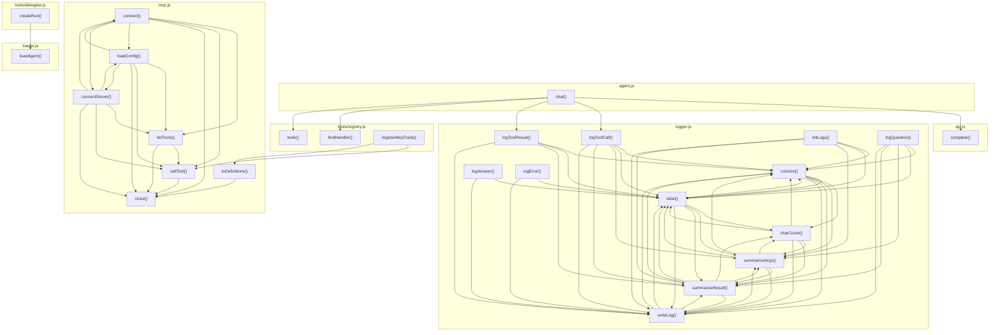

# 04_04_system — Mapa zależności funkcji

## Diagram Mermaid

## Tabela wywołań

| Funkcja | Plik | Wywołuje |
|---------|------|----------|
| `chat` | `agent.js` | `complete`, `logToolCall`, `logToolResult`, `findHandler`, `tools` |
| `complete` | `api.js` |  |
| `loadAgent` | `loader.js` |  |
| `initLogs` | `logger.js` | `colorize`, `label`, `summarizeArgs`, `summarizeResult`, `writeLog` |
| `logQuestion` | `logger.js` | `colorize`, `label`, `summarizeArgs`, `summarizeResult`, `writeLog` |
| `logToolCall` | `logger.js` | `colorize`, `label`, `summarizeArgs`, `summarizeResult`, `writeLog` |
| `logToolResult` | `logger.js` | `colorize`, `label`, `summarizeResult`, `writeLog` |
| `logAnswer` | `logger.js` | `label`, `writeLog` |
| `logError` | `logger.js` | `label`, `writeLog` |
| `colorize` | `logger.js` | `label`, `charCount`, `summarizeArgs`, `summarizeResult`, `writeLog` |
| `label` | `logger.js` | `colorize`, `charCount`, `summarizeArgs`, `summarizeResult`, `writeLog` |
| `charCount` | `logger.js` | `colorize`, `label`, `summarizeArgs`, `summarizeResult`, `writeLog` |
| `summarizeArgs` | `logger.js` | `colorize`, `label`, `charCount`, `summarizeResult`, `writeLog` |
| `summarizeResult` | `logger.js` | `colorize`, `label`, `charCount`, `summarizeArgs`, `writeLog` |
| `writeLog` | `logger.js` | `colorize`, `label`, `summarizeArgs`, `summarizeResult` |
| `connect` | `mcp.js` | `listTools`, `callTool`, `close`, `loadConfig`, `connectServer` |
| `listTools` | `mcp.js` | `callTool`, `close` |
| `callTool` | `mcp.js` | `close` |
| `toDefinitions` | `mcp.js` | `close` |
| `close` | `mcp.js` |  |
| `loadConfig` | `mcp.js` | `connect`, `listTools`, `callTool`, `close`, `connectServer` |
| `connectServer` | `mcp.js` | `connect`, `listTools`, `callTool`, `close`, `loadConfig` |
| `createRun` | `tools/delegate.js` | `loadAgent` |
| `registerMcpTools` | `tools/registry.js` | `callTool`, `toDefinitions` |
| `findHandler` | `tools/registry.js` |  |
| `tools` | `tools/registry.js` |  |