# 04_05_apps — Mapa zależności funkcji

## Diagram Mermaid

```mermaid
flowchart TD
  subgraph agent_js["agent.js"]
    runAgentTurn["runAgentTurn()"]
    parseJson["parseJson()"]
    formatAppContexts["formatAppContexts()"]
    resultToOutput["resultToOutput()"]
    toExecutionRecord["toExecutionRecord()"]
    buildFallbackResponse["buildFallbackResponse()"]
    normalizeText["normalizeText()"]
    executeNamedTool["executeNamedTool()"]
    toFunctionTool["toFunctionTool()"]
  end
  subgraph api_js["api.js"]
    extractToolCalls["extractToolCalls()"]
    extractText["extractText()"]
    complete["complete()"]
    extractMessageText["extractMessageText()"]
  end
  subgraph config_js["config.js"]
    hasAiAccess["hasAiAccess()"]
    resolveModel["resolveModel()"]
    loadLocalEnv["loadLocalEnv()"]
    parsePort["parsePort()"]
  end
  subgraph server_js["server.js"]
    startServer["startServer()"]
    json["json()"]
    readBody["readBody()"]
    ensureVendorBundles["ensureVendorBundles()"]
    safeStaticPath["safeStaticPath()"]
    serveFile["serveFile()"]
    formatBuildLogs["formatBuildLogs()"]
    tryServePublicFile["tryServePublicFile()"]
  end
  runAgentTurn --> parseJson
  runAgentTurn --> formatAppContexts
  runAgentTurn --> resultToOutput
  runAgentTurn --> toExecutionRecord
  runAgentTurn --> buildFallbackResponse
  runAgentTurn --> extractToolCalls
  runAgentTurn --> extractText
  runAgentTurn --> complete
  runAgentTurn --> hasAiAccess
  parseJson --> normalizeText
  parseJson --> resultToOutput
  parseJson --> toExecutionRecord
  parseJson --> executeNamedTool
  parseJson --> extractText
  normalizeText --> resultToOutput
  normalizeText --> toExecutionRecord
  normalizeText --> executeNamedTool
  normalizeText --> extractText
  formatAppContexts --> normalizeText
  formatAppContexts --> resultToOutput
  formatAppContexts --> toExecutionRecord
  formatAppContexts --> executeNamedTool
  formatAppContexts --> extractText
  toFunctionTool --> resultToOutput
  toFunctionTool --> toExecutionRecord
  toFunctionTool --> executeNamedTool
  toFunctionTool --> extractText
  resultToOutput --> toExecutionRecord
  resultToOutput --> executeNamedTool
  resultToOutput --> extractText
  toExecutionRecord --> resultToOutput
  toExecutionRecord --> executeNamedTool
  toExecutionRecord --> extractText
  executeNamedTool --> resultToOutput
  executeNamedTool --> toExecutionRecord
  executeNamedTool --> extractText
  buildFallbackResponse --> executeNamedTool
  extractToolCalls --> extractMessageText
  extractToolCalls --> hasAiAccess
  extractToolCalls --> resolveModel
  extractText --> extractMessageText
  extractText --> hasAiAccess
  extractText --> resolveModel
  complete --> extractMessageText
  complete --> hasAiAccess
  complete --> resolveModel
  extractMessageText --> hasAiAccess
  extractMessageText --> resolveModel
  loadLocalEnv --> parsePort
  startServer --> runAgentTurn
  startServer --> hasAiAccess
  startServer --> json
  startServer --> readBody
  startServer --> ensureVendorBundles
  json --> hasAiAccess
  json --> safeStaticPath
  json --> serveFile
  json --> formatBuildLogs
  json --> ensureVendorBundles
  readBody --> hasAiAccess
  readBody --> json
  readBody --> safeStaticPath
  readBody --> serveFile
  readBody --> formatBuildLogs
  readBody --> ensureVendorBundles
  safeStaticPath --> hasAiAccess
  safeStaticPath --> json
  safeStaticPath --> serveFile
  safeStaticPath --> formatBuildLogs
  safeStaticPath --> ensureVendorBundles
  serveFile --> hasAiAccess
  serveFile --> json
  serveFile --> safeStaticPath
  serveFile --> formatBuildLogs
  serveFile --> ensureVendorBundles
  tryServePublicFile --> hasAiAccess
  tryServePublicFile --> json
  tryServePublicFile --> safeStaticPath
  tryServePublicFile --> serveFile
  tryServePublicFile --> formatBuildLogs
  tryServePublicFile --> ensureVendorBundles
  formatBuildLogs --> hasAiAccess
  formatBuildLogs --> json
  formatBuildLogs --> ensureVendorBundles
  ensureVendorBundles --> hasAiAccess
  ensureVendorBundles --> json
  ensureVendorBundles --> formatBuildLogs
```

## Tabela wywołań

| Funkcja | Plik | Wywołuje |
|---------|------|----------|
| `runAgentTurn` | `agent.js` | `parseJson`, `formatAppContexts`, `resultToOutput`, `toExecutionRecord`, `buildFallbackResponse`, `extractToolCalls`, `extractText`, `complete`, `hasAiAccess` |
| `parseJson` | `agent.js` | `normalizeText`, `resultToOutput`, `toExecutionRecord`, `executeNamedTool`, `extractText` |
| `normalizeText` | `agent.js` | `resultToOutput`, `toExecutionRecord`, `executeNamedTool`, `extractText` |
| `formatAppContexts` | `agent.js` | `normalizeText`, `resultToOutput`, `toExecutionRecord`, `executeNamedTool`, `extractText` |
| `toFunctionTool` | `agent.js` | `resultToOutput`, `toExecutionRecord`, `executeNamedTool`, `extractText` |
| `resultToOutput` | `agent.js` | `toExecutionRecord`, `executeNamedTool`, `extractText` |
| `toExecutionRecord` | `agent.js` | `resultToOutput`, `executeNamedTool`, `extractText` |
| `executeNamedTool` | `agent.js` | `resultToOutput`, `toExecutionRecord`, `extractText` |
| `buildFallbackResponse` | `agent.js` | `executeNamedTool` |
| `extractToolCalls` | `api.js` | `extractMessageText`, `hasAiAccess`, `resolveModel` |
| `extractText` | `api.js` | `extractMessageText`, `hasAiAccess`, `resolveModel` |
| `complete` | `api.js` | `extractMessageText`, `hasAiAccess`, `resolveModel` |
| `extractMessageText` | `api.js` | `hasAiAccess`, `resolveModel` |
| `hasAiAccess` | `config.js` |  |
| `resolveModel` | `config.js` |  |
| `loadLocalEnv` | `config.js` | `parsePort` |
| `parsePort` | `config.js` |  |
| `startServer` | `server.js` | `runAgentTurn`, `hasAiAccess`, `json`, `readBody`, `ensureVendorBundles` |
| `json` | `server.js` | `hasAiAccess`, `safeStaticPath`, `serveFile`, `formatBuildLogs`, `ensureVendorBundles` |
| `readBody` | `server.js` | `hasAiAccess`, `json`, `safeStaticPath`, `serveFile`, `formatBuildLogs`, `ensureVendorBundles` |
| `safeStaticPath` | `server.js` | `hasAiAccess`, `json`, `serveFile`, `formatBuildLogs`, `ensureVendorBundles` |
| `serveFile` | `server.js` | `hasAiAccess`, `json`, `safeStaticPath`, `formatBuildLogs`, `ensureVendorBundles` |
| `tryServePublicFile` | `server.js` | `hasAiAccess`, `json`, `safeStaticPath`, `serveFile`, `formatBuildLogs`, `ensureVendorBundles` |
| `formatBuildLogs` | `server.js` | `hasAiAccess`, `json`, `ensureVendorBundles` |
| `ensureVendorBundles` | `server.js` | `hasAiAccess`, `json`, `formatBuildLogs` |