# 05_02_ui — Mapa zależności funkcji

## Diagram Mermaid

```mermaid
flowchart TD
  subgraph lib_runtime_incomplete_markdown["lib/runtime/incomplete-markdown"]
    hasIncompleteCodeFence["hasIncompleteCodeFence()"]
    prepareMarkdownForRender["prepareMarkdownForRender()"]
    hasTable["hasTable()"]
    repairIncompleteMarkdown["repairIncompleteMarkdown()"]
  end
  subgraph lib_runtime_materialize["lib/runtime/materialize"]
    materializeBlocks["materializeBlocks()"]
    applyEvent["applyEvent()"]
    findLatestOpenThinking["findLatestOpenThinking()"]
    updateTextRenderState["updateTextRenderState()"]
    createTextBlock["createTextBlock()"]
    closeStreamingText["closeStreamingText()"]
  end
  subgraph lib_runtime_streaming_markdown["lib/runtime/streaming-markdown"]
    rebuildIncrementalMarkdownView["rebuildIncrementalMarkdownView()"]
    syncIncrementalMarkdownView["syncIncrementalMarkdownView()"]
    createIncrementalMarkdownView["createIncrementalMarkdownView()"]
    splitBlocks["splitBlocks()"]
    toSegments["toSegments()"]
  end
  subgraph lib_runtime_parse_blocks["lib/runtime/parse-blocks"]
    parseMarkdownIntoBlocks["parseMarkdownIntoBlocks()"]
    countNonSelfClosingOpenTags["countNonSelfClosingOpenTags()"]
    countClosingTags["countClosingTags()"]
    countDoubleDollars["countDoubleDollars()"]
    parseMarkdownIntoBlocks["_parseMarkdownIntoBlocks()"]
    getOpenTagPattern["getOpenTagPattern()"]
    getCloseTagPattern["getCloseTagPattern()"]
  end
  subgraph lib_services_markdown["lib/services/markdown"]
    renderMarkdown["renderMarkdown()"]
    injectCaret["injectCaret()"]
    sanitizeHtml["sanitizeHtml()"]
    remember["remember()"]
    escapeHtml["escapeHtml()"]
    escapeAttribute["escapeAttribute()"]
    resolveLanguage["resolveLanguage()"]
    prettyLanguageLabel["prettyLanguageLabel()"]
    trimTrailingNewlines["trimTrailingNewlines()"]
    renderCodeBlock["renderCodeBlock()"]
    addSharedRendererRules["addSharedRendererRules()"]
    createMarkdownRenderer["createMarkdownRenderer()"]
  end
  subgraph lib_services_sse["lib/services/sse"]
    consumeSse["consumeSse()"]
    flushFrame["flushFrame()"]
  end
  subgraph lib_stores_chat_store_svelte["lib/stores/chat-store.svelte"]
    toUiMessage["toUiMessage()"]
    createChatStore["createChatStore()"]
  end
  subgraph lib_utils_perf["lib/utils/perf"]
    perfStats["perfStats()"]
    resetPerfStats["resetPerfStats()"]
    getBucket["getBucket()"]
  end
  hasIncompleteCodeFence --> prepareMarkdownForRender
  hasTable --> hasIncompleteCodeFence
  hasTable --> prepareMarkdownForRender
  prepareMarkdownForRender --> hasIncompleteCodeFence
  repairIncompleteMarkdown --> hasIncompleteCodeFence
  repairIncompleteMarkdown --> prepareMarkdownForRender
  materializeBlocks --> applyEvent
  materializeBlocks --> findLatestOpenThinking
  materializeBlocks --> updateTextRenderState
  materializeBlocks --> createTextBlock
  materializeBlocks --> closeStreamingText
  applyEvent --> findLatestOpenThinking
  applyEvent --> updateTextRenderState
  applyEvent --> createTextBlock
  applyEvent --> closeStreamingText
  findLatestOpenThinking --> applyEvent
  findLatestOpenThinking --> updateTextRenderState
  findLatestOpenThinking --> createTextBlock
  findLatestOpenThinking --> closeStreamingText
  findLatestOpenThinking --> rebuildIncrementalMarkdownView
  findLatestOpenThinking --> syncIncrementalMarkdownView
  updateTextRenderState --> applyEvent
  updateTextRenderState --> findLatestOpenThinking
  updateTextRenderState --> createTextBlock
  updateTextRenderState --> closeStreamingText
  updateTextRenderState --> rebuildIncrementalMarkdownView
  updateTextRenderState --> syncIncrementalMarkdownView
  createTextBlock --> applyEvent
  createTextBlock --> findLatestOpenThinking
  createTextBlock --> updateTextRenderState
  createTextBlock --> closeStreamingText
  createTextBlock --> rebuildIncrementalMarkdownView
  closeStreamingText --> applyEvent
  closeStreamingText --> findLatestOpenThinking
  closeStreamingText --> updateTextRenderState
  closeStreamingText --> createTextBlock
  parseMarkdownIntoBlocks --> countNonSelfClosingOpenTags
  parseMarkdownIntoBlocks --> countClosingTags
  parseMarkdownIntoBlocks --> countDoubleDollars
  parseMarkdownIntoBlocks --> parseMarkdownIntoBlocks
  getOpenTagPattern --> getCloseTagPattern
  getOpenTagPattern --> countNonSelfClosingOpenTags
  getOpenTagPattern --> countClosingTags
  getOpenTagPattern --> parseMarkdownIntoBlocks
  getCloseTagPattern --> getOpenTagPattern
  getCloseTagPattern --> countNonSelfClosingOpenTags
  getCloseTagPattern --> countClosingTags
  getCloseTagPattern --> parseMarkdownIntoBlocks
  countNonSelfClosingOpenTags --> getOpenTagPattern
  countNonSelfClosingOpenTags --> getCloseTagPattern
  countNonSelfClosingOpenTags --> countClosingTags
  countNonSelfClosingOpenTags --> countDoubleDollars
  countNonSelfClosingOpenTags --> parseMarkdownIntoBlocks
  countClosingTags --> getCloseTagPattern
  countClosingTags --> countNonSelfClosingOpenTags
  countClosingTags --> countDoubleDollars
  countClosingTags --> parseMarkdownIntoBlocks
  countDoubleDollars --> countNonSelfClosingOpenTags
  countDoubleDollars --> countClosingTags
  countDoubleDollars --> parseMarkdownIntoBlocks
  parseMarkdownIntoBlocks --> countNonSelfClosingOpenTags
  parseMarkdownIntoBlocks --> countClosingTags
  parseMarkdownIntoBlocks --> countDoubleDollars
  createIncrementalMarkdownView --> parseMarkdownIntoBlocks
  createIncrementalMarkdownView --> rebuildIncrementalMarkdownView
  createIncrementalMarkdownView --> splitBlocks
  createIncrementalMarkdownView --> toSegments
  rebuildIncrementalMarkdownView --> parseMarkdownIntoBlocks
  rebuildIncrementalMarkdownView --> createIncrementalMarkdownView
  rebuildIncrementalMarkdownView --> splitBlocks
  rebuildIncrementalMarkdownView --> toSegments
  syncIncrementalMarkdownView --> parseMarkdownIntoBlocks
  syncIncrementalMarkdownView --> createIncrementalMarkdownView
  syncIncrementalMarkdownView --> rebuildIncrementalMarkdownView
  syncIncrementalMarkdownView --> splitBlocks
  syncIncrementalMarkdownView --> toSegments
  splitBlocks --> parseMarkdownIntoBlocks
  splitBlocks --> createIncrementalMarkdownView
  splitBlocks --> rebuildIncrementalMarkdownView
  splitBlocks --> toSegments
  toSegments --> parseMarkdownIntoBlocks
  toSegments --> createIncrementalMarkdownView
  toSegments --> rebuildIncrementalMarkdownView
  toSegments --> splitBlocks
  renderMarkdown --> injectCaret
  renderMarkdown --> sanitizeHtml
  renderMarkdown --> remember
  escapeHtml --> escapeAttribute
  escapeHtml --> resolveLanguage
  escapeHtml --> prettyLanguageLabel
  escapeHtml --> trimTrailingNewlines
  escapeAttribute --> escapeHtml
  escapeAttribute --> resolveLanguage
  escapeAttribute --> prettyLanguageLabel
  escapeAttribute --> trimTrailingNewlines
  resolveLanguage --> escapeHtml
  resolveLanguage --> escapeAttribute
  resolveLanguage --> prettyLanguageLabel
  resolveLanguage --> trimTrailingNewlines
  prettyLanguageLabel --> escapeHtml
  prettyLanguageLabel --> escapeAttribute
  prettyLanguageLabel --> resolveLanguage
  prettyLanguageLabel --> trimTrailingNewlines
  trimTrailingNewlines --> escapeHtml
  trimTrailingNewlines --> escapeAttribute
  trimTrailingNewlines --> resolveLanguage
  trimTrailingNewlines --> prettyLanguageLabel
  trimTrailingNewlines --> renderCodeBlock
  renderCodeBlock --> escapeHtml
  renderCodeBlock --> escapeAttribute
  renderCodeBlock --> resolveLanguage
  renderCodeBlock --> prettyLanguageLabel
  renderCodeBlock --> trimTrailingNewlines
  renderCodeBlock --> addSharedRendererRules
  renderCodeBlock --> createMarkdownRenderer
  addSharedRendererRules --> renderCodeBlock
  addSharedRendererRules --> createMarkdownRenderer
  createMarkdownRenderer --> addSharedRendererRules
  createMarkdownRenderer --> injectCaret
  createMarkdownRenderer --> sanitizeHtml
  createMarkdownRenderer --> remember
  injectCaret --> sanitizeHtml
  injectCaret --> remember
  sanitizeHtml --> injectCaret
  sanitizeHtml --> remember
  remember --> injectCaret
  remember --> sanitizeHtml
  consumeSse --> flushFrame
  toUiMessage --> materializeBlocks
  toUiMessage --> applyEvent
  createChatStore --> applyEvent
  perfStats --> resetPerfStats
  resetPerfStats --> perfStats
  getBucket --> perfStats
  getBucket --> resetPerfStats
```

## Tabela wywołań

| Funkcja | Plik | Wywołuje |
|---------|------|----------|
| `hasIncompleteCodeFence` | `lib/runtime/incomplete-markdown.ts` | `prepareMarkdownForRender` |
| `hasTable` | `lib/runtime/incomplete-markdown.ts` | `hasIncompleteCodeFence`, `prepareMarkdownForRender` |
| `prepareMarkdownForRender` | `lib/runtime/incomplete-markdown.ts` | `hasIncompleteCodeFence` |
| `repairIncompleteMarkdown` | `lib/runtime/incomplete-markdown.ts` | `hasIncompleteCodeFence`, `prepareMarkdownForRender` |
| `materializeBlocks` | `lib/runtime/materialize.ts` | `applyEvent`, `findLatestOpenThinking`, `updateTextRenderState`, `createTextBlock`, `closeStreamingText` |
| `applyEvent` | `lib/runtime/materialize.ts` | `findLatestOpenThinking`, `updateTextRenderState`, `createTextBlock`, `closeStreamingText` |
| `findLatestOpenThinking` | `lib/runtime/materialize.ts` | `applyEvent`, `updateTextRenderState`, `createTextBlock`, `closeStreamingText`, `rebuildIncrementalMarkdownView`, `syncIncrementalMarkdownView` |
| `updateTextRenderState` | `lib/runtime/materialize.ts` | `applyEvent`, `findLatestOpenThinking`, `createTextBlock`, `closeStreamingText`, `rebuildIncrementalMarkdownView`, `syncIncrementalMarkdownView` |
| `createTextBlock` | `lib/runtime/materialize.ts` | `applyEvent`, `findLatestOpenThinking`, `updateTextRenderState`, `closeStreamingText`, `rebuildIncrementalMarkdownView` |
| `closeStreamingText` | `lib/runtime/materialize.ts` | `applyEvent`, `findLatestOpenThinking`, `updateTextRenderState`, `createTextBlock` |
| `parseMarkdownIntoBlocks` | `lib/runtime/parse-blocks.ts` | `countNonSelfClosingOpenTags`, `countClosingTags`, `countDoubleDollars`, `_parseMarkdownIntoBlocks` |
| `getOpenTagPattern` | `lib/runtime/parse-blocks.ts` | `getCloseTagPattern`, `countNonSelfClosingOpenTags`, `countClosingTags`, `_parseMarkdownIntoBlocks` |
| `getCloseTagPattern` | `lib/runtime/parse-blocks.ts` | `getOpenTagPattern`, `countNonSelfClosingOpenTags`, `countClosingTags`, `_parseMarkdownIntoBlocks` |
| `countNonSelfClosingOpenTags` | `lib/runtime/parse-blocks.ts` | `getOpenTagPattern`, `getCloseTagPattern`, `countClosingTags`, `countDoubleDollars`, `_parseMarkdownIntoBlocks` |
| `countClosingTags` | `lib/runtime/parse-blocks.ts` | `getCloseTagPattern`, `countNonSelfClosingOpenTags`, `countDoubleDollars`, `_parseMarkdownIntoBlocks` |
| `countDoubleDollars` | `lib/runtime/parse-blocks.ts` | `countNonSelfClosingOpenTags`, `countClosingTags`, `_parseMarkdownIntoBlocks` |
| `_parseMarkdownIntoBlocks` | `lib/runtime/parse-blocks.ts` | `countNonSelfClosingOpenTags`, `countClosingTags`, `countDoubleDollars` |
| `createIncrementalMarkdownView` | `lib/runtime/streaming-markdown.ts` | `parseMarkdownIntoBlocks`, `rebuildIncrementalMarkdownView`, `splitBlocks`, `toSegments` |
| `rebuildIncrementalMarkdownView` | `lib/runtime/streaming-markdown.ts` | `parseMarkdownIntoBlocks`, `createIncrementalMarkdownView`, `splitBlocks`, `toSegments` |
| `syncIncrementalMarkdownView` | `lib/runtime/streaming-markdown.ts` | `parseMarkdownIntoBlocks`, `createIncrementalMarkdownView`, `rebuildIncrementalMarkdownView`, `splitBlocks`, `toSegments` |
| `splitBlocks` | `lib/runtime/streaming-markdown.ts` | `parseMarkdownIntoBlocks`, `createIncrementalMarkdownView`, `rebuildIncrementalMarkdownView`, `toSegments` |
| `toSegments` | `lib/runtime/streaming-markdown.ts` | `parseMarkdownIntoBlocks`, `createIncrementalMarkdownView`, `rebuildIncrementalMarkdownView`, `splitBlocks` |
| `renderMarkdown` | `lib/services/markdown.ts` | `injectCaret`, `sanitizeHtml`, `remember` |
| `escapeHtml` | `lib/services/markdown.ts` | `escapeAttribute`, `resolveLanguage`, `prettyLanguageLabel`, `trimTrailingNewlines` |
| `escapeAttribute` | `lib/services/markdown.ts` | `escapeHtml`, `resolveLanguage`, `prettyLanguageLabel`, `trimTrailingNewlines` |
| `resolveLanguage` | `lib/services/markdown.ts` | `escapeHtml`, `escapeAttribute`, `prettyLanguageLabel`, `trimTrailingNewlines` |
| `prettyLanguageLabel` | `lib/services/markdown.ts` | `escapeHtml`, `escapeAttribute`, `resolveLanguage`, `trimTrailingNewlines` |
| `trimTrailingNewlines` | `lib/services/markdown.ts` | `escapeHtml`, `escapeAttribute`, `resolveLanguage`, `prettyLanguageLabel`, `renderCodeBlock` |
| `renderCodeBlock` | `lib/services/markdown.ts` | `escapeHtml`, `escapeAttribute`, `resolveLanguage`, `prettyLanguageLabel`, `trimTrailingNewlines`, `addSharedRendererRules`, `createMarkdownRenderer` |
| `addSharedRendererRules` | `lib/services/markdown.ts` | `renderCodeBlock`, `createMarkdownRenderer` |
| `createMarkdownRenderer` | `lib/services/markdown.ts` | `addSharedRendererRules`, `injectCaret`, `sanitizeHtml`, `remember` |
| `injectCaret` | `lib/services/markdown.ts` | `sanitizeHtml`, `remember` |
| `sanitizeHtml` | `lib/services/markdown.ts` | `injectCaret`, `remember` |
| `remember` | `lib/services/markdown.ts` | `injectCaret`, `sanitizeHtml` |
| `consumeSse` | `lib/services/sse.ts` | `flushFrame` |
| `flushFrame` | `lib/services/sse.ts` |  |
| `toUiMessage` | `lib/stores/chat-store.svelte.ts` | `materializeBlocks`, `applyEvent` |
| `createChatStore` | `lib/stores/chat-store.svelte.ts` | `applyEvent` |
| `perfStats` | `lib/utils/perf.ts` | `resetPerfStats` |
| `resetPerfStats` | `lib/utils/perf.ts` | `perfStats` |
| `getBucket` | `lib/utils/perf.ts` | `perfStats`, `resetPerfStats` |