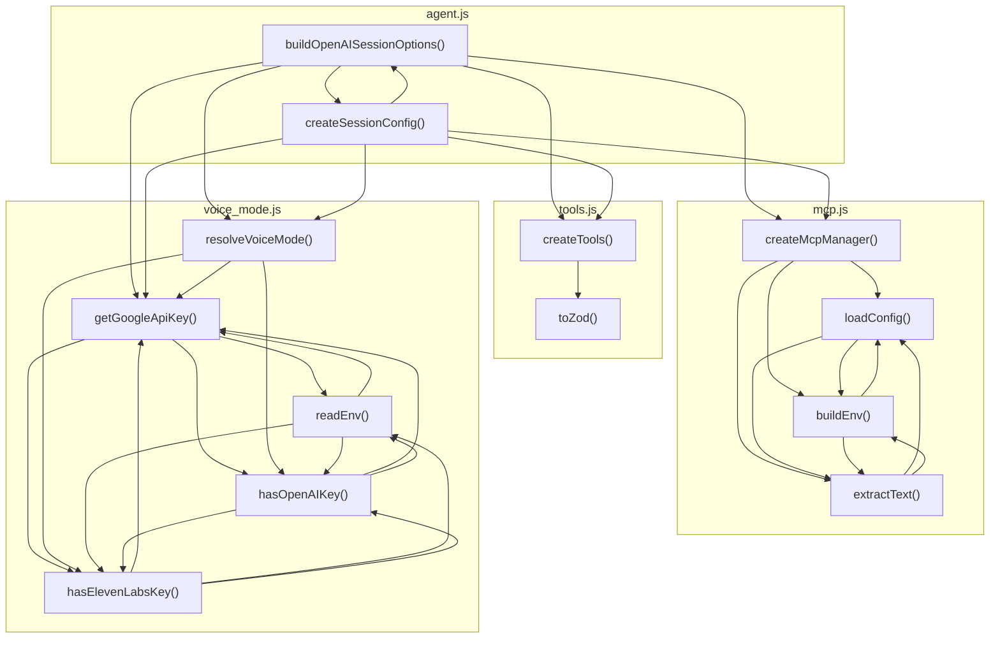

# 05_02_voice — Mapa zależności funkcji

## Diagram Mermaid

## Tabela wywołań

| Funkcja | Plik | Wywołuje |
|---------|------|----------|
| `buildOpenAISessionOptions` | `agent.js` | `createSessionConfig`, `createMcpManager`, `createTools`, `getGoogleApiKey`, `resolveVoiceMode` |
| `createSessionConfig` | `agent.js` | `buildOpenAISessionOptions`, `createMcpManager`, `createTools`, `getGoogleApiKey`, `resolveVoiceMode` |
| `createMcpManager` | `mcp.js` | `loadConfig`, `buildEnv`, `extractText` |
| `loadConfig` | `mcp.js` | `buildEnv`, `extractText` |
| `buildEnv` | `mcp.js` | `loadConfig`, `extractText` |
| `extractText` | `mcp.js` | `loadConfig`, `buildEnv` |
| `createTools` | `tools.js` | `toZod` |
| `toZod` | `tools.js` |  |
| `getGoogleApiKey` | `voice_mode.js` | `readEnv`, `hasOpenAIKey`, `hasElevenLabsKey` |
| `resolveVoiceMode` | `voice_mode.js` | `getGoogleApiKey`, `hasOpenAIKey`, `hasElevenLabsKey` |
| `readEnv` | `voice_mode.js` | `getGoogleApiKey`, `hasOpenAIKey`, `hasElevenLabsKey` |
| `hasOpenAIKey` | `voice_mode.js` | `getGoogleApiKey`, `readEnv`, `hasElevenLabsKey` |
| `hasElevenLabsKey` | `voice_mode.js` | `getGoogleApiKey`, `readEnv`, `hasOpenAIKey` |