# 05_03_autoprompt — Mapa zależności funkcji

## Diagram Mermaid

```mermaid
flowchart TD
  subgraph cli_console_reporter_js["cli/console-reporter.js"]
    createOptimizeReporter["createOptimizeReporter()"]
    dim["dim()"]
    green["green()"]
    red["red()"]
    yellow["yellow()"]
    bold["bold()"]
    cyan["cyan()"]
    formatModelProfile["formatModelProfile()"]
    bar["bar()"]
    printCaseResult["printCaseResult()"]
    printVerifyResult["printVerifyResult()"]
  end
  subgraph cli_optimize_js["cli/optimize.js"]
    runOptimizeCli["runOptimizeCli()"]
    usage["usage()"]
    parseArgs["parseArgs()"]
  end
  subgraph core_optimize_project_js["core/optimize-project.js"]
    optimizeProject["optimizeProject()"]
    buildCandidateStrategies["buildCandidateStrategies()"]
    averageSectionScores["averageSectionScores()"]
    computeSectionDeltas["computeSectionDeltas()"]
    formatSectionSummary["formatSectionSummary()"]
    formatSectionDeltaSummary["formatSectionDeltaSummary()"]
    toHistoryEntry["toHistoryEntry()"]
    compareCandidateIterations["compareCandidateIterations()"]
  end
  subgraph project_load_project_js["project/load-project.js"]
    loadProject["loadProject()"]
    loadModule["loadModule()"]
    normalizeSchemaExport["normalizeSchemaExport()"]
    normalizeModels["normalizeModels()"]
    loadTestCases["loadTestCases()"]
    normalizeModelProfile["normalizeModelProfile()"]
  end
  subgraph run_artifacts_write_optimize_run_js["run-artifacts/write-optimize-run.js"]
    writeOptimizeRun["writeOptimizeRun()"]
    timestamp["timestamp()"]
    writeDiffLog["writeDiffLog()"]
  end
  subgraph cli_verify_js["cli/verify.js"]
    runVerifyCli["runVerifyCli()"]
  end
  subgraph core_run_evaluation_js["core/run-evaluation.js"]
    runSingleEvaluation["runSingleEvaluation()"]
    runEvaluation["runEvaluation()"]
    buildUserMessage["buildUserMessage()"]
  end
  subgraph core_improve_prompt_js["core/improve-prompt.js"]
    detectStuck["detectStuck()"]
    formatBreakdown["formatBreakdown()"]
    parseImproverResponse["parseImproverResponse()"]
    buildImproverMessage["buildImproverMessage()"]
    suggestPromptImprovement["suggestPromptImprovement()"]
  end
  subgraph core_format_evaluation_policy_js["core/format-evaluation-policy.js"]
    formatEvaluationPolicy["formatEvaluationPolicy()"]
  end
  subgraph llm_complete_js["llm/complete.js"]
    complete["complete()"]
  end
  subgraph core_score_batch_js["core/score-batch.js"]
    scoreBatch["scoreBatch()"]
    buildJudgeSchema["buildJudgeSchema()"]
  end
  subgraph prompts_judge_system_js["prompts/judge-system.js"]
    buildJudgeSystem["buildJudgeSystem()"]
  end
  subgraph llm_trace_js["llm/trace.js"]
    recordTrace["recordTrace()"]
    collectTraces["collectTraces()"]
  end
  subgraph project_validate_project_js["project/validate-project.js"]
    validateProject["validateProject()"]
    fail["fail()"]
  end
  createOptimizeReporter --> dim
  createOptimizeReporter --> green
  createOptimizeReporter --> red
  createOptimizeReporter --> yellow
  createOptimizeReporter --> bold
  createOptimizeReporter --> cyan
  createOptimizeReporter --> formatModelProfile
  createOptimizeReporter --> bar
  createOptimizeReporter --> printCaseResult
  printVerifyResult --> dim
  printVerifyResult --> bold
  printVerifyResult --> formatModelProfile
  printVerifyResult --> bar
  printVerifyResult --> printCaseResult
  dim --> green
  dim --> red
  dim --> yellow
  dim --> bold
  dim --> cyan
  dim --> formatModelProfile
  dim --> bar
  dim --> printCaseResult
  green --> dim
  green --> red
  green --> yellow
  green --> bold
  green --> cyan
  green --> formatModelProfile
  green --> bar
  green --> printCaseResult
  red --> dim
  red --> green
  red --> yellow
  red --> bold
  red --> cyan
  red --> formatModelProfile
  red --> bar
  red --> printCaseResult
  yellow --> dim
  yellow --> green
  yellow --> red
  yellow --> bold
  yellow --> cyan
  yellow --> formatModelProfile
  yellow --> bar
  yellow --> printCaseResult
  bold --> dim
  bold --> green
  bold --> red
  bold --> yellow
  bold --> cyan
  bold --> formatModelProfile
  bold --> bar
  bold --> printCaseResult
  cyan --> dim
  cyan --> green
  cyan --> red
  cyan --> yellow
  cyan --> bold
  cyan --> formatModelProfile
  cyan --> bar
  cyan --> printCaseResult
  formatModelProfile --> dim
  formatModelProfile --> green
  formatModelProfile --> red
  formatModelProfile --> yellow
  formatModelProfile --> bold
  formatModelProfile --> cyan
  formatModelProfile --> bar
  formatModelProfile --> printCaseResult
  bar --> dim
  bar --> green
  bar --> red
  bar --> yellow
  bar --> bold
  bar --> cyan
  bar --> formatModelProfile
  bar --> printCaseResult
  printCaseResult --> dim
  printCaseResult --> green
  printCaseResult --> red
  printCaseResult --> yellow
  printCaseResult --> bold
  printCaseResult --> cyan
  printCaseResult --> formatModelProfile
  printCaseResult --> bar
  runOptimizeCli --> createOptimizeReporter
  runOptimizeCli --> usage
  runOptimizeCli --> parseArgs
  runOptimizeCli --> optimizeProject
  runOptimizeCli --> loadProject
  runOptimizeCli --> writeOptimizeRun
  usage --> createOptimizeReporter
  usage --> runOptimizeCli
  usage --> parseArgs
  usage --> optimizeProject
  usage --> loadProject
  usage --> writeOptimizeRun
  usage --> printVerifyResult
  usage --> runVerifyCli
  usage --> runSingleEvaluation
  parseArgs --> createOptimizeReporter
  parseArgs --> runOptimizeCli
  parseArgs --> usage
  parseArgs --> optimizeProject
  parseArgs --> loadProject
  parseArgs --> writeOptimizeRun
  parseArgs --> printVerifyResult
  parseArgs --> runVerifyCli
  parseArgs --> runSingleEvaluation
  runVerifyCli --> printVerifyResult
  runVerifyCli --> usage
  runVerifyCli --> parseArgs
  runVerifyCli --> runSingleEvaluation
  runVerifyCli --> loadProject
  detectStuck --> formatBreakdown
  parseImproverResponse --> formatEvaluationPolicy
  parseImproverResponse --> detectStuck
  parseImproverResponse --> formatBreakdown
  buildImproverMessage --> formatEvaluationPolicy
  buildImproverMessage --> detectStuck
  buildImproverMessage --> formatBreakdown
  buildImproverMessage --> complete
  suggestPromptImprovement --> parseImproverResponse
  suggestPromptImprovement --> buildImproverMessage
  suggestPromptImprovement --> complete
  optimizeProject --> suggestPromptImprovement
  optimizeProject --> buildCandidateStrategies
  optimizeProject --> averageSectionScores
  optimizeProject --> runEvaluation
  buildCandidateStrategies --> runEvaluation
  averageSectionScores --> runEvaluation
  computeSectionDeltas --> suggestPromptImprovement
  computeSectionDeltas --> buildCandidateStrategies
  computeSectionDeltas --> averageSectionScores
  computeSectionDeltas --> runEvaluation
  formatSectionSummary --> suggestPromptImprovement
  formatSectionSummary --> buildCandidateStrategies
  formatSectionSummary --> averageSectionScores
  formatSectionSummary --> runEvaluation
  formatSectionDeltaSummary --> suggestPromptImprovement
  formatSectionDeltaSummary --> buildCandidateStrategies
  formatSectionDeltaSummary --> averageSectionScores
  formatSectionDeltaSummary --> runEvaluation
  toHistoryEntry --> suggestPromptImprovement
  toHistoryEntry --> buildCandidateStrategies
  toHistoryEntry --> averageSectionScores
  toHistoryEntry --> runEvaluation
  compareCandidateIterations --> suggestPromptImprovement
  compareCandidateIterations --> buildCandidateStrategies
  compareCandidateIterations --> averageSectionScores
  compareCandidateIterations --> runEvaluation
  runSingleEvaluation --> buildUserMessage
  runSingleEvaluation --> scoreBatch
  runSingleEvaluation --> complete
  runEvaluation --> runSingleEvaluation
  buildUserMessage --> runSingleEvaluation
  buildUserMessage --> scoreBatch
  buildUserMessage --> complete
  scoreBatch --> buildJudgeSchema
  scoreBatch --> complete
  scoreBatch --> buildJudgeSystem
  buildJudgeSchema --> complete
  buildJudgeSchema --> buildJudgeSystem
  complete --> recordTrace
  loadProject --> loadModule
  loadProject --> normalizeSchemaExport
  loadProject --> normalizeModels
  loadProject --> loadTestCases
  loadProject --> validateProject
  loadModule --> normalizeModelProfile
  loadModule --> normalizeModels
  normalizeSchemaExport --> loadModule
  normalizeSchemaExport --> normalizeModelProfile
  normalizeSchemaExport --> normalizeModels
  normalizeModelProfile --> loadModule
  normalizeModelProfile --> normalizeSchemaExport
  normalizeModelProfile --> normalizeModels
  normalizeModelProfile --> loadTestCases
  normalizeModelProfile --> validateProject
  normalizeModels --> loadModule
  normalizeModels --> normalizeSchemaExport
  normalizeModels --> normalizeModelProfile
  normalizeModels --> loadTestCases
  normalizeModels --> validateProject
  loadTestCases --> loadModule
  loadTestCases --> normalizeSchemaExport
  loadTestCases --> normalizeModels
  loadTestCases --> validateProject
  validateProject --> fail
  buildJudgeSystem --> formatEvaluationPolicy
  writeOptimizeRun --> collectTraces
  writeOptimizeRun --> timestamp
  writeOptimizeRun --> writeDiffLog
  timestamp --> collectTraces
  timestamp --> writeDiffLog
  writeDiffLog --> collectTraces
  writeDiffLog --> timestamp
```

## Tabela wywołań

| Funkcja | Plik | Wywołuje |
|---------|------|----------|
| `createOptimizeReporter` | `cli/console-reporter.js` | `dim`, `green`, `red`, `yellow`, `bold`, `cyan`, `formatModelProfile`, `bar`, `printCaseResult` |
| `printVerifyResult` | `cli/console-reporter.js` | `dim`, `bold`, `formatModelProfile`, `bar`, `printCaseResult` |
| `dim` | `cli/console-reporter.js` | `green`, `red`, `yellow`, `bold`, `cyan`, `formatModelProfile`, `bar`, `printCaseResult` |
| `green` | `cli/console-reporter.js` | `dim`, `red`, `yellow`, `bold`, `cyan`, `formatModelProfile`, `bar`, `printCaseResult` |
| `red` | `cli/console-reporter.js` | `dim`, `green`, `yellow`, `bold`, `cyan`, `formatModelProfile`, `bar`, `printCaseResult` |
| `yellow` | `cli/console-reporter.js` | `dim`, `green`, `red`, `bold`, `cyan`, `formatModelProfile`, `bar`, `printCaseResult` |
| `bold` | `cli/console-reporter.js` | `dim`, `green`, `red`, `yellow`, `cyan`, `formatModelProfile`, `bar`, `printCaseResult` |
| `cyan` | `cli/console-reporter.js` | `dim`, `green`, `red`, `yellow`, `bold`, `formatModelProfile`, `bar`, `printCaseResult` |
| `formatModelProfile` | `cli/console-reporter.js` | `dim`, `green`, `red`, `yellow`, `bold`, `cyan`, `bar`, `printCaseResult` |
| `bar` | `cli/console-reporter.js` | `dim`, `green`, `red`, `yellow`, `bold`, `cyan`, `formatModelProfile`, `printCaseResult` |
| `printCaseResult` | `cli/console-reporter.js` | `dim`, `green`, `red`, `yellow`, `bold`, `cyan`, `formatModelProfile`, `bar` |
| `runOptimizeCli` | `cli/optimize.js` | `createOptimizeReporter`, `usage`, `parseArgs`, `optimizeProject`, `loadProject`, `writeOptimizeRun` |
| `usage` | `cli/optimize.js` | `createOptimizeReporter`, `runOptimizeCli`, `parseArgs`, `optimizeProject`, `loadProject`, `writeOptimizeRun`, `printVerifyResult`, `runVerifyCli`, `runSingleEvaluation` |
| `parseArgs` | `cli/optimize.js` | `createOptimizeReporter`, `runOptimizeCli`, `usage`, `optimizeProject`, `loadProject`, `writeOptimizeRun`, `printVerifyResult`, `runVerifyCli`, `runSingleEvaluation` |
| `runVerifyCli` | `cli/verify.js` | `printVerifyResult`, `usage`, `parseArgs`, `runSingleEvaluation`, `loadProject` |
| `formatEvaluationPolicy` | `core/format-evaluation-policy.js` |  |
| `detectStuck` | `core/improve-prompt.js` | `formatBreakdown` |
| `parseImproverResponse` | `core/improve-prompt.js` | `formatEvaluationPolicy`, `detectStuck`, `formatBreakdown` |
| `buildImproverMessage` | `core/improve-prompt.js` | `formatEvaluationPolicy`, `detectStuck`, `formatBreakdown`, `complete` |
| `suggestPromptImprovement` | `core/improve-prompt.js` | `parseImproverResponse`, `buildImproverMessage`, `complete` |
| `formatBreakdown` | `core/improve-prompt.js` |  |
| `optimizeProject` | `core/optimize-project.js` | `suggestPromptImprovement`, `buildCandidateStrategies`, `averageSectionScores`, `runEvaluation` |
| `buildCandidateStrategies` | `core/optimize-project.js` | `runEvaluation` |
| `averageSectionScores` | `core/optimize-project.js` | `runEvaluation` |
| `computeSectionDeltas` | `core/optimize-project.js` | `suggestPromptImprovement`, `buildCandidateStrategies`, `averageSectionScores`, `runEvaluation` |
| `formatSectionSummary` | `core/optimize-project.js` | `suggestPromptImprovement`, `buildCandidateStrategies`, `averageSectionScores`, `runEvaluation` |
| `formatSectionDeltaSummary` | `core/optimize-project.js` | `suggestPromptImprovement`, `buildCandidateStrategies`, `averageSectionScores`, `runEvaluation` |
| `toHistoryEntry` | `core/optimize-project.js` | `suggestPromptImprovement`, `buildCandidateStrategies`, `averageSectionScores`, `runEvaluation` |
| `compareCandidateIterations` | `core/optimize-project.js` | `suggestPromptImprovement`, `buildCandidateStrategies`, `averageSectionScores`, `runEvaluation` |
| `runSingleEvaluation` | `core/run-evaluation.js` | `buildUserMessage`, `scoreBatch`, `complete` |
| `runEvaluation` | `core/run-evaluation.js` | `runSingleEvaluation` |
| `buildUserMessage` | `core/run-evaluation.js` | `runSingleEvaluation`, `scoreBatch`, `complete` |
| `scoreBatch` | `core/score-batch.js` | `buildJudgeSchema`, `complete`, `buildJudgeSystem` |
| `buildJudgeSchema` | `core/score-batch.js` | `complete`, `buildJudgeSystem` |
| `complete` | `llm/complete.js` | `recordTrace` |
| `recordTrace` | `llm/trace.js` |  |
| `collectTraces` | `llm/trace.js` |  |
| `loadProject` | `project/load-project.js` | `loadModule`, `normalizeSchemaExport`, `normalizeModels`, `loadTestCases`, `validateProject` |
| `loadModule` | `project/load-project.js` | `normalizeModelProfile`, `normalizeModels` |
| `normalizeSchemaExport` | `project/load-project.js` | `loadModule`, `normalizeModelProfile`, `normalizeModels` |
| `normalizeModelProfile` | `project/load-project.js` | `loadModule`, `normalizeSchemaExport`, `normalizeModels`, `loadTestCases`, `validateProject` |
| `normalizeModels` | `project/load-project.js` | `loadModule`, `normalizeSchemaExport`, `normalizeModelProfile`, `loadTestCases`, `validateProject` |
| `loadTestCases` | `project/load-project.js` | `loadModule`, `normalizeSchemaExport`, `normalizeModels`, `validateProject` |
| `validateProject` | `project/validate-project.js` | `fail` |
| `fail` | `project/validate-project.js` |  |
| `buildJudgeSystem` | `prompts/judge-system.js` | `formatEvaluationPolicy` |
| `writeOptimizeRun` | `run-artifacts/write-optimize-run.js` | `collectTraces`, `timestamp`, `writeDiffLog` |
| `timestamp` | `run-artifacts/write-optimize-run.js` | `collectTraces`, `writeDiffLog` |
| `writeDiffLog` | `run-artifacts/write-optimize-run.js` | `collectTraces`, `timestamp` |