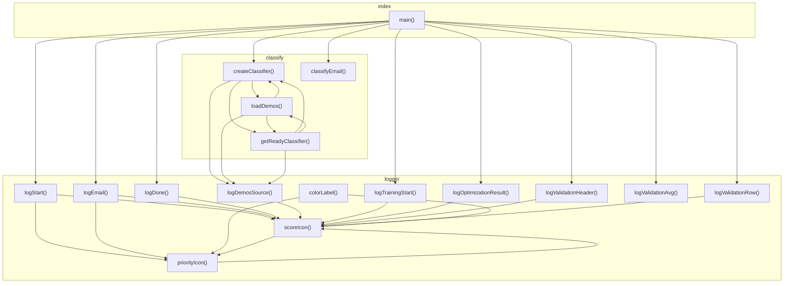

# 05_03_ax — Mapa zależności funkcji

## Diagram Mermaid

## Tabela wywołań

| Funkcja | Plik | Wywołuje |
|---------|------|----------|
| `createClassifier` | `classify.ts` | `loadDemos`, `getReadyClassifier`, `logDemosSource` |
| `classifyEmail` | `classify.ts` |  |
| `loadDemos` | `classify.ts` | `createClassifier`, `getReadyClassifier`, `logDemosSource` |
| `getReadyClassifier` | `classify.ts` | `createClassifier`, `loadDemos`, `logDemosSource` |
| `main` | `index.ts` | `classifyEmail`, `logStart`, `logEmail`, `logDone`, `createClassifier`, `logTrainingStart`, `logOptimizationResult`, `logValidationHeader`, `logValidationRow`, `logValidationAvg` |
| `logStart` | `logger.ts` | `priorityIcon`, `scoreIcon` |
| `logEmail` | `logger.ts` | `priorityIcon`, `scoreIcon` |
| `logDone` | `logger.ts` | `scoreIcon` |
| `logDemosSource` | `logger.ts` | `scoreIcon` |
| `logTrainingStart` | `logger.ts` | `scoreIcon` |
| `logOptimizationResult` | `logger.ts` | `scoreIcon` |
| `logValidationHeader` | `logger.ts` | `scoreIcon` |
| `logValidationRow` | `logger.ts` | `scoreIcon` |
| `logValidationAvg` | `logger.ts` |  |
| `colorLabel` | `logger.ts` | `priorityIcon`, `scoreIcon` |
| `priorityIcon` | `logger.ts` | `scoreIcon` |
| `scoreIcon` | `logger.ts` | `priorityIcon` |