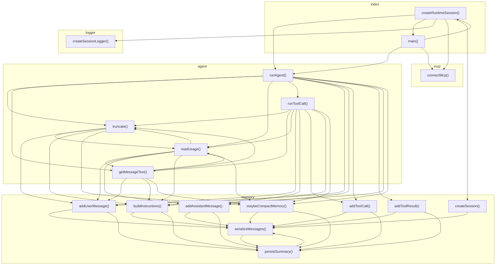

# 05_03_coding — Mapa zależności funkcji

## Diagram Mermaid

## Tabela wywołań

| Funkcja | Plik | Wywołuje |
|---------|------|----------|
| `runAgent` | `agent.ts` | `truncate`, `getMessageText`, `readUsage`, `runToolCall`, `addUserMessage`, `addAssistantMessage`, `addToolCall`, `addToolResult`, `buildInstructions`, `maybeCompactMemory` |
| `truncate` | `agent.ts` | `readUsage`, `addUserMessage`, `buildInstructions`, `maybeCompactMemory` |
| `getMessageText` | `agent.ts` | `truncate`, `readUsage`, `addUserMessage`, `buildInstructions`, `maybeCompactMemory` |
| `readUsage` | `agent.ts` | `truncate`, `getMessageText`, `addUserMessage`, `addAssistantMessage`, `buildInstructions`, `maybeCompactMemory` |
| `runToolCall` | `agent.ts` | `truncate`, `getMessageText`, `readUsage`, `addUserMessage`, `addAssistantMessage`, `addToolCall`, `buildInstructions`, `maybeCompactMemory` |
| `createRuntimeSession` | `index.ts` | `runAgent`, `main`, `createSessionLogger`, `connectMcp`, `createSession` |
| `main` | `index.ts` | `runAgent`, `createRuntimeSession`, `connectMcp` |
| `createSessionLogger` | `logger.ts` |  |
| `connectMcp` | `mcp.ts` |  |
| `createSession` | `memory.ts` | `serializeMessages` |
| `addUserMessage` | `memory.ts` | `serializeMessages`, `persistSummary` |
| `addAssistantMessage` | `memory.ts` | `serializeMessages`, `persistSummary` |
| `addToolCall` | `memory.ts` | `serializeMessages`, `persistSummary` |
| `addToolResult` | `memory.ts` | `serializeMessages`, `persistSummary` |
| `buildInstructions` | `memory.ts` | `serializeMessages`, `persistSummary` |
| `maybeCompactMemory` | `memory.ts` | `serializeMessages`, `persistSummary` |
| `serializeMessages` | `memory.ts` | `persistSummary` |
| `persistSummary` | `memory.ts` | `serializeMessages` |